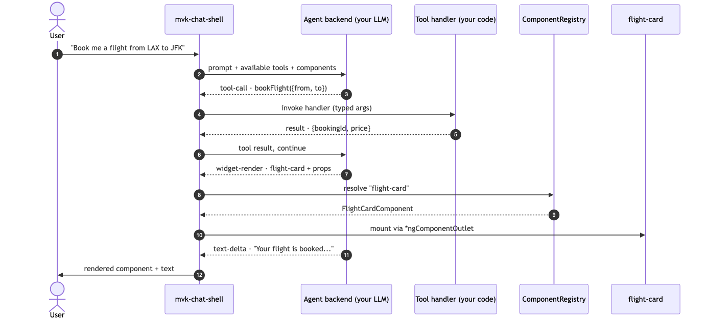
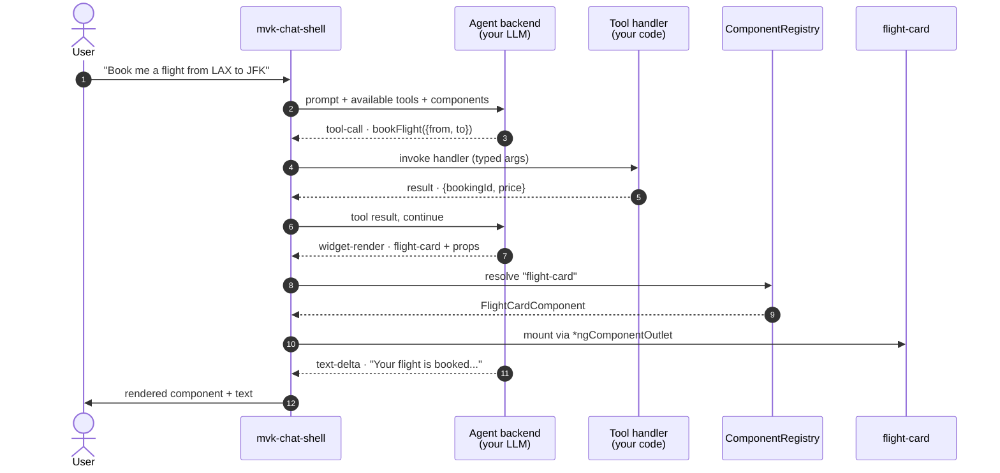
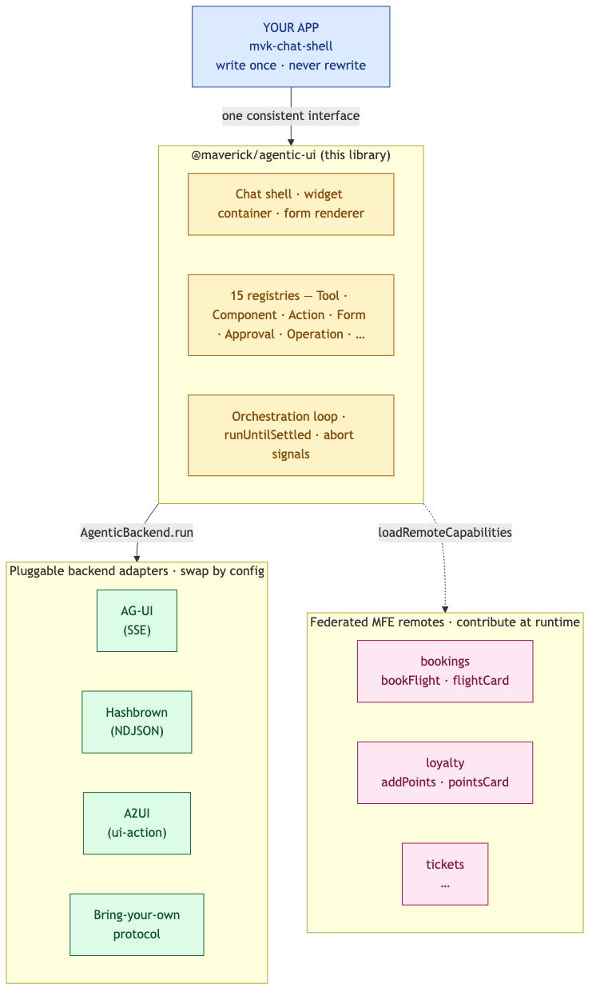
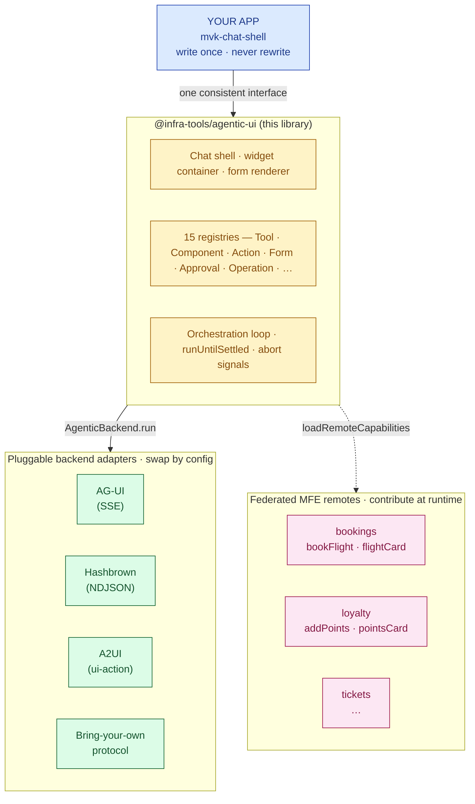
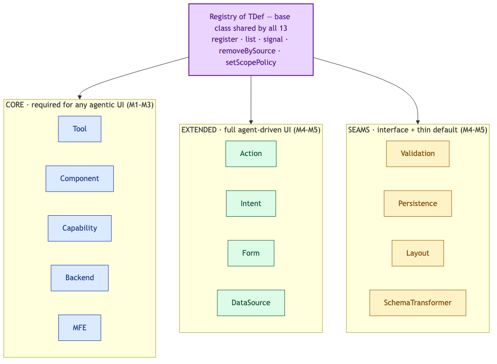
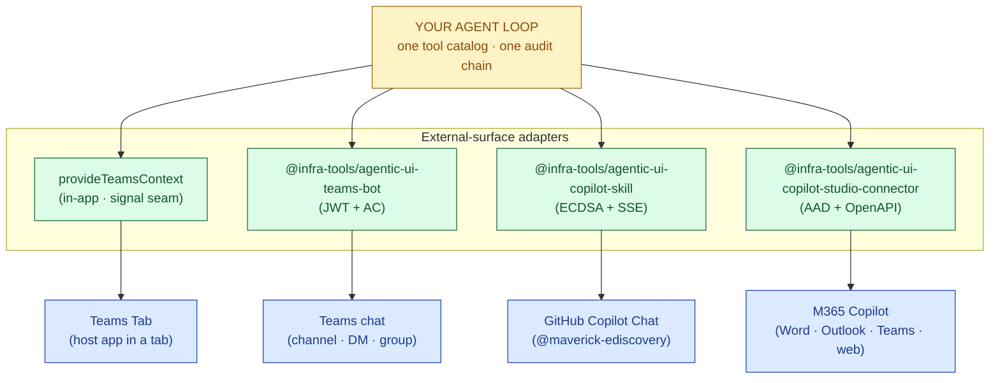

# @infra-tools/agentic-ui

[](https://github.com/sahassakhare/agentic-ui/actions/workflows/ci.yml)
[](https://www.npmjs.com/package/@infra-tools/agentic-ui)
[](https://angular.dev)
[](https://nodejs.org)
[](./LICENSE)

> **A reusable Angular 21 library for building user interfaces an LLM can drive.**
> One chat shell, one set of registries, one orchestration loop — works against AG-UI, Hashbrown, or A2UI without rewriting application code.


*Above (~13 second loop): live capture of the [eDiscovery flagship demo](./examples/demo-ediscovery-shell). User types "Add Sarah Chen as a custodian"; the orchestrator routes to the **collection** specialist; the `addCustodian` tool fires; the chat panel mounts an `app-custodian-card` widget — a real Angular component the LLM picked from the `ComponentRegistry`. Three federated MFE remotes contribute the 18 tools the agent can call. None of the flow is hard-coded in the app.*

> Need a static frame for slides or print? See [`docs/assets/agentic-ui-in-action.png`](./docs/assets/agentic-ui-in-action.png) — same scene, 2× retina PNG.

## What is an "agentic UI"?

A regular chat app shows you text. An **agentic** chat app does more — it lets the LLM decide:

1. Which **tool** to call against your backend (`bookFlight`, `searchDocuments`, …) — with typed arguments validated by a Zod schema.
2. Which **UI component** to render in response — a `<flight-card>`, a `<search-results>` panel, a redacted-document preview — with typed props the LLM picks.
3. When to **stream more text**, when to **call another tool**, when to **stop**. Multi-turn orchestration the user never sees.

```
┌─────────────────────────────────────────────────────────────────────────────────────┐
│                              ONE USER PROMPT, FIVE THINGS                           │
│                                                                                     │
│  user types ────►  "Book me a flight from LAX to JFK on May 15"                     │
│                                                                                     │
│   ┌──────────────────────┬────────────────────────────────┬───────────────────────┐ │
│   │ 1. LLM picks a tool  │  2. handler runs against the   │  3. LLM picks a UI    │ │
│   │    bookFlight        │     backend (your code)        │     component         │ │
│   │    {from:"LAX",      │     → returns booking confirm. │     flight-card       │ │
│   │     to:"JFK", …}     │                                │     {price:342,       │ │
│   └──────────────────────┴────────────────────────────────┘     status:"ok", …}   │ │
│                                                              └───────────────────┘  │
│   ┌──────────────────────┐                                                          │
│   │ 4. host mounts the   │      ┌─────────────────────────────────────────┐         │
│   │    component by name │ ───► │  ✈  LAX → JFK  ·  May 15  ·  $342      │         │
│   │    (ngComponentOutlet│      │  [Book]  [Save for later]                │         │
│   │     + Zod-validated  │      └─────────────────────────────────────────┘         │
│   │     props)           │                                                          │
│   └──────────────────────┘                                                          │
│                                                                                     │
│   5. LLM streams a closing line of natural-language confirmation.                   │
└─────────────────────────────────────────────────────────────────────────────────────┘
```

The same flow as a rendered image (high-res, available even when Mermaid can't render):



…and the same diagram as Mermaid source (GitHub renders it natively):



None of that flow is hard-coded in *your* application code. Tools are entries in a registry. Components are entries in a registry. The agent's choice of which one to call is a model decision the chat shell forwards.

## What this library does

It's the **plumbing between your app code and the agentic protocols**. You write tools and components; this library does the orchestration, transport translation, and federation handoff so the same code runs against three protocols — and against tools contributed by federated MFE remotes you didn't even know about at compile time.

```
┌──────────────────────────────────────────────────────────────────────┐
│  YOUR APP                                                            │
│    import { ChatShellComponent } from '@infra-tools/agentic-ui';        │  ← write once,
│    <mvk-chat-shell />        no fetch, no SSE parsing, no DOM glue   │    never rewrite
└─────────────────────────────────┬────────────────────────────────────┘
                                  │  one consistent interface
┌─────────────────────────────────▼────────────────────────────────────┐
│  @infra-tools/agentic-ui                                                │
│    · Chat shell + widget container + form renderer                   │  ← this library
│    · 15 registries (tool, component, action, form, …) all uniform    │
│    · Orchestration loop · runUntilSettled · abort signals            │
└─────────────────────────────────┬────────────────────────────────────┘
                                  │  AgenticBackend abstraction
┌──────────┬──────────────────────▼───────────────────┬────────────────┐
│  AG-UI   │     Hashbrown    │     A2UI             │  Bring-your-own │  ← pluggable,
│  (SSE)   │     (NDJSON)     │     (ui-action)      │  protocol       │    swap by config
└──────────┴──────────────────────────────────────────┴────────────────┘
                                  │
                                  │  loadRemoteCapabilities()
┌─────────────────────────────────▼────────────────────────────────────┐
│  FEDERATED MFE REMOTES                                                │
│   bookings remote          loyalty remote          tickets remote    │  ← contribute
│   bookFlight, flightCard   addPoints, pointsCard   etc.              │    at runtime
└──────────────────────────────────────────────────────────────────────┘
```

The same layout as a rendered image:



…and the same diagram as Mermaid source:



**Three concrete benefits:**

- **Vendor-agnostic.** AG-UI looks like the leader today; Hashbrown and A2UI are gaining traction. The library treats agent transports as pluggable adapters so you swap backends with a one-line config change, not a chat-shell rewrite.
- **Microfrontend native.** Multiple teams ship Angular remotes that contribute tools and widgets at runtime via Native Federation (or webpack Module Federation). The host's chat shell discovers them dynamically — no compile-time imports required. An MFE shipped today shows up in tomorrow's chat without redeploying the host.
- **Registry-uniform.** Fifteen registries — tools, components, actions, intents, forms, validation, persistence, layout, approval (F4), operation (F5), … — share one `Registry<TDef>` shape. Same `register / list / signal / removeBySource` semantics. Same per-persona `setScopePolicy` filter. Add a new registry for your domain in ~30 LOC of base-class extension.

If you've ever shipped a chat box where rendering "the flight card" required a `switch` statement on an LLM-emitted string and a separate fetch chain, this library replaces all of that with one `<mvk-chat-shell />` and a typed registry.

## Problem statement (for technical architects)

Agentic UIs are easy to demo and hard to ship. The pain compounds across six axes — every team building this shape of product hits at least four of them.

| # | Problem | What teams build without an abstraction | What this library does |
|---|---|---|---|
| 1 | **Protocol churn** — AG-UI, Hashbrown, A2UI all evolve quarterly; picking one is betting on a moving target. | Hand-rolled SSE / WebSocket / NDJSON parser per app, retried per protocol revision; chat-shell rewrites every quarter. | One `AgenticBackend` interface with three shipped adapters; the chat shell never sees the wire format. Swap protocols by changing one provider. |
| 2 | **Fan-out** — an agentic UI isn't just chat; it's tools + components + validation + persistence + telemetry + audit + federation. Each becomes bespoke. | Each capability shipped as a one-off store / service with its own conventions, life-cycle, signal pattern, and teardown semantics. | One `Registry<TDef>` base class. Fifteen registries (Tool, Component, Action, Form, DataSource, Approval, Operation, …) all expose the same `register / list / signal / removeBySource / setScopePolicy`. Adding your own registry for a domain concept is ~30 LOC. |
| 3 | **Generative UI dispatch** — the LLM emits "render flight-card with these props" as a string; resolving that to a typed Angular component with validated inputs is fiddly. | A growing `switch` over LLM-emitted strings, mounting hard-imported components, no schema validation on props. | `ComponentRegistry.get(name)` + Zod-validated props + `*ngComponentOutlet` mount. The agent's choice of widget is a registry read; missing names show a fallback, not a runtime crash. |
| 4 | **Microfrontend composition** — multiple teams need to contribute tools and widgets to one chat without recompiling the host or redeploying the shell. | Static imports + central registration list maintained by the host team; every new MFE is a host-team PR. | `defineCapabilityModule` + Native or webpack Federation. Remote loads at runtime, calls `registerAll`, and the next chat turn sees its tools. Unload runs `removeBySource` across all 15 registries in one pass. |
| 5 | **Governance + persona scope** — regulated domains require per-role tool surfaces. The LLM should not even see tools the active user can't invoke. | Bolt-on input filter in the chat shell only; remotes that come later don't honour it; the audit story is per-app. | `RegistryBase.setScopePolicy(predicate)` filters every `list / get / signal` read — the LLM's tool list, the widget container's resolution, the form renderer's available shapes — uniformly across all 15 registries. Three layers: library enforces, app authorises (predicate), server verifies (trust boundary). |
| 6 | **Observability across the SSE boundary** — a chat turn fans out into LLM streaming, multiple tool calls, federation loads, persistence writes. Tracing it end-to-end is non-trivial. | Per-app logs, no correlation between client + server, no W3C trace propagation; debugging slow turns means staring at network tabs. | `AgenticTelemetrySink` emit points baked in from M1 (no-op default). Optional `/otel` entry point ships an OpenTelemetry-backed sink with W3C `traceparent` propagation across the SSE handshake — one trace covers `chat shell → backend → server → LLM → tool → registry`. |

**The architect's net.** You design *one* shape — registries plus pluggable backends plus an MFE-aware host — and protocol shifts, governance changes, and team ownership splits land as configuration changes, not chat-shell rewrites. The library trades a few extra abstractions up front (yes, fifteen registries) for the elimination of bespoke code for the next five years of agent protocol churn.

## Use cases

Twenty-one distinct scenarios the library covers, ranked roughly by adoption order — the first sixteen are in-app capabilities, the last five wire those same tools into the catalog platform and into external chat surfaces (Teams, GitHub Copilot, M365 Copilot Studio). Pick the rows your team will hit; the rest are opt-in via DI.

| # | Use case | Library seam | Audience |
|---|---|---|---|
| 1 | **Generative UI** — agent picks the component to render | `ComponentRegistry` · `<mvk-widget-container>` | Foundational |
| 2 | **Tool calling with state mutation** — typed args, abort signals | `ToolRegistry` · `tool-call-*` events | Foundational |
| 3 | **Federating MFE remotes** — remotes contribute tools/widgets at runtime | `defineCapabilityModule` · `loadRemoteCapabilities` | Architects |
| 4 | **Per-persona entitlement** — LLM can't see tools the user isn't entitled to | `RegistryBase.setScopePolicy(predicate)` | Architects + execs |
| 5 | **Backend swap (AG-UI ↔ Hashbrown ↔ A2UI)** — one shell, three protocols | `AgenticBackend` interface | Architects |
| 6 | **Multi-agent orchestration** — sticky routing across specialists | `OrchestratorAgent` · `ThreadStateStore` | Architects |
| 7 | **Per-turn tool budget at scale** — keyword-filtered tool list per prompt | `provideToolFilter(keywordToolFilter({maxTools, floor}))` | Architects |
| 8 | **MCP — same tools power Claude Desktop / Cursor** | `@infra-tools/agentic-ui-mcp` | Execs + architects |
| 9 | **Observability — distributed tracing per chat turn** | `AgenticTelemetrySink` · `/otel` entry | Architects + devs |
| 10 | **Audit trail / chain-of-custody** — tamper-evident state mutations | Pattern: `prevHash` / `chainHash` + telemetry | Execs + architects |
| 11 | **Composable forms at runtime** — agent picks sections from registered widgets; predicates toggle on persona / matter / partial values; values survive section unmount with drop/keep prompt | `agenticForm({ composition: [...] })` · `CompositionStore` · `<mvk-form-renderer>` ([cookbook](./docs/cookbook/composable-intake-form.md)) | Architects + product |
| 12 | **Live data fetching from generated UI** — widgets declare `dataSources`; mount-time validation surfaces missing sources; UI calls backend directly without burning LLM tokens; adapter swap (mock → REST → GraphQL) without widget changes | `ComponentDef.dataSources` · `DataSourceRegistry.getTyped<TQuery,TResult>()` · `restDataSource` ([cookbook](./docs/cookbook/widgets-with-live-data.md)) | Architects + devs |
| 13 | **Guided multi-step workflows** — one widget per step, conditional `next` branches on aggregated state, Back preserves prior values, terminal Submit runs the same domain handler as the equivalent one-shot tool | `agenticWorkflow({ steps, onComplete })` · `<mvk-workflow-renderer>` ([cookbook](./docs/cookbook/interactive-workflows.md)) | Architects + product |
| 14 | **Human-in-the-loop approval** — the agent drafts an irreversible action; chat-shell intercept queues it for HITL; senior reviewer approves or rejects from an inline card or the `/approvals` queue page; every transition appends to the same tamper-evident audit chain (`tool-approved` / `tool-rejected`) | `agenticApproval({...})` · `ApprovalRegistry` · `<mvk-approval-card>` · `AGENTIC_APPROVAL_AUDIT_HOOK` ([cookbook](./docs/cookbook/approval-flow.md)) | Execs + architects + compliance |
| 15 | **Long-running operations** — tools that take minutes return immediately with an `opId`; chat shows live progress inline; `/operations` page lists in-flight + recent across routes; lifecycle (started/progress/finished/failed) participates in the same audit chain | `agenticTool({ longRunning: true, ... })` · `OperationRegistry` · `<mvk-operation-progress>` · `AGENTIC_OPERATION_AUDIT_HOOK` ([cookbook](./docs/cookbook/long-running-operations.md)) | Architects + product + SRE |
| 16 | **Multi-modal input** — paperclip / drag-drop / paste-image on the chat composer; client-side MIME + size validation; transcript renders text / image / file parts; backends without multi-modal capability text-only fallback with explicit warning | `MessageContent` union · `BackendCapabilities.multiModal` · `<mvk-chat-shell>` composer affordances ([cookbook](./docs/cookbook/multi-modal-input.md)) | Architects + product |
| 17 | **Wire the catalog platform** — single composite provider for IAM persona + MFE registry + capability registrar/authorizer + usage metering | `provideAgenticPlatform({...})` ([ADR-031](./docs/adr/0031-provide-agentic-platform.md)) | Architects + execs |
| 18 | **External surface — Teams Tab embed** — same Angular app inside a Teams Tab, with tenant + UPN + theme bridged into the catalog | `provideTeamsContext({ loadContext })` ([cookbook](./docs/cookbook/teams-tab-embed.md)) | Architects + execs |
| 19 | **External surface — Teams chat (Bot Framework)** — converse with the agent in Teams chat; tool results render as Adaptive Cards | `@infra-tools/agentic-ui-teams-bot` ([cookbook](./docs/cookbook/teams-bot-adaptive-cards.md)) | Architects + execs |
| 20 | **External surface — GitHub Copilot Extension** — `@maverick-ediscovery` invocable from Copilot Chat in VS Code / JetBrains / github.com | `@infra-tools/agentic-ui-copilot-skill` ([cookbook](./docs/cookbook/github-copilot-extension.md)) | Architects + execs |
| 21 | **External surface — M365 Copilot Studio Connector** — every catalog tool becomes a Power Platform action callable from Word / Outlook / Teams / Copilot web | `@infra-tools/agentic-ui-copilot-studio-connector` ([ADR-042](./docs/adr/0042-copilot-studio-connector.md), [cookbook](./docs/cookbook/copilot-studio-connector.md)) | Architects + execs |

> **Each use case has a dedicated walkthrough in the [User Guide → Use cases](./docs/USER_GUIDE.md#use-cases).** The walkthroughs include scenario, library responsibility, minimal wiring code, and a link to the relevant cookbook entry.

## Table of contents

- [Features](#features)
- [Architecture](#architecture)
- [Installation](#installation)
- [Quick start](#quick-start)
- [Demo applications](#demo-applications)
- [Documentation](#documentation)
- [Development](#development)
- [Testing](#testing)
- [Versioning and release](#versioning-and-release)
- [Compatibility](#compatibility)
- [License](#license)

## Features

- **Pluggable agent backends.** A single `AgenticBackend` interface; ship adapters for AG-UI (`@ag-ui/client` HttpAgent + SSE), Hashbrown (NDJSON), and A2UI (`ui-action` event class routed through `ActionRegistry`).
- **Layered registry system.** Fifteen registries grouped into Core, Extended, and Seam tiers, all sharing one `Registry<TDef>` shape — uniform `register / list / signal / removeBySource` semantics across tools, components, capabilities, backends, MFE remotes, actions, intents, forms, data sources, validation, persistence, layout, schema transformation, plus the dynamic-UI additions (approval, operation).
- **Generative UI.** Tool results carrying a `components: [{ name, props }]` field cause the chat shell to render registered Angular components by name through `*ngComponentOutlet`, with Zod-validated props.
- **MFE federation.** `defineCapabilityModule` packages a remote's tools and widgets; `loadRemoteCapabilities` (Native Federation) and `loadRemoteCapabilitiesMF` (webpack Module Federation) push them into the host's runtime registries. Remote discovery happens through a pluggable `MfeRegistrySource` (static JSON or Spring Boot reference adapters; bring-your-own for Consul, Etcd, etc.).
- **Schematics.** Ten generators: `ng-add`, `tool`, `widget`, `chat-shell`, `backend`, `agent-server`, `mfe-capability`, `action`, `intent`, `form`. Snapshot-tested.
- **Observability.** `AgenticTelemetrySink` emit points are baked into the orchestrator and registries from M1; the optional OpenTelemetry-backed sink ships with W3C trace context propagation across SSE.
- **Federation-safe single primary entry.** All public API exports through one entry point so Native Federation can share the runtime as a singleton across host and remote (see [ADR-005](./docs/adr/0005-single-primary-entry.md)). Tree-shaking is preserved by `"sideEffects": false`.
- **Platform integration in one provider.** `provideAgenticPlatform({...})` wires every catalog adapter through a single shared `catalogUrl` / `tenantId` / `getToken` config: IAM persona resolver, federated MFE registry source, **capability registrar** (auto-POST every registered tool/widget at boot — closes the catalog-drift gap from [ADR-025](./docs/adr/0025-ediscovery-demo-seed.md)), **capability authorizer** (catalog `lifecycle: 'disabled'` toggles hide entries from `ToolRegistry` / `ComponentRegistry` reads — closes the "ops console disable button is decorative" gap), and **usage metering** (every tool call / widget render / federation load posts to `/v1/catalogs/{tenant}/usage`). All four are opt-in per-feature switches; `false` or omission skips. Apps without `provideAgenticPlatform` see zero behaviour change. See [ADRs 031](./docs/adr/0031-provide-agentic-platform.md) / [032](./docs/adr/0032-catalog-capability-registrar.md) / [033](./docs/adr/0033-catalog-capability-authorizer.md) / [034](./docs/adr/0034-catalog-usage-metering.md) and the [2026-05-10 platform audit](./docs/audit/2026-05-10-platform-audit.md).

## Architecture

```
┌────────────────────────────────────────────────────────────────────────────┐
│                       ANGULAR HOST APPLICATION  (browser)                  │
│                                                                            │
│  UI layer                                                                  │
│   <mvk-chat-shell>     <mvk-widget-container>     <mvk-form-renderer>      │
│   <mvk-approval-card>  <mvk-operation-progress>   <mvk-workflow-renderer>  │
│           │                       ▲                      ▲                 │
│           │ injectAgenticChat()   │ resolves from        │                 │
│           ▼                       │ ComponentRegistry    │                 │
│   Agentic core (Angular 21 resource() + signals)                           │
│   runUntilSettled · message stream · abort · turn orchestration            │
│           │                                                                │
│           │ reads/writes via uniform Registry<TDef>                        │
│           ▼                                                                │
│   Registry layer  (15 root injectables, signal-backed)                     │
│     CORE:    Tool · Component · Capability · Backend · MFE                 │
│     EXT:     Action · Intent · Form · DataSource · Approval(F4) ·          │
│              Operation(F5)                                                 │
│     SEAMS:   Validation · Persistence · Layout · SchemaTransformer         │
│           │                                                                │
│           │ AgenticBackend.run(input) → AsyncIterable<AgenticEvent>        │
│           ▼                                                                │
│   Backend adapter layer                                                    │
│     AgUiBackend (@ag-ui/client) │ HashbrownBackend │ A2uiBackend           │
│           │           │                 │                                  │
│  ╔════════╪═══════════╪═════════════════╪═══════════════════════════════╗ │
│  ║                       FEDERATION RUNTIME                              ║ │
│  ║   Native Federation (esbuild)   OR   Module Federation (webpack)      ║ │
│  ║   loadRemoteCapabilities() pushes into Tool / Component registries    ║ │
│  ╚════════════════╤══════════════════════╤═══════════════════════════════╝ │
│                   │                      │                                  │
│      Remote MFE A (bookings)    Remote MFE B (loyalty)                     │
│      bookFlight tool            loyaltyAward tool                          │
│      flightCard widget          pointsCard widget                          │
└──────────────┬─────────────────────────────────────┬───────────────────────┘
               │ HTTP / SSE                          │ HTTP discovery
               ▼                                     ▼
       Agent server  (Node)                MFE registry  (external)
       @infra-tools/agentic-ui-server          Spring Boot OR static JSON
       /api/agents/:id/run  ── SSE          via MfeRegistrySource
       ServerAgent implementations          GET /mfes?env=...
       (GeminiAgent, EchoAgent, ...)        SSE /mfes/watch
```

The chat shell talks to the registry layer; the registry layer dispatches the active `AgenticBackend`; the backend streams events from the agent server. Federation loads MFE remotes into the same browser realm so their `CapabilityModule.apply()` writes directly into the host's registries — and because the library ships as a single primary entry shared via federation, the registry singletons resolve to the same class identity in host and remote.

### The registry layer up close

All fifteen registries inherit one base class — `Registry<TDef>` — with identical `register / list / signal / removeBySource / setScopePolicy` semantics. They split into three tiers by adoption stage:



- **Core (5)** — every agentic UI needs these from day one. Tool, Component, Capability, Backend, MFE.
- **Extended (4)** — agent-driven UI beyond chat. Action (NgRx-style commands), Intent (NL → tool routing), Form (schema-driven dynamic forms), DataSource (REST/GraphQL/SSE adapters).
- **Seams (4)** — interface + thin default; you plug in your own. Validation (Zod by default; pluggable Ajv / Joi), Persistence (localStorage / sessionStorage / Dexie), Layout (CDK-friendly), SchemaTransformer (JSON Schema ↔ Zod, OpenAPI → Tool importer).

Adding a registry of your own — say, a `MetricRegistry` for a custom domain — is ~30 LOC of base-class extension and gets the same MFE teardown, conformance suite, and persona scope policy out of the box.

### Bring the agent to other surfaces — four adapter packages

Your operators don't all live in your app. Some are in **Microsoft Teams chat**; some in **GitHub Copilot Chat** (VS Code / JetBrains / github.com); some in **Microsoft 365 Copilot** (Word / Outlook / Teams / Copilot web). The library ships four sibling packages — one per ecosystem — so your existing tools become callable from each surface without the agent loop, the catalog, or the audit chain forking.

Each adapter is a **thin protocol shim**: it verifies the inbound signature, parses the wire format, hands the request to a single `Handler` callback (your agent loop), and translates outbound events back into the surface's native shape (Adaptive Cards / SSE / OpenAPI). No LLM is embedded — your existing backend runs unchanged.

```
                       ╔═══════════════════════════════════════════╗
                       ║   YOUR EXISTING AGENT LOOP (server-side)  ║
                       ║   one tool catalog · one audit chain      ║
                       ╚════╤══════════╤═══════════╤═══════════╤═══╝
                            │          │           │           │
              ┌─────────────┘    ┌─────┘     ┌─────┘     ┌─────┘
              │                  │           │           │
   ┌──────────▼─────┐  ┌─────────▼─────┐  ┌──▼─────────┐  ┌─▼─────────────────┐
   │ provideTeams   │  │ teams-bot     │  │ copilot-   │  │ copilot-studio-   │
   │ Context        │  │ middleware    │  │ skill mw   │  │ connector mw      │
   │ (in-app)       │  │ (server)      │  │ (server)   │  │ (server)          │
   │                │  │ JWT verify    │  │ ECDSA verify  │ AAD JWT verify    │
   │ getContext →   │  │ + AAD bearer  │  │ + OpenAI SSE  │ + Zod→OpenAPI mfst│
   │ TEAMS_CONTEXT  │  │ + AC cards    │  │   chunks      │ + AC response     │
   │ signal         │  │               │  │               │                   │
   └────┬───────────┘  └─────┬─────────┘  └─────┬───────┘  └────┬──────────────┘
        │                    │                  │                │
        ▼                    ▼                  ▼                ▼
  ┌──────────────┐  ┌──────────────────┐ ┌────────────────┐  ┌─────────────────┐
  │ Teams Tab    │  │ Teams chat       │ │ GitHub Copilot │  │ M365 Copilot    │
  │ (host the    │  │ (channel · DM ·  │ │ Chat           │  │ (Word · Outlook │
  │  Angular app │  │  group)          │ │ (@ediscovery)  │  │  · Teams · web) │
  │  in a tab)   │  │                  │ │                │  │                 │
  └──────────────┘  └──────────────────┘ └────────────────┘  └─────────────────┘
       P0                  P1                   P2                   P3
```



| Phase | Package | Surface | Wire format | Auth | Cookbook |
|-------|---------|---------|-------------|------|----------|
| P0 | `provideTeamsContext` (in-lib) | Teams Tab | n/a — embeds the Angular app | Teams SSO (host-side) | [teams-tab-embed](./docs/cookbook/teams-tab-embed.md) |
| P1 | `@infra-tools/agentic-ui-teams-bot` | Teams chat | Bot Framework activities + Adaptive Cards | JWT verify against Bot Connector keys; AAD client-credentials for outbound | [teams-bot-adaptive-cards](./docs/cookbook/teams-bot-adaptive-cards.md) |
| P2 | `@infra-tools/agentic-ui-copilot-skill` | GitHub Copilot Chat | Signed JSON webhook + OpenAI-shaped SSE | GitHub ECDSA P-256 signed-request verify | [github-copilot-extension](./docs/cookbook/github-copilot-extension.md) |
| P3 | `@infra-tools/agentic-ui-copilot-studio-connector` | Microsoft 365 Copilot | Power Platform OpenAPI 2.0 + Adaptive Card response | Azure AD v2.0 JWT (tenant whitelist + JWKS) | [copilot-studio-connector](./docs/cookbook/copilot-studio-connector.md) |

[ADR-041](./docs/adr/0041-teams-copilot-external-surfaces.md) and [ADR-042](./docs/adr/0042-copilot-studio-connector.md) document the design contracts. The integration plan that prioritised these four paths is at [docs/plans/teams-copilot-integration-plan.md](./docs/plans/teams-copilot-integration-plan.md). All four are **additive** — runtime tier (`@infra-tools/agentic-ui`) is unchanged; adopters install only the adapters they need.

## Installation

```bash
npm install @infra-tools/agentic-ui
ng add @infra-tools/agentic-ui --backend=ag-ui
```

`ng add` patches `app.config.ts` with `provideAgenticUi()` plus the chosen backend provider, scaffolds `src/app/agentic/{tools,widgets}.ts`, and adds the required peer dependencies. Optional peers are flagged in `package.json` so consumers only install what they use.

| Peer | Required? | Used when |
|------|-----------|-----------|
| `@angular/common` `^21.2.0` | yes | always |
| `@angular/core` `^21.2.0` | yes | always |
| `rxjs` `~7.8.0` | yes | always |
| `zod` `^3.23.0` | yes | always |
| `@angular/forms` | optional | importing `<mvk-form-renderer>` |
| `@ag-ui/client` | optional | importing `provideAgUiBackend` |
| `@module-federation/runtime` | optional | webpack MF (`loadRemoteCapabilitiesMF`) |
| `@opentelemetry/api` | optional | OpenTelemetry telemetry sink |

## Quick start

The shortest end-to-end example: a single Angular app that streams LLM responses through the AG-UI adapter.

```ts
// src/app/app.config.ts
import { ApplicationConfig, provideZonelessChangeDetection } from '@angular/core';
import { provideAgenticUi, provideAgUiBackend } from '@infra-tools/agentic-ui';

export const appConfig: ApplicationConfig = {
  providers: [
    provideZonelessChangeDetection(),
    provideAgenticUi(),
    provideAgUiBackend({ url: 'http://localhost:4111/agents/gemini/run' }),
  ],
};
```

```html
<!-- src/app/app.html -->
<mvk-chat-shell />
```

```ts
// src/app/app.ts
import { Component } from '@angular/core';
import { ChatShellComponent } from '@infra-tools/agentic-ui';

@Component({
  selector: 'app-root',
  imports: [ChatShellComponent],
  template: '<mvk-chat-shell />',
})
export class App {}
```

For tools, widgets, MFE federation, and the full step-by-step walkthrough that builds the federated demo, see the [User Guide](./docs/USER_GUIDE.md).

### Wire the catalog platform (optional)

Run a [Maverick catalog server](./platform/agentic-catalog-server/) and a single
provider line gives the app live persona resolution, federated MFE
discovery, automatic capability registration, catalog-driven
capability authorization, and usage metering — all opt-in:

```ts
// src/app/app.config.ts
import { provideAgenticUi, provideAgenticPlatform } from '@infra-tools/agentic-ui';

export const appConfig: ApplicationConfig = {
  providers: [
    provideZonelessChangeDetection(),
    provideAgenticUi({ tools: [...], widgets: [...] }),
    provideAgenticPlatform({
      catalogUrl: 'https://catalog.example.com',
      tenantId: 'acme',
      getToken: () => oidc.getAccessToken(),
      personaResolver:      { defaultPersona: 'paralegal' },
      mfeRegistry:          { refreshIntervalMs: 30_000 },
      capabilityRegistrar:  {},   // auto-POST registered tools/widgets at boot
      capabilityAuthorizer: {},   // catalog 'disabled' toggles hide from registry
      usageMetering:        {},   // tool calls → POST /usage
    }),
  ],
};
```

`mvk new app demo --with-platform` (from the [`mvk` CLI](./platform/mvk-cli/)) scaffolds this for you.

Each feature switch is independently opt-in; the app stays embedded-first when none of them is set. Closes Gaps 1–4 from the [2026-05-10 platform audit](./docs/audit/2026-05-10-platform-audit.md). See [ADRs 031–034](./docs/adr/) for the design rationale.

## Demo applications

The repository ships **sixteen reference applications** under `examples/` (fifteen runnable apps + one shared domain library). They cover four patterns: single-process showcases, federated MFEs, agent backends, and a flagship enterprise reference.

### 🏛 Flagship — enterprise eDiscovery reference (Phases 0–7 shipped)

A multi-pane regulated-domain reference app built across the eight phases in [docs/plans/ediscovery-app-plan.md](./docs/plans/ediscovery-app-plan.md) plus the six dynamic-UI capabilities (F1–F6) from the [r3 plan](./docs/plans/ediscovery-dynamic-ui-plan.md). Exercises every load-bearing library feature simultaneously: 25+ tools across 4 specialists, 3 federated MFE remotes, all 15 registries (including F4 `ApprovalRegistry` + F5 `OperationRegistry`), tamper-evident chain-of-custody audit (extended with `tool-approved` / `tool-rejected` / `operation-*` event kinds), MCP for analyst workstations, persona-scoped permission filtering, `/approvals` queue + `/operations` panel routes. **Drop the eight phases plus F1–F6 in here for the headline architectural story.**

| App | Purpose | Port |
|-----|---------|------|
| `demo-ediscovery-shell` | Host shell with three-pane layout (left nav, routed pages, collapsible chat rail). 6 routes (Dashboard, Documents, Custodians, Holds, Audit, Productions) + persona menu. Wires `provideToolFilter` chaining `personaToolFilter` → `keywordToolFilter`. | 4300 |
| `demo-ediscovery-server` | Hono server with `OrchestratorAgent` routing to four specialists: `collection`, `review`, `production`, `search`. Per-thread sticky routing via `ThreadStateStore`. | 4311 |
| `demo-ediscovery-review` | Review MFE remote. 4 tools (search, tag, mark privileged, privilege log) + 3 widgets (documentPreview, tagPanel, reviewProgress). | 4302 |
| `demo-ediscovery-production` | Production MFE remote. 5 tools (create → bates → redact → export → chain-of-custody) + 4 widgets including HTML5-canvas redactionEditor. `productionConfigForm` via FormRegistry; Bates-pattern Validation seam. | 4303 |
| `demo-ediscovery-search` | Search MFE remote. 4 tools (semanticSearch, filterByDateRange, filterByCustodians, runTARClassifier) routing through a `documentIndex` `DataSourceDef`. 3 widgets including a TAR-score table. | 4304 |
| `demo-ediscovery-mcp` | MCP server exposing the review + search tools to Claude Desktop / Cursor / Zed. 5 tools with HTML render-hints (`text/html;profile=mcp-app`). Per-user audit attribution via env vars. | stdio |
| `demo-ediscovery-shared` | Framework-agnostic domain types + mock data + Bates utilities + tamper-evident chain-hash + chain-of-custody report builder. Imported by every app above. | (lib) |

What ships through Phase 7 — quick reference:
- **Phase 0** — foundation (mock data, server skeleton, three-pane shell)
- **Phase 1** — collection specialist + 5 tools + 2 widgets + custodianIntakeForm
- **Phase 2** — review remote (Native Federation) + click-to-navigate via ActionRegistry
- **Phase 3** — production remote + Bates chain + productionConfigForm + canvas redaction widget
- **Phase 4** — search remote + DataSource + TAR classifier + `keywordToolFilter` activation
- **Phase 5** — tamper-evident audit chain + `chain-of-custody` report widget + integrity badge
- **Phase 6** — MCP server (`@infra-tools/demo-ediscovery-mcp`) for analyst workstations
- **Phase 7** — persona permission shim (5 personas, allow-listed tools, live tool-count badge)

### Single-process examples

| App | Purpose | Port |
|-----|---------|------|
| `demo-monolith` | Single-app, single-agent demo. Tools and widgets registered locally; no federation moving parts. | 4202 |
| `demo-multi-agent` | One host, multiple agents. Registers tools + widgets for three domains inline; the orchestrator on the server classifies each turn and forwards events from the chosen specialist. | 4204 |
| `demo-feature-tour` | Extended-registry showcase. Demonstrates the four library capabilities not covered by the other demos: `ActionRegistry` (agent-triggered navigation + toasts), `FormRegistry` (`<mvk-form-renderer>`), `DataSourceRegistry` (typed REST adapter), and an `IntentRegistry` entry for pre-LLM short-circuit. | 4206 |

### Federated example — one app per domain, one agent per app

| App | Purpose | Port |
|-----|---------|------|
| `demo-shell` | Native Federation host. Discovers remotes via `MfeRegistryClient`, blocks bootstrap until each `Capability` registers via `provideAppInitializer`. Talks to `/agents/orchestrator/run`. | 4200 |
| `demo-remote-bookings` | Bookings MFE remote. Exposes `./Capability` with `bookFlightTool` + `flightCardWidget`. **Also has its own form-driven UI** at `:4201` that calls the same handler and renders the same widget. | 4201 |
| `demo-remote-loyalty` | Loyalty MFE remote. Exposes `./Capability` with `checkPointsTool`, `redeemPointsTool`, and `pointsCardWidget`. **Also has its own UI** at `:4203` (check balance + redeem) that reuses the same handlers and widget. | 4203 |
| `demo-remote-support` | Support MFE remote. Exposes `./Capability` with `openTicketTool`, `checkTicketTool`, and `ticketCardWidget`. **Also has its own UI** at `:4205` (open + check ticket) reusing the same handlers and widget. | 4205 |

### Backend

| App | Purpose | Port |
|-----|---------|------|
| `demo-server` | Hono SSE agent server. Hosts six `ServerAgent` implementations under one process: `EchoAgent`, the single-domain `GeminiAgent`, three specialists (`bookings`, `loyalty`, `support`), and an `OrchestratorAgent` that classifies each turn and forwards events from the chosen specialist. | 4111 |

### Quick start — single-process multi-agent (`demo-multi-agent`)

```bash
npm install
cd examples/demo-server && npm install && cd ../..
cp examples/demo-server/.env.example examples/demo-server/.env
# Add your GOOGLE_GENERATIVE_AI_API_KEY to examples/demo-server/.env
npm run build:lib
npm install ./dist/agentic-ui --no-save

# Two terminals:
cd examples/demo-server && npm run dev     # :4111
npx ng serve demo-multi-agent              # :4204
```

Open <http://localhost:4204> and try `Book a flight from LAX to JFK on 2026-05-05`, `How many points do I have?`, or `Open a support ticket`. The orchestrator routes each turn to the matching specialist and renders the appropriate card.

### Quick start — federated, one app per domain (`demo-shell` + remotes)

Topology — each domain owns one app; the orchestrator on the server routes per turn:

```
┌─────────────────────────────────────────────────────────────────┐
│  demo-shell  (host, :4200)                                      │
│   • orchestrator agent URL: /agents/orchestrator/run            │
│   • discovers remotes from /mfes.json at boot                   │
│   • blocks bootstrap until every Capability is registered       │
└────────┬─────────────┬──────────────┬───────────────────────────┘
         │             │              │
   ┌─────▼────┐  ┌─────▼─────┐  ┌─────▼─────┐
   │ bookings │  │  loyalty  │  │  support  │
   │  :4201   │  │   :4203   │  │   :4205   │
   │          │  │           │  │           │
   │ tools +  │  │ tools +   │  │ tools +   │
   │ widget   │  │ widget    │  │ widget    │
   └──────────┘  └───────────┘  └───────────┘
                       │
              ┌────────▼────────────────────────┐
              │ demo-server (:4111)             │
              │ orchestrator + specialists      │
              │ (bookings · loyalty · support)  │
              └─────────────────────────────────┘
```

| Process | Port | Role |
|---|---|---|
| `demo-server` | 4111 | Six agents — `echo`, `gemini`, `bookings`, `loyalty`, `support`, `orchestrator` |
| `demo-shell` | 4200 | Federation host. Talks to `/agents/orchestrator/run`. Loads remotes via `MfeRegistryClient.discover()`. |
| `demo-remote-bookings` | 4201 | Owns `bookFlight`, `flightCard` |
| `demo-remote-loyalty` | 4203 | Owns `checkPoints`, `redeemPoints`, `pointsCard` |
| `demo-remote-support` | 4205 | Owns `openTicket`, `checkTicket`, `ticketCard` |

```bash
npm install
cd examples/demo-server && npm install && cd ../..
cp examples/demo-server/.env.example examples/demo-server/.env
# Add your GOOGLE_GENERATIVE_AI_API_KEY to examples/demo-server/.env
npm run build:lib
npm install ./dist/agentic-ui --no-save

# Five terminals:
cd examples/demo-server && npm run dev     # :4111
npx ng serve demo-remote-bookings          # :4201
npx ng serve demo-remote-loyalty           # :4203
npx ng serve demo-remote-support           # :4205
npx ng serve demo-shell                    # :4200
```

Open <http://localhost:4200>. The browser console should log `[demo-shell] Loaded demo-remote-bookings (1 tool(s), 1 widget(s))` and the same for loyalty + support. Try one prompt per domain:

| Prompt | Routes to | Owned by |
|---|---|---|
| *"Book a flight from LAX to JFK on 2026-05-05"* | bookings specialist | `demo-remote-bookings` |
| *"How many loyalty points do I have?"* | loyalty specialist | `demo-remote-loyalty` |
| *"Open a support ticket — my refund hasn't arrived"* | support specialist | `demo-remote-support` |

Adding a fourth domain is the same recipe: clone one of the remote folders, point it at a new port, register it in `mfes.json`, add a corresponding sub-agent in `demo-server/src/server.ts`, and the orchestrator picks it up automatically.

#### Each remote is also a standalone app

Open <http://localhost:4201>, <http://localhost:4203>, and <http://localhost:4205> directly to see each domain MFE running on its own with a real form-driven UI. The standalone UIs call the **same tool handlers** and render the **same widget components** the agent uses — proving each MFE is a complete domain artefact, not a chat-only shim. The capability surface (`./Capability` exposed via federation) is unchanged; the host shell at `:4200` keeps consuming each remote exactly as before.

## Documentation

| Document | Contents |
|----------|----------|
| [API reference](https://sahassakhare.github.io/agentic-ui/) | Full TypeDoc-generated reference; rebuilt on every push to `main` and on every `v*` tag. Locally: `npm run docs:api`. |
| Compodoc site | Angular-aware docs site (components, services, modules, routes) with the cookbook embedded as an additional-pages section. Build: `npm run docs:compodoc`. Live-reload: `npm run docs:compodoc:serve`. Output: `docs/compodoc/`. |
| [User Guide](./docs/USER_GUIDE.md) | 7-step walkthrough from clean clone to a working federated demo, plus a troubleshooting matrix keyed to specific error messages. |
| [Quickstart](./docs/cookbook/quickstart.md) | Provider wiring in five minutes. |
| [Sample prompts](./docs/cookbook/sample-prompts.md) | Canonical prompts for every demo and every library feature — paste into the chat, or use as a manual regression suite. |
| [Production deployment](./docs/cookbook/production-deployment.md) | The `ThreadStateStore` abstraction (Redis / Postgres adapters), rate-limiting, secrets, K8s liveness probes — what changes between localhost and a multi-pod deploy. |
| [Federation at scale](./docs/cookbook/federation-at-scale.md) | Capability prefetch (manifest-only registration without bundle load) + per-turn tool filtering — what's needed at 50+ remotes / 200+ tools. |
| [Registries vs. industry](./docs/architecture/registries-vs-industry.md) | Comparison of our 15 registries against agent SDKs (CopilotKit, LangChain, Vercel AI) and plugin platforms (VS Code, Backstage). Governance gaps + integration map onto the existing `RegistryBase`. |
| [Roadmap](./ROADMAP.md) | Researched extension recommendations + phased plan. Tier 1 (MCP server, user-in-the-loop confirmations, streaming citations, memory registry, cost gates), Tier 2 (streaming structured output, eval adapters, code-interpreter, voice), Tier 3 (deferred). Each item has industry context, API sketch, effort estimate, acceptance criteria, risks. |
| [ADR-006 — MCP server-side adapter](./docs/adr/0006-mcp-server-side-adapter.md) | Design rationale for `@infra-tools/agentic-ui-mcp`. **Status: Accepted (implementing).** |
| [Platform audit — 2026-05-10](./docs/audit/2026-05-10-platform-audit.md) | Industry-standard scorecard (Auth/AuthZ, Multi-tenancy, Audit, API design, Real-time, Observability, Reliability, Security, Operational, Governance) + four runtime↔platform integration gaps + prioritized recommendations. **Status: Gaps 4 / 1 / 3 / 2 closed by ADR-031–034 (shipped).** |
| [ADR-031 — `provideAgenticPlatform`](./docs/adr/0031-provide-agentic-platform.md) | Single-config-point composite provider. Closes audit Gap 4. **Status: Accepted (shipped).** |
| [ADR-032 — Catalog capability registrar](./docs/adr/0032-catalog-capability-registrar.md) | Boot-time auto-POST of registered tools/widgets to the catalog; idempotent via `(tenant, kind, name)` UNIQUE constraint. Server-side: `POST capabilities` returns 409 (not 500) on duplicate. Closes audit Gap 1. **Status: Accepted (shipped).** |
| [ADR-033 — Catalog capability authorizer](./docs/adr/0033-catalog-capability-authorizer.md) | Catalog-driven deny-list composed onto registry scope policy; 30s polling, default-allow on fetch failure. New public `RegistryBase.currentScopePolicy()`. Closes audit Gap 3. **Status: Accepted (shipped).** |
| [ADR-034 — Catalog usage metering](./docs/adr/0034-catalog-usage-metering.md) | Wraps `AGENTIC_TELEMETRY_SINK` so tool call / widget render / federation load events become catalog usage POSTs; batched flush; `delegate` preserves the host's existing sink. Closes audit Gap 2. **Status: Accepted (shipped).** |
| [Plan — Enterprise eDiscovery example app](./docs/plans/ediscovery-app-plan.md) | Eight-phase plan for a complex enterprise reference application that exercises every load-bearing library feature simultaneously (federation, multi-agent, MCP, all 13 registries from the v1.1 baseline, audit trails, permission scopes). **Status: All 8 phases shipped — see `examples/demo-ediscovery-{shared,server,shell,review,production,search,mcp}/`.** |
| [Plan — Dynamic-UI program (r3 enterprise spec)](./docs/plans/ediscovery-dynamic-ui-plan.md) | Six-capability program (F1–F6 — composable forms, live data, workflows, approval, long-running operations, multi-modal input) built on top of the eDiscovery flagship. NFRs, threat model, capability G/W/T acceptance criteria, observability + test + release + cost + ops sections, risk register, phase gates with exit criteria. **Status: F1–F6 lib + demo + cookbook + Playwright shipped (F6 slice 1).** |
| [Plan — Platform evolution (v3 — fully open-source)](./docs/plans/platform-evolution-plan.md) | Three-tier platform direction (runtime / control plane / ecosystem), all Apache 2.0, layered sustainability (sponsorship + services + hosted). M1–M8 milestones over 24–36 months. **Status: M1 R1–R5 shipped — platform-seams map, RegistryProviderHook, Redis/Postgres ThreadStateStore adapters (`@infra-tools/agentic-ui-server-stores`), AG-UI state channel, governance hooks (requiredHostVersion / tags / owner / lifecycle).** |
| [Plan — Post-chat surfaces (agent everywhere)](./docs/plans/post-chat-surfaces-plan.md) | Phased plan to extend the agent beyond the chat rail: 10 web-surface patterns (smart cells, row menus, bulk toolbar, assist panel, NL filters, inline annotations, ⌘K palette), 5 layout modes via promoted `LayoutRegistry`, user-defined dashboards via new `DashboardRegistry`, scheduled triggers via new `TriggerRegistry`, plus 7 complex workflows (legal-hold lifecycle, production pipeline, CAL training loop, multi-reviewer queue, timeline reconstruction). 6 phases over ~14 weeks. **Status: drafted, awaiting acceptance on §1 goals + §9 P0 exit criteria.** |
| [ADR-010 — Platform principles + Apache 2.0](./docs/adr/0010-platform-principles-and-license.md) | The two non-negotiable principles (P1 embedded-first, P2 zero breaking changes through v1.x) + codified non-goals (no Temporal / NATS / OPA / OpenSearch in the runtime, no closed-source features at any tier, no relicensing). Frozen contracts. |
| [docs/architecture/platform-seams.md](./docs/architecture/platform-seams.md) | The definitive map of every platform contract: 12 InjectionTokens, 2 registry methods (`setScopePolicy` + `setProviderHook`), 12 `provideX` factories, 4 audit/telemetry hooks, 1 server-side store interface (3 adapters), 4 governance metadata fields. **Read first** if you're integrating, contributing, or reviewing a PR. |
| [Expose your tools as an MCP server](./docs/cookbook/mcp-server.md) | Wrap any `ToolDef[]` with `createMcpServer({...})` so Claude Desktop / Cursor / Zed can call your tools. Includes Claude Desktop config snippet, transport choices (stdio / HTTP / embeddable), `beforeCall`/`afterCall` patterns, production checklist. |
| [Paralegal privilege review in Claude Desktop](./docs/cookbook/paralegal-mcp-review.md) | End-to-end walkthrough of the eDiscovery flagship's MCP server: build, wire into `claude_desktop_config.json`, run a typical privilege-review session, per-user audit attribution, debugging, production hardening. Phase 6 of the [eDiscovery plan](./docs/plans/ediscovery-app-plan.md). |
| [Context-aware agent — test scenarios](./docs/cookbook/context-aware-agent.md) | Hands-on walkthrough proving the agent's tool surface and rendered UI adapt to persona, matter type, and live data without re-prompting or remounting. Five tests across persona-aware tool filtering (Test 1, 4, 5), F1 reactive predicate composition (Test 2), and F2 live data (Test 3) — plus the three pitfalls we hit and fixed during validation (frozen-prop, missing allow-list, ambiguous prompt). |
| [eDiscovery end-to-end test suite](./e2e/README.md) | 16 Playwright tests across 6 specs covering every phase of the flagship — `npm run test:e2e`. Auto-skips LLM-driven specs when no Gemini key is configured; `00-smoke` + `05-persona-scope` are LLM-free and run anywhere. |
| [ADR-008 — Registry scope policy](./docs/adr/0008-registry-scope-policy.md) | Design rationale for `RegistryBase.setScopePolicy` + `RegistryEntry.scopes` field. Filter-on-read decision, before/after migration of the eDiscovery shell, trade-offs. **Status: Accepted (shipped).** |
| [Integrate into an existing Angular app](./docs/cookbook/integrate-into-existing-angular-app.md) | Step-by-step guide with sequence + flow diagrams: install → tools/widgets → MFE federation → multi-agent orchestration. Each phase is independently shippable. |
| [Schematics reference](./docs/cookbook/schematics.md) | The 10 generators (`ng add`, `tool`, `widget`, `chat-shell`, `backend`, `agent-server`, `mfe-capability`, `action`, `intent`, `form`) — all options + common pipelines. |
| [Federate an MFE](./docs/cookbook/federate-an-mfe.md) | Host + remote setup with Native Federation. |
| [Domain MFEs as standalone apps + capability providers](./docs/cookbook/domain-mfe-standalone-and-federated.md) | Why each remote is simultaneously a real Angular app and an agentic capability — one codebase, two surfaces, same widgets. |
| [Multi-agent orchestration](./docs/cookbook/multi-agent-orchestration.md) | Shell orchestrator routes to per-domain specialists; AG-UI events forwarded verbatim so widgets and tool calls keep working. |
| [Extended registries — feature tour](./docs/cookbook/extended-registries-feature-tour.md) | Worked walkthrough of `ActionRegistry`, `FormRegistry`, `DataSourceRegistry`, `IntentRegistry` with the running `demo-feature-tour` app. |
| [Swap the backend](./docs/cookbook/swap-backend.md) | AG-UI ↔ Hashbrown ↔ A2UI; runtime backend selection via `BackendRegistry`. |
| [Observability](./docs/cookbook/observability.md) | `provideAgenticTelemetry` wiring; OpenTelemetry SDK integration. |
| [ADR-001](./docs/adr/0001-agentic-backend-abstraction.md) | Pluggable backend abstraction. |
| [ADR-002](./docs/adr/0002-layered-registry-system.md) | Layered registry system. |
| [ADR-003](./docs/adr/0003-pluggable-mfe-registry-source.md) | Pluggable MFE registry source. |
| [ADR-005](./docs/adr/0005-single-primary-entry.md) | Single primary entry (no ng-packagr secondary entries). |
| [CHANGELOG](./projects/agentic-ui/CHANGELOG.md) | Release notes. |

## Development

```bash
# install workspace dependencies
npm install

# build the library + schematics
npm run build:lib

# run the unit-test suite (Vitest via @angular/build:unit-test)
npx ng test agentic-ui --no-watch

# build a demo app
npx ng build demo-monolith            # development
npx ng build demo-monolith --configuration=production
```

The repository uses a Git pre-commit hook (`.githooks/pre-commit`, activated via `git config --local core.hooksPath .githooks`) that blocks commits containing `.env`-named files or strings matching common API-key signatures (Google, OpenAI/Anthropic, GitHub PATs, Slack tokens, PEM private keys).

## Testing

The npm-published packages cover **547 unit tests** across 46 spec files, executed in seconds via Vitest:

| Package | Tests | What's covered |
|---------|------:|----------------|
| `@infra-tools/agentic-ui` (runtime tier) | **459** | Registry base + 15 concrete registries · run orchestrator (turn lifecycle + tool execution + F4 approval + F5 long-running) · `defineCapabilityModule.apply()` / dispose · cross-backend conformance suite · AG-UI converters + event mapper + RxJS bridge · MFE registry sources (static / Spring Boot / REST) · platform providers (catalog IAM, registrar, authorizer, usage metering, Teams context) · form / workflow / approval / operation-progress components · composition store + expression engine · `agentic-form` / `-widget` / `-workflow` / `-approval` factories · schematics snapshot tests for all 10 generators |
| `@infra-tools/agentic-ui-mcp` | **24** | `createMcpServer` end-to-end · Zod → MCP JSON-Schema translator · result formatter (text + HTML render hint + image parts) |
| `@infra-tools/agentic-ui-teams-bot` | **21** | Activity parser + identity extractor · Adaptive Card builders (`welcomeCard`, `errorCard`, `widgetFallbackCard`) · Bot Connector JWT verifier with real RSA-256 round trips |
| `@infra-tools/agentic-ui-copilot-skill` | **17** | GitHub ECDSA P-256 signed-request verifier · request parser · OpenAI-shaped SSE chunk stream |
| `@infra-tools/agentic-ui-copilot-studio-connector` | **26** | Zod → OpenAPI translator (every supported primitive + refinement + permissive fallback) · Power-Platform manifest builder · Azure AD JWT verifier (audience + tenant + JWKS) · identity extraction |

GitHub Actions runs the full pipeline (build → test → three production demo builds → 200 KB FESM size guard) on every push and pull request. See `.github/workflows/ci.yml`. The eDiscovery flagship adds **16 Playwright tests across 6 specs** under [`e2e/`](./e2e/README.md).

## Versioning and release

All published packages share a unified version line — currently **1.2.0** — and follow [Semantic Versioning](https://semver.org/). See per-package `CHANGELOG.md` for details.

### Publishing to npm

A GitHub Actions workflow at [`.github/workflows/publish.yml`](./.github/workflows/publish.yml) builds and publishes all **nine** packages to npm with [provenance attestations](https://docs.npmjs.com/generating-provenance-statements):

| Package | npm | Source dir | Purpose |
|---|---|---|---|
| [`@infra-tools/agentic-ui`](https://www.npmjs.com/package/@infra-tools/agentic-ui) | [](https://www.npmjs.com/package/@infra-tools/agentic-ui) | [`projects/agentic-ui`](./projects/agentic-ui) | Angular runtime tier — chat shell, 15 registries, F1–F6 capabilities |
| [`@infra-tools/agentic-ui-server`](https://www.npmjs.com/package/@infra-tools/agentic-ui-server) | [](https://www.npmjs.com/package/@infra-tools/agentic-ui-server) | [`projects/agentic-ui-server`](./projects/agentic-ui-server) | Server-side helpers — generic Agent interface + AG-UI SSE route handler |
| [`@infra-tools/agentic-ui-mcp`](https://www.npmjs.com/package/@infra-tools/agentic-ui-mcp) | [](https://www.npmjs.com/package/@infra-tools/agentic-ui-mcp) | [`projects/agentic-ui-mcp`](./projects/agentic-ui-mcp) | MCP server-side adapter — Claude Desktop / Cursor / Continue / Zed ([ADR-006](./docs/adr/0006-mcp-server-side-adapter.md)) |
| [`@infra-tools/agentic-ui-copilot-skill`](https://www.npmjs.com/package/@infra-tools/agentic-ui-copilot-skill) | [](https://www.npmjs.com/package/@infra-tools/agentic-ui-copilot-skill) | [`projects/agentic-ui-copilot-skill`](./projects/agentic-ui-copilot-skill) | GitHub Copilot Extensions webhook adapter ([ADR-041](./docs/adr/0041-teams-copilot-external-surfaces.md) / plan P2) |
| [`@infra-tools/agentic-ui-teams-bot`](https://www.npmjs.com/package/@infra-tools/agentic-ui-teams-bot) | [](https://www.npmjs.com/package/@infra-tools/agentic-ui-teams-bot) | [`projects/agentic-ui-teams-bot`](./projects/agentic-ui-teams-bot) | Microsoft Teams Bot Framework adapter — Adaptive Cards in Teams chat ([ADR-041](./docs/adr/0041-teams-copilot-external-surfaces.md) / plan P1) |
| [`@infra-tools/agentic-ui-copilot-studio-connector`](https://www.npmjs.com/package/@infra-tools/agentic-ui-copilot-studio-connector) | [](https://www.npmjs.com/package/@infra-tools/agentic-ui-copilot-studio-connector) | [`projects/agentic-ui-copilot-studio-connector`](./projects/agentic-ui-copilot-studio-connector) | M365 Copilot Studio Connector — Power Platform actions invocable from M365 Copilot ([ADR-042](./docs/adr/0042-copilot-studio-connector.md) / plan P3) |
| [`@infra-tools/agentic-ui-server-stores`](https://www.npmjs.com/package/@infra-tools/agentic-ui-server-stores) | [](https://www.npmjs.com/package/@infra-tools/agentic-ui-server-stores) | [`projects/agentic-ui-server-stores`](./projects/agentic-ui-server-stores) | Redis + Postgres adapters for `ThreadStateStore` ([ADR-012](./docs/adr/0012-thread-state-store-adapters.md)) |
| [`@infra-tools/agentic-ui-server-registrar`](https://www.npmjs.com/package/@infra-tools/agentic-ui-server-registrar) | [](https://www.npmjs.com/package/@infra-tools/agentic-ui-server-registrar) | [`projects/agentic-ui-server-registrar`](./projects/agentic-ui-server-registrar) | Server-side helper that auto-registers an agent server with the catalog ([ADR-039](./docs/adr/0039-agent-auto-registration.md)) |
| [`@infra-tools/agentic-ui-opa-authorizer`](https://www.npmjs.com/package/@infra-tools/agentic-ui-opa-authorizer) | [](https://www.npmjs.com/package/@infra-tools/agentic-ui-opa-authorizer) | [`projects/agentic-ui-opa-authorizer`](./projects/agentic-ui-opa-authorizer) | OPA-backed `CapabilityAuthorizer` for fine-grained per-tool policy ([ADR-040](./docs/adr/0040-opa-policy-integration.md)) |

Two ways to trigger a publish:

1. **GitHub Release** (recommended). Tag the commit with one of the recognised prefixes:
   - `agentic-ui-v<X.Y.Z>` → `@infra-tools/agentic-ui`
   - `agentic-ui-server-v<X.Y.Z>` → `@infra-tools/agentic-ui-server`
   - `agentic-ui-mcp-v<X.Y.Z>` → `@infra-tools/agentic-ui-mcp`
   - `agentic-ui-copilot-skill-v<X.Y.Z>` → `@infra-tools/agentic-ui-copilot-skill`
   - `agentic-ui-teams-bot-v<X.Y.Z>` → `@infra-tools/agentic-ui-teams-bot`
   - `agentic-ui-copilot-studio-connector-v<X.Y.Z>` → `@infra-tools/agentic-ui-copilot-studio-connector`
   - `agentic-ui-server-stores-v<X.Y.Z>` → `@infra-tools/agentic-ui-server-stores`
   - `agentic-ui-server-registrar-v<X.Y.Z>` → `@infra-tools/agentic-ui-server-registrar`
   - `agentic-ui-opa-authorizer-v<X.Y.Z>` → `@infra-tools/agentic-ui-opa-authorizer`
   - `v<X.Y.Z>` (legacy) → primary `@infra-tools/agentic-ui`

   Then create the GitHub Release for that tag — the workflow fires automatically on `release: published`.

2. **Manual trigger** (Actions tab → `publish` → **Run workflow**). Pick a package or `all`, optionally tick `dry_run` to test the workflow without pushing to npm. Already-published versions are skipped — safe to re-run.

### One-time setup

Generate an npm **Granular Access Token** (npmjs.com → Access Tokens → Generate New Token → Granular Access Token) with **Read and write** on the `@infra-tools` scope and **"Allow this token to bypass 2FA"** enabled (required for non-interactive CI publishes when your account has 2FA-on-publish on). Add to GitHub: **Settings → Secrets and variables → Actions → New repository secret → name `NPM_TOKEN`**.

Once the first publish succeeds, switching to [npm Trusted Publishing](https://docs.npmjs.com/trusted-publishers) is recommended — the workflow already requests an OIDC token, so the secret can then be removed.

### Tagging convention

Annotated tags `<package>-v<MAJOR>.<MINOR>.<PATCH>` against the commit that bumps that package's `package.json#version`. The repo currently ships all nine packages on a **unified version line** (1.2.0) for clarity at the public-API boundary; package-by-package independent versioning is supported by the workflow if/when that diverges.

## Compatibility

| Tool | Version |
|------|---------|
| Angular | 21+ |
| Node.js | ≥ 20.19 |
| TypeScript | 5.9+ |
| RxJS | 7.8.x (peer) |
| Zod | 3.23+ (peer) |

## License

[Apache 2.0](./LICENSE)
