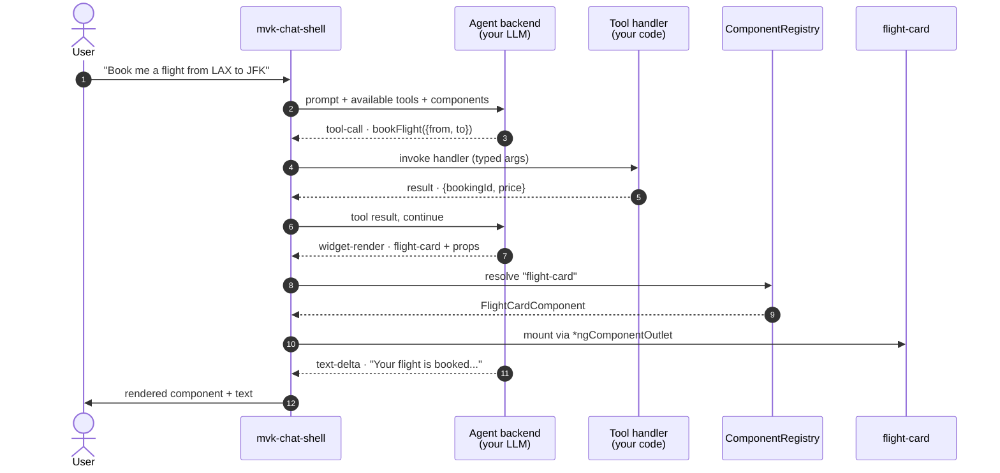

# @infra-tools/agentic-ui

[](https://github.com/sahassakhare/agentic-ui/actions/workflows/ci.yml)
[](https://www.npmjs.com/package/@infra-tools/agentic-ui)
[](https://angular.dev)
[](https://nodejs.org)
[](./LICENSE)

> **A library for building user interfaces an LLM can drive — a framework-agnostic core with a production Angular 21 binding.**
> One chat shell, one set of registries, one orchestration loop — works against AG-UI, Hashbrown, or A2UI without rewriting application code.[¹](#backend-support-matrix) **Angular is the only shipped UI binding today; React, Vue, and vanilla-web bindings are [planned](#framework-support).**


*Above (~13 second loop): live capture of the [eDiscovery flagship demo](./examples/demo-ediscovery-shell). User types "Add Sarah Chen as a custodian"; the orchestrator routes to the **collection** specialist; the `addCustodian` tool fires; the chat panel mounts an `app-custodian-card` widget — a real Angular component the LLM picked from the `ComponentRegistry`. Three federated MFE remotes contribute the 18 tools the agent can call. None of the flow is hard-coded in the app.*

> Need a static frame for slides or print? See [`docs/assets/agentic-ui-in-action.png`](./docs/assets/agentic-ui-in-action.png) — same scene, 2× retina PNG.

## Table of contents

- [What is an "agentic UI"?](#what-is-an-agentic-ui)
- [What this library does](#what-this-library-does)
- [Framework support](#framework-support)
- [Features](#features)
- [MCP surfaces](#mcp-surfaces)
- [Backend support matrix](#backend-support-matrix)
- [Installation](#installation)
- [Quick start](#quick-start)
- [Documentation](#documentation)
- [Development](#development)
- [Testing](#testing)
- [Compatibility](#compatibility)
- [License](#license)

Deeper reference lives in `docs/`: **[Architecture & problem statement](./docs/ARCHITECTURE.md)** · **[Use cases (27)](./docs/USE_CASES.md)** · **[Capability inventory](./docs/CAPABILITY_INVENTORY.md)** · **[Demo applications](./docs/DEMOS.md)** · **[Versioning & release](./docs/RELEASING.md)**.

## What is an "agentic UI"?

A regular chat app shows you text. An **agentic** chat app does more — it lets the LLM decide:

1. Which **tool** to call against your backend (`bookFlight`, `searchDocuments`, …) — with typed arguments validated by a Zod schema.
2. Which **UI component** to render in response — a `<flight-card>`, a `<search-results>` panel, a redacted-document preview — with typed props the LLM picks.
3. When to **stream more text**, when to **call another tool**, when to **stop**. Multi-turn orchestration the user never sees.



None of that flow is hard-coded in *your* application code. Tools are entries in a registry. Components are entries in a registry. The agent's choice of which one to call is a model decision the chat shell forwards.

## What this library does

It's the **plumbing between your app code and the agentic protocols**. You write tools and components; this library does the orchestration, transport translation, and federation handoff so the same code runs against three protocols — and against tools contributed by federated MFE remotes you didn't even know about at compile time.

```
┌──────────────────────────────────────────────────────────────────────┐
│  YOUR APP                                                            │
│    import { ChatShellComponent } from '@infra-tools/agentic-ui';        │  ← write once,
│    <mvk-chat-shell />        no fetch, no SSE parsing, no DOM glue   │    never rewrite
└─────────────────────────────────┬────────────────────────────────────┘
                                  │  one consistent interface
┌─────────────────────────────────▼────────────────────────────────────┐
│  @infra-tools/agentic-ui                                                │
│    · Chat shell + widget container + form renderer                   │  ← this library
│    · 18 registries (tool, component, action, form, trigger, …) all uniform │
│    · Orchestration loop · runUntilSettled · abort signals            │
└─────────────────────────────────┬────────────────────────────────────┘
                                  │  AgenticBackend abstraction
┌──────────┬──────────────────────▼───────────────────┬────────────────┐
│  AG-UI   │     Hashbrown    │     A2UI             │  Bring-your-own │  ← pluggable,
│  (SSE)   │     (frames)     │     (ui-action)      │  protocol       │    swap by config
└──────────┴──────────────────────────────────────────┴────────────────┘
                                  │
                                  │  loadRemoteCapabilities()
┌─────────────────────────────────▼────────────────────────────────────┐
│  FEDERATED MFE REMOTES                                                │
│   bookings remote          loyalty remote          tickets remote    │  ← contribute
│   bookFlight, flightCard   addPoints, pointsCard   etc.              │    at runtime
└──────────────────────────────────────────────────────────────────────┘
```

**Three concrete benefits:**

- **Vendor-agnostic.** AG-UI looks like the leader today; Hashbrown and A2UI are gaining traction. The library treats agent transports as pluggable adapters so you swap backends with a one-line config change, not a chat-shell rewrite.
- **Microfrontend native.** Multiple teams ship Angular remotes that contribute tools and widgets at runtime via Native Federation (or webpack Module Federation). The host's chat shell discovers them dynamically — no compile-time imports required. An MFE shipped today shows up in tomorrow's chat without redeploying the host.
- **Registry-uniform.** Eighteen registries — tools, components, actions, intents, forms, validation, persistence, layout, approval (F4), operation (F5), trigger (ADR-045), dashboard (ADR-044), playbook (post-chat-surfaces P5), … — share one `Registry<TDef>` shape. Same `register / list / signal / removeBySource` semantics. Same per-persona `setScopePolicy` filter. Add a new registry for your domain in ~30 LOC of base-class extension.

If you've ever shipped a chat box where rendering "the flight card" required a `switch` statement on an LLM-emitted string and a separate fetch chain, this library replaces all of that with one `<mvk-chat-shell />` and a typed registry.

> **For the full system architecture, the registry layer up close, the external-surface adapters, and the architect's problem statement (six axes of pain), see [docs/ARCHITECTURE.md](./docs/ARCHITECTURE.md). For the 27 supported use cases, see [docs/USE_CASES.md](./docs/USE_CASES.md); for the complete capability surface, [docs/CAPABILITY_INVENTORY.md](./docs/CAPABILITY_INVENTORY.md).**

## Framework support

The design separates a **framework-agnostic core** from the **UI binding** that renders it. The core is the canonical `AgenticEvent` / protocol contracts, the Zod schemas, and the backend adapters (AG-UI / Hashbrown / A2UI) — plain TypeScript with no framework dependency. The binding supplies the reactive registry layer, the chat shell, and the widgets for one UI framework.

**Today there is exactly one shipped binding: Angular 21.** React, Vue, and vanilla-web bindings are on the roadmap, unblocked by extracting the core into its own package.

| Layer | Package | Status |
|---|---|---|
| Framework-agnostic core — types, Zod schemas, protocol contracts, backend adapters, pure orchestration logic | folded into `@infra-tools/agentic-ui` today; extraction to `@infra-tools/agentic-core` is a pending [RFC](./docs/plans/agentic-core-split-plan.md) | ⏳ Planned (RFC) |
| **Angular 21 binding** — `<mvk-chat-shell>`, 18 registries, widgets, 13 schematics | `@infra-tools/agentic-ui` | ✅ **Production** |
| React binding | `@infra-tools/agentic-react` (proposed) | 🗺 Roadmap |
| Vue / vanilla-web bindings | proposed | 🗺 Roadmap |

The contracts are *already* framework-agnostic — a non-Angular backend can consume the type/schema surface today via `.d.ts` codegen. What's planned is (1) the formal [`agentic-core` split](./docs/plans/agentic-core-split-plan.md) so non-Angular adopters install a package that doesn't advertise Angular peer-deps, and (2) first-class React/Vue/vanilla bindings on top of it (the Angular binding's registry layer currently uses Angular signals; a React binding would reimplement that reactive layer on React primitives over the shared core). See the [Roadmap](./ROADMAP.md#framework-bindings--non-angular-support).

## Features

- **Pluggable agent backends.** A single `AgenticBackend` interface; ship adapters for AG-UI (`@ag-ui/client` HttpAgent + SSE), Hashbrown (`@hashbrownai/core` length-prefixed frames), and A2UI (`ui-action` event class routed through `ActionRegistry`). All three pass the `runConformance` harness per [ADR-048](./docs/adr/0048-backend-adapter-parity-contract.md). See the [Backend support matrix](#backend-support-matrix) for what's tested end-to-end vs adopter-supplied.
- **Layered registry system.** Eighteen registries grouped into Core, Extended, and Seam tiers, all sharing one `Registry<TDef>` shape — uniform `register / list / signal / removeBySource` semantics.
- **Generative UI.** Tool results carrying a `components: [{ name, props }]` field cause the chat shell to render registered Angular components by name through `*ngComponentOutlet`, with Zod-validated props.
- **MFE federation.** `defineCapabilityModule` packages a remote's tools and widgets; `loadRemoteCapabilities` (Native Federation) and `loadRemoteCapabilitiesMF` (webpack Module Federation) push them into the host's runtime registries. Remote discovery happens through a pluggable `MfeRegistrySource`.
- **Schematics.** Thirteen generators: `ng-add`, `tool`, `widget`, `chat-shell`, `backend`, `agent-server`, `mfe-capability`, `action`, `intent`, `form`, plus the post-chat-surfaces scaffolds `trigger`, `dashboard`, `playbook`. All snapshot-tested.
- **Post-chat surfaces (P0–P5).** The agent is reachable beyond the chat rail through 16 dispatch-agnostic widgets (workspace layout, ⌘K palette, smart cells, notification tray, inbox, dashboards, review queue, timeline, playbook runner, …). Every contribution federates through `defineCapabilityModule`; `removeBySource` reaps them on unload. **Try the live demo** at [ediscovery-shell.onrender.com](https://ediscovery-shell.onrender.com) — the [guided tour](./docs/cookbook/post-chat-surfaces-tour.md) walks through every pillar. See the [post-chat-surfaces plan](./docs/plans/post-chat-surfaces-plan.md).
- **MCP on three sides.** Expose your `ToolDef[]` **as** an MCP server (`@infra-tools/agentic-ui-mcp`) over stdio or modern **Streamable HTTP** for Claude Desktop / Cursor / Zed; render server-driven UI **in-app** with `<mvk-mcp-ui-resource>` — both the legacy MCP-UI convention and the **MCP Apps SEP-1865** (`text/html;profile=mcp-app` + a scope-gated `ui/*` JSON-RPC action channel); and expose the host's tools to an **in-page** agent via WebMCP. See [MCP surfaces](#mcp-surfaces).
- **Observability.** `AgenticTelemetrySink` emit points are baked into the orchestrator and registries from M1; the optional OpenTelemetry-backed sink ships with W3C trace context propagation across SSE.
- **Federation-safe single primary entry.** All public API exports through one entry point so Native Federation can share the runtime as a singleton across host and remote (see [ADR-005](./docs/adr/0005-single-primary-entry.md)). Tree-shaking is preserved by `"sideEffects": false`.
- **Platform integration in one provider.** `provideAgenticPlatform({...})` wires every catalog adapter through a single shared config: IAM persona resolver, federated MFE registry, capability registrar, capability authorizer, and usage metering. All opt-in per-feature. See [ADRs 031](./docs/adr/0031-provide-agentic-platform.md)–[034](./docs/adr/0034-catalog-usage-metering.md).

## MCP surfaces

The library touches the [Model Context Protocol](https://modelcontextprotocol.io) on three sides — all reusing the same `ToolDef` and the same `ToolRegistry` scope policy, so a tool authored once is exposable everywhere without forking:

| Side | Surface | What it does |
|---|---|---|
| **Outbound — MCP server** | `@infra-tools/agentic-ui-mcp` · `createMcpServer({ tools, uiResources, toolUi })` | Wraps any `ToolDef[]` as an MCP server. Transports: **stdio** (Claude Desktop / Cursor / Zed) and modern **Streamable HTTP** (MCP 2025-03-26 — single `/mcp` endpoint, stateful sessions), replacing the deprecated HTTP+SSE transport. Serves **MCP Apps (SEP-1865)** templates: predeclared `ui://` resources as `text/html;profile=mcp-app`, `_meta.ui.resourceUri` on tools, `structuredContent` on results. |
| **Inbound — server-driven UI** | `<mvk-mcp-ui-resource>` + `McpUiActionBridge` | Renders a UI resource in a sandboxed iframe. Speaks both the legacy MCP-UI convention (`text/html` + `{source:'mcp-ui'}` postMessage) **and the MCP Apps SEP-1865** (`text/html;profile=mcp-app` + the `ui/*` JSON-RPC-over-postMessage channel — `ui/initialize`, `tools/list`, `tools/call`, `ui/open-link` — scope-gated through the host's `ToolRegistry`). Component-tree resources render as native registered widgets. |
| **In-page — WebMCP** | `@infra-tools/agentic-ui-webmcp` | Exposes the host's `ToolRegistry` to an in-browser agent via the draft `navigator.modelContext` API, scope- + approval-gated. |

> The MCP Apps SEP support (inbound renderer + outbound server) and the Streamable HTTP transport landed in **v1.3.0** — see the [agentic-ui](./projects/agentic-ui/CHANGELOG.md) and [agentic-ui-mcp](./projects/agentic-ui-mcp/CHANGELOG.md) changelogs. Host-renderer maturity varies; see [docs/host-compatibility-analysis.md](./docs/host-compatibility-analysis.md).

## Backend support matrix

The library ships three protocol adapters. All three are **client-conformant** (pass `runConformance` per [ADR-048](./docs/adr/0048-backend-adapter-parity-contract.md)); operational maturity varies. Read this before picking which adapter to wire.

| | AG-UI | Hashbrown | A2UI |
|---|---|---|---|
| **Client adapter** (this lib) | ✓ production | ✓ production (since v1.2.2) | ✓ production (since v1.2.2) |
| Tools posted with full JSON-Schema | ✓ | ✓ | ✓ |
| `state` threaded ([ADR-013](./docs/adr/0013-run-state-provider.md)) | ✓ | ✓ | ✓ |
| Inbound events Zod-validated | ✓ | ✓ | ✓ |
| `ui-action` dispatcher attribution | n/a | n/a | ✓ |
| Conformance harness | passes | passes | passes |
| Reference server in `examples/` | ✓ [`demo-server`](./examples/demo-server) + [`demo-ediscovery-server`](./examples/demo-ediscovery-server) | ✓ [`demo-server`](./examples/demo-server) — real `@hashbrownai/core` frames (echo-based) | adopter-supplied (A2UI spec 0.x) |
| Real-LLM e2e tests | ✓ Gemini via [Playwright](./e2e/README.md) | none (echo reference server) | none |
| Deployed reference | ✓ [ediscovery-shell.onrender.com](https://ediscovery-shell.onrender.com) | none | none |
| Upstream spec stability | `@ag-ui/client` v0.0.52 (pinned) | `@hashbrownai/core` 0.4.x (optional peer dep) | spec 0.x (unsettled) |

**What this means in practice.** Wire-protocol fidelity is the same across all three; build and ship against any of them. AG-UI is the recommended default because the repo ships the full stack (host adapter + server + LLM-driven e2e tests + deployed demo). **Hashbrown is a real client of `@hashbrownai/core`** — it sends a `Chat.Api.CompletionCreateParams` request and decodes the SDK's length-prefixed frame stream. A2UI remains a correct client adapter waiting for an adopter to bring the server.

¹ Footnote from the headline pitch: *"works against AG-UI, Hashbrown, or A2UI without rewriting application code"* — the **application** (registries, widgets, tools, chat shell) is genuinely backend-agnostic. A2UI still needs an adopter-supplied **server**.

## Installation

```bash
npm install @infra-tools/agentic-ui
ng add @infra-tools/agentic-ui --backend=ag-ui
```

`ng add` patches `app.config.ts` with `provideAgenticUi()` plus the chosen backend provider, scaffolds `src/app/agentic/{tools,widgets}.ts`, and adds the required peer dependencies. Optional peers are flagged in `package.json` so consumers only install what they use.

| Peer | Required? | Used when |
|------|-----------|-----------|
| `@angular/common` `^21.2.0` | yes | always |
| `@angular/core` `^21.2.0` | yes | always |
| `rxjs` `~7.8.0` | yes | always |
| `zod` `^3.23.0` | yes | always |
| `@angular/forms` | optional | importing `<mvk-form-renderer>` |
| `@ag-ui/client` | optional | importing `provideAgUiBackend` |
| `@module-federation/runtime` | optional | webpack MF (`loadRemoteCapabilitiesMF`) |
| `@opentelemetry/api` | optional | OpenTelemetry telemetry sink |

## Quick start

The shortest end-to-end example: a single Angular app that streams LLM responses through the AG-UI adapter.

```ts
// src/app/app.config.ts
import { ApplicationConfig, provideZonelessChangeDetection } from '@angular/core';
import { provideAgenticUi, provideAgUiBackend } from '@infra-tools/agentic-ui';

export const appConfig: ApplicationConfig = {
  providers: [
    provideZonelessChangeDetection(),
    provideAgenticUi(),
    provideAgUiBackend({ url: 'http://localhost:4111/agents/gemini/run' }),
  ],
};
```

```ts
// src/app/app.ts
import { Component } from '@angular/core';
import { ChatShellComponent } from '@infra-tools/agentic-ui';

@Component({
  selector: 'app-root',
  imports: [ChatShellComponent],
  template: '<mvk-chat-shell />',
})
export class App {}
```

For tools, widgets, MFE federation, and the full step-by-step walkthrough that builds the federated demo, see the [User Guide](./docs/USER_GUIDE.md). To run the bundled reference apps, see [docs/DEMOS.md](./docs/DEMOS.md).

### Wire the catalog platform (optional)

Run a [Maverick catalog server](./platform/agentic-catalog-server/) and a single provider line gives the app live persona resolution, federated MFE discovery, automatic capability registration, catalog-driven capability authorization, and usage metering — all opt-in:

```ts
// src/app/app.config.ts
import { provideAgenticUi, provideAgenticPlatform } from '@infra-tools/agentic-ui';

export const appConfig: ApplicationConfig = {
  providers: [
    provideZonelessChangeDetection(),
    provideAgenticUi({ tools: [...], widgets: [...] }),
    provideAgenticPlatform({
      catalogUrl: 'https://catalog.example.com',
      tenantId: 'acme',
      getToken: () => oidc.getAccessToken(),
      personaResolver:      { defaultPersona: 'paralegal' },
      mfeRegistry:          { refreshIntervalMs: 30_000 },
      capabilityRegistrar:  {},   // auto-POST registered tools/widgets at boot
      capabilityAuthorizer: {},   // catalog 'disabled' toggles hide from registry
      usageMetering:        {},   // tool calls → POST /usage
    }),
  ],
};
```

Each feature switch is independently opt-in; the app stays embedded-first when none of them is set. See [ADRs 031–034](./docs/adr/) for the design rationale.

## Documentation

**Start here**

| Document | Contents |
|----------|----------|
| [Concepts & Taxonomy](./docs/CONCEPTS.md) | **Read first.** 7-layer taxonomy defining every primitive + decision matrices + glossary. |
| [Developer Guide](./docs/DEVELOPER_GUIDE.md) | **Step-by-step journey** from `ng add` to production: 19 sequenced steps, each with a working example + a "skip if…" clause. **Start here if you're building your own agentic UI.** |
| [Architecture](./docs/ARCHITECTURE.md) | System diagram, registry layer, external-surface adapters, and the architect's problem statement. |
| [Use cases](./docs/USE_CASES.md) | The 27 scenarios the library covers, with the library seam for each. |
| [Capability inventory](./docs/CAPABILITY_INVENTORY.md) | The complete public surface, tier by tier (what's exercised by the flagship vs opt-in). |
| [Demo applications](./docs/DEMOS.md) | The sixteen reference apps + copy-paste quick starts (single-process, multi-agent, federated). |
| [User Guide](./docs/USER_GUIDE.md) | 7-step walkthrough from clean clone to a working federated *demo*. |
| [Versioning & release](./docs/RELEASING.md) | The eleven published packages, publish workflow, tagging convention. |
| [Roadmap](./ROADMAP.md) | Researched extension recommendations + phased plan. |

**Cookbook & reference (selected)**

| Document | Contents |
|----------|----------|
| [API reference](https://sahassakhare.github.io/agentic-ui/) | Full TypeDoc-generated reference; rebuilt on every push to `main`. Locally: `npm run docs:api`. |
| [Quickstart](./docs/cookbook/quickstart.md) | Provider wiring in five minutes. |
| [Sample prompts](./docs/cookbook/sample-prompts.md) | Canonical prompts for every demo and feature — paste into the chat or use as a manual regression suite. |
| [Production deployment](./docs/cookbook/production-deployment.md) | `ThreadStateStore` (Redis / Postgres), rate-limiting, secrets, K8s probes — localhost → multi-pod. |
| [Federation at scale](./docs/cookbook/federation-at-scale.md) | Capability prefetch + per-turn tool filtering at 50+ remotes / 200+ tools. |
| [Expose your tools as an MCP server](./docs/cookbook/mcp-server.md) | Wrap any `ToolDef[]` with `createMcpServer({...})` for Claude Desktop / Cursor / Zed. |
| [Integrate into an existing Angular app](./docs/cookbook/integrate-into-existing-angular-app.md) | Install → tools/widgets → MFE federation → multi-agent orchestration. |
| [Schematics reference](./docs/cookbook/schematics.md) | The 13 generators — all options + common pipelines. |
| [Swap the backend](./docs/cookbook/swap-backend.md) | AG-UI ↔ Hashbrown ↔ A2UI; runtime selection via `BackendRegistry`. |
| [Observability](./docs/cookbook/observability.md) | `provideAgenticTelemetry` wiring; OpenTelemetry SDK integration. |
| [Platform seams](./docs/architecture/platform-seams.md) | The definitive map of every platform contract — **read first** if integrating or reviewing a PR. |
| [Registries vs. industry](./docs/architecture/registries-vs-industry.md) | Our 18 registries vs CopilotKit / LangChain / Vercel AI and VS Code / Backstage. |
| [CHANGELOG](./projects/agentic-ui/CHANGELOG.md) | Release notes. |

The full set of ADRs lives in [`docs/adr/`](./docs/adr/), cookbook entries in [`docs/cookbook/`](./docs/cookbook/), and program plans in [`docs/plans/`](./docs/plans/).

## Development

```bash
# install workspace dependencies
npm install

# build the library + schematics
npm run build:lib

# run the unit-test suite (Vitest via @angular/build:unit-test)
npx ng test agentic-ui --no-watch

# build a demo app
npx ng build demo-monolith            # development
npx ng build demo-monolith --configuration=production
```

The repository uses a Git pre-commit hook (`.githooks/pre-commit`, activated via `git config --local core.hooksPath .githooks`) that blocks commits containing `.env`-named files or strings matching common API-key signatures (Google, OpenAI/Anthropic, GitHub PATs, Slack tokens, PEM private keys).

## Testing

The npm-published packages cover **900+ unit tests** across the workspace, executed in seconds via Vitest. The runtime tier (`@infra-tools/agentic-ui`) carries the bulk — registry base + 18 concrete registries, the run orchestrator, federation symmetry, the cross-backend conformance suite, the post-chat-surface components, and snapshot tests for all 13 schematics. The sibling packages each carry their own focused suites (MCP server, Teams bot, Copilot skill, Copilot Studio connector, OPA authorizer).

GitHub Actions runs the full pipeline (build → test → three production demo builds → FESM size guard) on every push and pull request. See [`.github/workflows/ci.yml`](./.github/workflows/ci.yml). The eDiscovery flagship adds **25 Playwright tests across 11 specs** under [`e2e/`](./e2e/README.md) — including a post-chat-surfaces video walkthrough (no LLM required).

## Compatibility

| Tool | Version |
|------|---------|
| UI binding | Angular 21+ (only shipped binding today — see [Framework support](#framework-support)) |
| Node.js | ≥ 20.19 |
| TypeScript | 5.9+ |
| RxJS | 7.8.x (peer) |
| Zod | 3.23+ (peer) |
| `@modelcontextprotocol/sdk` | ^1.26.0 (used by `@infra-tools/agentic-ui-mcp`) |

## License

[Apache 2.0](./LICENSE)
