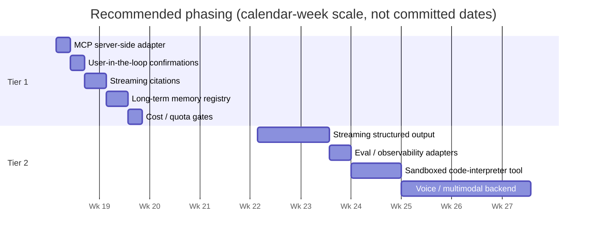

# Roadmap

This document captures **researched extension recommendations** and a
**phased implementation plan** for `@maverick/agentic-ui`. It draws on
the industry survey in
[`docs/architecture/registries-vs-industry.md`](./docs/architecture/registries-vs-industry.md)
and the trend analysis from early-2026 agentic-UI / agent-infrastructure
work.

> **Status disclaimer.** Items in Tier 1 and Tier 2 are *recommendations
> with effort estimates*, not committed work. Sequencing is a proposal,
> not a commitment. Tier 3 items are deliberately *not* on the
> short-term radar; they're listed so future revisits have context.

## Already shipped — production-grade today

These are the governance and scaling primitives the library has
already built; the roadmap below is what's *next*, not what's missing.

| Capability | Where | Notes |
|---|---|---|
| 13 registries on a uniform `Registry<TDef>` shape | `projects/agentic-ui/src/lib/registries/` | Tool, Component, Capability, Backend, MFE + Action, Intent, Form, DataSource + Validation, Persistence, Layout, SchemaTransformer |
| **Conflict resolution policies** | `RegistryBase.conflictPolicy` | `'replace' \| 'throw' \| 'first-wins' \| 'namespace'` |
| **Lifecycle hook** | `RegistryEntry.onDispose?` | Called from explicit disposer, `removeBySource`, and `'replace'` overrides; errors routed to telemetry |
| **Federation prefetch** | `prefetchCapabilities({ remote })` | Manifest-only registration without bundle load |
| **Per-turn tool filter** | `provideToolFilter()` + `keywordToolFilter()` | Identity by default; consumer plugs in keyword / embedding scoring |
| **Pluggable per-thread state** | `ThreadStateStore<TState>` + `InMemoryThreadStateStore` | Async-shaped contract; Redis / Postgres adapters sketched in cookbook |
| **MCP consumer-side bridge** | `mcpToolBridge({ client })` | Imports tools FROM an MCP server INTO `ToolRegistry` |
| **Telemetry sink** | `AgenticTelemetrySink` from M1 | OpenTelemetry adapter ships in the lib |
| **Multi-agent orchestrator (demo)** | `examples/demo-server/` | Sticky-by-thread, retry + keyword fallback, error surfacing |

## Roadmap at a glance



---

# Tier 1 — high leverage, low/medium effort (1–4 weeks)

## 1.1 — MCP server-side adapter

### Industry context

The Model Context Protocol is the de-facto interop layer for agentic
tools in early 2026: Claude Desktop, Cursor, Continue, Zed, Windsurf,
the upcoming Copilot MCP support — every IDE-class chat host consumes
MCP servers. Our library currently implements the **consumer** half
(`mcpToolBridge`) but not the **server** half — meaning tools written
against `@maverick/agentic-ui` are not exposable to those clients.

### Architecture fit

The registry-based design is purpose-built for this. Every `ToolDef`
already has the four fields MCP wants:

| `ToolDef` field | MCP `Tool` field |
|---|---|
| `name` | `name` |
| `description` | `description` |
| `schema` (Zod) | `inputSchema` (JSON Schema) — `zodToJsonSchema` already shipped |
| `handler(args, ctx)` | `tools/call` request handler |

### Proposed public API

New optional package: `@maverick/agentic-ui-mcp`. Reuses
`@modelcontextprotocol/sdk` as the wire-format implementation.

```ts
import { createMcpServer } from '@maverick/agentic-ui-mcp';
import { bookFlightTool, cancelFlightTool } from './tools';

const server = createMcpServer({
  name: 'maverick-bookings',
  version: '1.0.0',
  tools: [bookFlightTool, cancelFlightTool],
  // Optional: a hook called for each tools/call so the consumer can
  // attach auth / rate-limit / audit logging before the handler runs.
  beforeCall: async (callId, name, args) => { /* ... */ },
});

await server.start();   // stdio transport for Claude Desktop
// or: server.handleRequest(req) for HTTP/SSE deployments
```

Plus a "tool result shape" enhancement on `ToolDef`'s return value
(non-breaking, optional fields):

```ts
return {
  ...typedData,                                   // existing — every consumer sees this
  components: [{ name, props }],                  // existing — host's chat shell renders Angular widget
  markdown: '| From | To |\n|---|---|\n| LAX | JFK |',  // NEW — markdown hosts render this
  image_url: '...',                               // NEW — markdown hosts render inline image
};
```

### Effort

~2 days.
- Day 1: package scaffold, MCP `tools/list` + `tools/call` handler over the `ToolDef[]` array, error mapping, stdio transport.
- Day 2: HTTP/SSE transport variant, sample server in `examples/demo-mcp-server/`, cookbook entry, tests.

### Acceptance criteria

- A new minimal example app (`examples/demo-mcp-server/`) wraps the bookings/loyalty/support tools as an MCP server reachable on stdio.
- Mounting it in Claude Desktop's `claude_desktop_config.json` lets a user type "Book a flight from LAX to JFK on May 5" and see the booking handler execute against the demo's mock data.
- Cookbook entry walks through (a) authoring an MCP server from existing `ToolDef`s, (b) the multi-shape return convention.
- Snapshot tests cover: `tools/list` response shape, `tools/call` happy path, validation error path, MCP error format compliance.

### Risks

- MCP spec is still evolving. Pin `@modelcontextprotocol/sdk` and document the supported spec version. Add a compatibility note to the cookbook.
- Tool handlers may rely on Angular DI (`inject(SomeService)`); MCP server runs in pure Node. Design the adapter so handlers without DI dependencies (the common case) just work; document the pattern for handlers that need an injection context (use a captured injector or move the side-effecting call into a service).

### Why first

Highest distribution multiplier — every existing tool gains a new audience. Validates the registry-as-portable-capability pattern.

---

## 1.2 — User-in-the-loop confirmations

### Industry context

Permission gates for destructive tool calls — "Are you sure you want to send 500 emails?" — are mature production patterns. OpenAI Operator, Anthropic Computer Use, Devin, Cursor's agent mode all gate. Failure to gate is the most common cause of agent-driven incidents.

### Architecture fit

Single new optional field on `ToolDef`. Chat shell intercepts the tool-call event before invoking the handler.

### Proposed public API

```ts
agenticTool({
  name: 'cancelBooking',
  description: 'Cancel a booking by id (irreversible).',
  schema: z.object({ bookingId: z.string() }),
  handler: async ({ bookingId }) => { /* ... */ },

  // NEW — optional gate
  requiresConfirmation: true,
  // or function form, with access to args:
  // requiresConfirmation: ({ amount }) => amount > 1_000,
  confirmationPrompt: ({ bookingId }) =>
    `Cancel booking ${bookingId}? This cannot be undone.`,
});
```

The chat shell, on receiving a `TOOL_CALL_*` event for a tool with `requiresConfirmation` truthy, pauses the run, renders a confirmation card with `confirmationPrompt(args)`, waits for explicit approval, then resumes. New events: `TOOL_CALL_PENDING_CONFIRMATION`, `TOOL_CALL_CONFIRMED`, `TOOL_CALL_DENIED`.

### Effort

~2 days.

### Acceptance criteria

- A `dangerousTool` in `demo-feature-tour` triggers a confirm card before running.
- Chat shell renders a `<mvk-confirmation-card>` component (registered automatically; consumers can replace via `provideAgenticUi({ confirmationCard: MyCustomCard })`).
- Denial sends a synthetic tool result `{ status: 'denied', reason: '...' }` so the LLM can reason about the rejection.
- 4–5 unit tests on the gate logic, including the function-form case.

### Risks

- LLM may interpret denial as "try again with different args" and loop. Mitigation: include guidance in the synthetic denial result, and document a recommended system-prompt addition.

---

## 1.3 — Streaming citations

### Industry context

Anthropic's `citations` API plus Perplexity-style source bubbles have made citations a baseline expectation for any RAG-shaped agent. Trust signal users now expect.

### Proposed public API

```ts
// Tool result shape (additive)
return {
  answer: 'The cheapest direct flight is $342.',
  citations: [
    { id: 'c1', source: 'flights-api', title: 'LAX→JFK 2026-05-05', url: '...', span: [12, 18] },
  ],
};

// New event class
type AgenticEvent =
  | { type: 'citation-attached'; messageId: string; citationId: string; range: [number, number]; meta: CitationMeta }
  | /* existing events */;
```

A new `<mvk-citation-ref>` standalone component is registered automatically; the chat-shell text renderer slots citation refs into the streaming markdown at the indicated ranges. Click reveals source.

### Effort

~3 days. Most of the work is the streaming-aware text renderer that splices citation markers into partial text deltas.

### Acceptance criteria

- A `searchKnowledgeBase` tool in `demo-feature-tour` returns citations alongside its answer.
- Streaming text renders inline citation chips that resolve on hover/click.
- Conformance suite gains a citation-streaming case.

### Risks

- Citation ranges over streaming text are tricky — the chat shell may not yet have rendered position N when an event references it. Buffer + replay strategy needed.

---

## 1.4 — Long-term memory registry

### Industry context

Mem0, Letta (formerly MemGPT), Zep — semantic memory across conversations is the second-biggest feature gap consumers notice ("why doesn't it remember I'm vegetarian?"). This is becoming an assumed capability in consumer-grade agents.

### Proposed public API

A 14th registry, same `RegistryBase` shape:

```ts
export interface MemoryDef extends RegistryEntry {
  readonly recall: (query: string, ctx: { threadId: string; userId?: string; limit?: number }) => Promise<readonly MemoryHit[]>;
  readonly remember: (fact: string, ctx: { threadId: string; userId?: string; tags?: readonly string[] }) => Promise<void>;
}

provideAgenticUi({
  // ...
  memory: mem0Memory({ apiKey: '...' }),  // or lettaMemory({ ... }) or sqliteVecMemory()
});
```

Tool handlers `inject(MemoryRegistry).get('default').recall(query)` instead of inlining vector-search code.

### Effort

~3 days for the seam + one adapter (Mem0 or sqlite-vec).

### Acceptance criteria

- New `MemoryRegistry` in core, with one bundled adapter.
- `demo-feature-tour` adds a `rememberPreference` and `recallPreferences` tool.
- Cookbook entry on memory architectures.

### Risks

- Memory privacy / consent — adding memory makes the app more powerful and more dangerous. Document the consent model loudly.

---

## 1.5 — Cost / quota gates

### Industry context

Per-user / per-tenant budget caps and model routing (Haiku for simple, Opus for hard) are standard production practice. Unbounded LLM spend is a real outage class.

### Proposed public API

```ts
// Server-side, on the route handler:
import { rateLimit, costGate } from '@maverick/agentic-ui-server/guards';

app.post('/agents/:id/run',
  costGate({
    perThread: { tokens: 100_000, perDay: true },
    perUser: { usd: 5, perDay: true },
    onDeny: async (ctx) => ({ status: 429, body: { error: 'budget exceeded' } }),
  }),
  agUiRouteHandler({ resolver }),
);

// Client-side, on the chat shell:
provideTokenBudget({
  perTurn: 4000,    // cap context size sent to backend
  // optional: switch model based on remaining budget
  modelSelector: ({ remaining }) => remaining > 1000 ? 'gemini-3-pro' : 'gemini-3-flash',
});
```

### Effort

~2 days. The server-side guard is simple middleware; the client-side selector ties into existing `BackendRegistry`.

### Acceptance criteria

- Cookbook entry showing a single demo with budget caps.
- Telemetry events: `agentic.budget.exceeded`, `agentic.budget.warning`.

### Risks

- Mostly a UX puzzle — what does the chat show when a budget is exhausted? Three options (silent throttle, visible warning, hard stop) all valid; document tradeoffs.

---

# Tier 2 — high leverage, larger effort (next quarter)

## 2.1 — Streaming structured output

Vercel AI SDK's `streamObject`, OpenAI's `response_format: json_schema`. The LLM streams partial JSON that incrementally fills a typed shape. Pairs with our generative-UI: a `flightCard` widget streams in field-by-field rather than appearing all at once.

**Public API direction**: new event class `STRUCTURED_DELTA` carrying partial JSON, validated against the widget's `propsSchema` at each step. Backend adapters opt-in. Chat shell's signal-driven binding makes streaming-to-render natural.

**Effort**: ~1–2 weeks. **Risk**: partial-JSON parsing across streamed chunks is fiddly — needs a tolerant parser (jsonrepair-class) or upstream `parsePartialJson` integration.

## 2.2 — Eval / observability adapters

Braintrust, Langfuse, Phoenix, LangSmith. We have `AgenticTelemetrySink` and structured spans; the work is **adapters**.

**Public API direction**: `provideAgenticEvals({ exporter: 'braintrust' | 'langfuse', apiKey, dataset })`. Each tool call already has the right span shape; adapter maps to the target product's schema.

**Effort**: ~3 days per adapter. **Risk**: each product has its own conventions; pick one to start (Langfuse is open-source-friendly), evaluate adoption, add others.

## 2.3 — Sandboxed code-interpreter tool

E2B, Modal, Riza — agents that run arbitrary Python/Node/Bash in a sandbox. Single most popular tool in production agentic systems (Devin, Cursor, ChatGPT's interpreter all have one).

**Public API direction**: `agenticCodeInterpreter({ runtime: 'python' | 'node', sandbox: e2bSandbox({ apiKey }) })` returns a `ToolDef`. Plus a `codeBlockResult` widget for renders.

**Effort**: ~1 week including a working E2B adapter. **Risk**: sandbox cost (E2B charges per minute); document.

## 2.4 — Voice / multimodal backend

OpenAI Realtime API, Gemini Live. Bidirectional audio + video in the same chat session.

**Public API direction**: Major new event types (`AUDIO_DELTA`, `VIDEO_DELTA`); a `<mvk-voice-pane>` companion to `<mvk-chat-shell>`; new backend adapters that negotiate WebRTC or WebSockets, not just SSE. Probably a new top-level `provideAgenticVoice({ url, mode: 'realtime' })`.

**Effort**: ~3–4 weeks for a working voice path. **Risk**: protocol shape diverges from AG-UI's text-stream assumption; this is a new backend, not an evolution of AG-UI.

---

# Tier 3 — wait-and-see (don't commit yet)

| Trend | Why deferred |
|---|---|
| **Google's A2A protocol** | Real spec but ecosystem thin. Wait for adoption signal. Our orchestrator + specialist pattern already does multi-agent. |
| **Computer use / browser automation** | Powerful but narrow audience. Better fit as a tool a consumer registers from `playwright-mcp` than something we ship. |
| **Speculative tool execution** (Vercel-experimental) | Correctness story unsettled. |
| **Persistent agent identity / handoffs** (OpenAI Agents SDK `handoff()`) | Our orchestrator pattern covers most of this. Revisit when consumers ask. |
| **Workflow engines as agent runtime** (Mastra, Inngest, Temporal) | Adjacent to the library — better as an *integration* than something we own. |

---

# Sequencing rationale

Tier 1 is ordered to maximise *visible polish per effort*, with the load-bearing item first:

1. **MCP server (#1.1)** — distribution multiplier. Until shipped, the library is "for Angular apps." After: every existing tool reaches every IDE-class chat host. Highest leverage by a wide margin.
2. **User-in-the-loop confirmations (#1.2)** — cheapest, prevents the worst class of agent mistake, demoable.
3. **Streaming citations (#1.3)** — visible polish; pairs naturally with a hypothetical RAG demo.
4. **Long-term memory (#1.4)** — visibly improves agents on the *second* turn ("it remembered me"). Ship after #1.3 so the demo has both citation + memory together.
5. **Cost / quota gates (#1.5)** — operational safety, less visible. Ship before any production rollout.

Tier 2 is **less time-pressured** — these are bigger swings. Sequence depends on consumer signal:

- **Streaming structured output (#2.1)** if a consumer ships a complex widget that benefits from progressive rendering.
- **Eval adapters (#2.2)** if a consumer is building a regression suite.
- **Code interpreter (#2.3)** if a consumer is building an analyst-class agent.
- **Voice (#2.4)** if a consumer is building a customer-support or accessibility-focused product.

# Cross-references

- [`docs/architecture/registries-vs-industry.md`](./docs/architecture/registries-vs-industry.md) — the source analysis for the governance gaps already shipped (conflict policy, onDispose) and for the remaining ones (scopes, versioning, activation events, health probes — Tier 1.6+ candidates if any consumer asks).
- [ADR-001](./docs/adr/0001-agentic-backend-abstraction.md), [ADR-002](./docs/adr/0002-layered-registry-system.md), [ADR-003](./docs/adr/0003-pluggable-mfe-registry-source.md), [ADR-005](./docs/adr/0005-single-primary-entry.md) — the architecture decisions every Tier 1/2 item is bounded by.
- [`docs/cookbook/`](./docs/cookbook/) — every shipped feature gets a cookbook entry; expect the same for each Tier 1 item.
- [`projects/agentic-ui/CHANGELOG.md`](./projects/agentic-ui/CHANGELOG.md) and [`projects/agentic-ui-server/CHANGELOG.md`](./projects/agentic-ui-server/CHANGELOG.md) — the [Unreleased] section at any given moment is the diff between this roadmap and what's been delivered.

# How to pick this up

If a contributor (or future-Claude) wants to start one of these:

1. Read the linked industry source for the trend.
2. Sketch the public API in a short ADR-style proposal under `docs/adr/`.
3. Open a PR with the API + tests + cookbook entry first; implementation second.
4. Update this `ROADMAP.md` with status (`In progress` / `Shipped — see CHANGELOG`).

The architecture is intentionally additive: every Tier 1 and Tier 2 item lands either as a **new optional registry/provider** (memory, budget, eval) or as **new opt-in fields on existing registry shapes** (`requiresConfirmation`, `citations` on tool results). None of them require breaking changes to the v1 surface.
