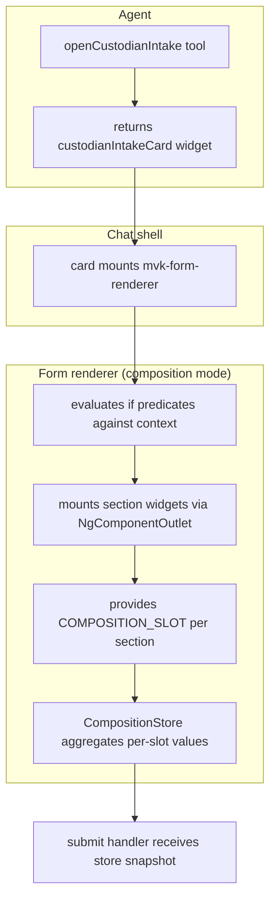

# Composable intake form (Capability F1)

A form composed at runtime from registered widgets, with sections that
appear and disappear based on persona, matter type, and partial form
values — and inline drop / keep prompts when context changes would
discard user-entered data. Capability F1 of the
[r3 dynamic-UI plan](../plans/ediscovery-dynamic-ui-plan.md#91-capability-f1--composable-intake-form-widgets--form).

> If you only read one page about runtime form composition, this is the
> one for product engineers wiring AI-driven flows. The plan's §9.1 is
> the contract; this is how you actually use it.

## Why this matters

Static forms force the same shape on every user, every matter, every
context. The intake form for a Finance custodian on a securities
matter — where regulatory consent is mandatory and the accounting-system
picker is load-bearing — is a different form from the intake for an
Engineering custodian on a routine employment matter. Building
N hard-coded forms doesn't scale; gating fields with `*ngIf` inside one
monolithic form doesn't either.

F1 lets the **agent compose the form at runtime** from a small library
of registered section widgets. Each section knows how to render itself
and (optionally) opt into a renderer-scoped store so its values survive
section unmount when persona or matter type changes.



## What you'll build

A `custodianIntake` form with four section widgets:

- **Identity** — always shown.
- **Compliance disclosure** — only when `matter.type === 'securities'`.
- **Supervisor sign-off** — only when `persona !== 'lead-counsel'`.
- **Accounting systems** — only when `department === 'Finance'`.

Switching persona toggles the supervisor section live; switching matter
type toggles the compliance section. If the user has filled the
compliance checkbox and then switches off securities, the renderer
shows an inline banner asking whether to drop the value or keep the
section visible.

The full working version ships in the eDiscovery flagship —
[`examples/demo-ediscovery-shell`](../../examples/demo-ediscovery-shell/src/app/agentic).

## Step 1 — register section widgets

Each section is an ordinary standalone component plus an
`agenticWidget` registration. No special base class, no decorator
metadata.

```ts
// examples/demo-ediscovery-shell/src/app/agentic/intake-sections.component.ts
import { Component, computed, inject } from '@angular/core';
import { COMPOSITION_SLOT, CompositionStore } from '@maverick/agentic-ui';

interface IdentityValue { name: string; email: string; department: string; }
const EMPTY: IdentityValue = { name: '', email: '', department: '' };

@Component({
  selector: 'app-intake-identity',
  imports: [FormsModule],
  template: `
    <label>Full name
      <input type="text" [ngModel]="value().name"
             (ngModelChange)="patch({ name: $event })" name="name" />
    </label>
    <label>Work email
      <input type="email" [ngModel]="value().email"
             (ngModelChange)="patch({ email: $event })" name="email" />
    </label>
    <label>Department
      <input type="text" [ngModel]="value().department"
             (ngModelChange)="patch({ department: $event })" name="department" />
    </label>
  `,
})
export class IntakeIdentityComponent {
  private readonly slot = inject(COMPOSITION_SLOT, { optional: true });
  private readonly store = inject(CompositionStore, { optional: true });

  protected readonly value = computed<IdentityValue>(() => {
    if (!this.store || !this.slot) return EMPTY;
    return (this.store.values()[this.slot] as IdentityValue) ?? EMPTY;
  });

  protected patch(part: Partial<IdentityValue>): void {
    if (!this.store || !this.slot) return;
    this.store.write(this.slot, { ...this.value(), ...part });
  }
}
```

The widget reads its **slot key** from `COMPOSITION_SLOT` (provided by
the renderer per section) and reads/writes through the renderer-scoped
`CompositionStore`. **State lives in the store, not the component.** When
the renderer unmounts a section because its predicate flipped false,
state survives — and re-mounts pick up where they left off.

Both injections are `{ optional: true }`. A widget that ignores the
contract (no opinions about composition) just doesn't inject these and
renders standalone state. The `slot` token is delivered via a per-section
child injector — there's no public `Input` to declare.

Register the widget like any other component:

```ts
// examples/demo-ediscovery-shell/src/app/agentic/agentic.ts
import { agenticWidget, type ComponentDef } from '@maverick/agentic-ui';
import { IntakeIdentityComponent, /* ... */ } from './intake-sections.component';

export const widgets: ComponentDef[] = [
  // ...
  agenticWidget({
    name: 'intake-identity-fields',
    component: IntakeIdentityComponent,
    propsSchema: z.object({}),
  }),
  // three more — regulatory consent, supervisor picker, accounting systems
];
```

## Step 2 — declare the composition

Switch the form from `fieldsSchema` to `composition`. The factory
parses every `if` expression at registration time and rejects bad
input before the UI mounts.

```ts
import { agenticForm, FormRegistry, type FormDef } from '@maverick/agentic-ui';

env.get(FormRegistry).register(
  agenticForm({
    name: 'custodianIntakeForm',
    description: 'Onboard a custodian — composed at runtime.',
    composition: [
      { widget: 'intake-identity-fields',     section: 'Identity' },
      { widget: 'intake-regulatory-consent',  section: 'Compliance', if: 'matter.type === "securities"' },
      { widget: 'intake-supervisor-picker',   section: 'Approval',   if: 'persona !== "lead-counsel"' },
      { widget: 'intake-accounting-systems',  section: 'Discovery',  if: 'department === "Finance"' },
    ],
    submit: async (values) => {
      // values is a Record<slotName, slotValue>
      const id = (values['intake-identity-fields'] ?? {}) as IdentityValue;
      const ack = Boolean(values['intake-regulatory-consent']);
      const supervisor = (values['intake-supervisor-picker'] as string) ?? '';
      const systems = (values['intake-accounting-systems'] as readonly string[]) ?? [];
      // ... persist whatever shape your domain wants
    },
  }) as FormDef,
);
```

The `if` expression DSL is intentionally narrow:

- Operators: `===`, `!==`, `&&`, `||`.
- Dotted property access (`matter.type`, `matter.metadata.priority`).
- Parentheses for grouping.
- String, number, boolean literals.
- **No** function calls, no regex, no arithmetic, no `null`/`undefined`,
  no chained equality, no other comparison operators.

Path resolution is **own-property-only**, so `matter.__proto__.toString`
or `matter.constructor` evaluate to `undefined` — prototype walks are
not a covert escalation route.

If the closed AST cannot express your condition, replace `if` with the
`predicate` escape hatch:

```ts
{
  widget: 'something-bespoke',
  predicate: (ctx) =>
    typeof ctx['amount'] === 'number' && ctx['amount'] > 10_000,
}
```

`if` and `predicate` are mutually exclusive — passing both throws a
`FormCompositionError` at registration.

## Step 3 — surface the form via a tool

The agent emits a generative-UI widget that mounts `<mvk-form-renderer>`
with the right context. Two pieces — the wrapper widget, then a tool
that returns it.

```ts
// examples/demo-ediscovery-shell/src/app/agentic/custodian-intake-card.component.ts
import { Component, computed, input } from '@angular/core';
import { FormRendererComponent } from '@maverick/agentic-ui';

@Component({
  selector: 'app-custodian-intake-card',
  imports: [FormRendererComponent],
  template: `
    <article class="card">
      <header><strong>Onboard custodian</strong></header>
      <mvk-form-renderer formName="custodianIntakeForm" [context]="ctx()" />
    </article>
  `,
})
export class CustodianIntakeCardComponent {
  readonly matterType = input.required<string>();
  readonly persona = input.required<string>();
  readonly department = input<string>('');

  protected readonly ctx = computed(() => ({
    matter: { type: this.matterType() },
    persona: this.persona(),
    department: this.department(),
  }));
}
```

```ts
// examples/demo-ediscovery-shell/src/app/agentic/agentic.ts
function openCustodianIntakeTool(env: EnvironmentInjector) {
  return agenticTool({
    name: 'openCustodianIntake',
    description: 'Open the runtime-composed custodian intake form.',
    schema: z.object({
      department: z.string().optional(),
      matterType: z.string().optional(),
    }),
    handler: async ({ department, matterType }) => runInInjectionContext(env, () => ({
      components: [{
        name: 'custodianIntakeCard',
        props: {
          matterType: matterType ?? 'securities',
          persona: env.get(PersonaService).active(),
          department: department ?? '',
        },
      }],
      markdown: 'Opening custodian intake.',
    })),
  });
}
```

The agent now recognises requests like *"onboard a custodian from the
Finance team"* and emits the card with the right context.

## Step 4 — let the user toggle context

The renderer's `[context]` input is reactive. Anywhere your shell pushes
`matter`, `persona`, or `department` into the card's inputs, the
renderer re-evaluates `if` predicates and toggles sections (AC-F1-1).

In the eDiscovery demo, the persona dropdown in the header drives
`PersonaService.active()`. Because `CustodianIntakeCardComponent`
re-derives `ctx` from the active persona, switching personas mid-form
makes the supervisor section appear (paralegal) or disappear
(lead-counsel) without remounting the form.

## AC-F1-2 — preservation, drop, keep

Composition would be a footgun if a user typed into the supervisor
field, switched persona to lead-counsel, and silently lost the value.
The renderer interrupts that path:

- Each section's predicate is tracked across context changes.
- When a predicate flips **visible → hidden** and the slot's value is
  **dirty** (per the `CompositionStore.isDirty` rules), the renderer
  *keeps the section mounted* and shows an inline banner:

  > This section no longer applies in the new context. Drop your
  > entries, or keep the section visible? **[Drop values] [Keep visible]**

- **Drop values** → `store.drop(slot)`, the prompt clears, and the
  section unmounts on the next pass (predicate is still false).
- **Keep visible** → the slot is added to a `keepOverrides` set; the
  section stays visible with a small hint until the predicate goes
  true again, at which point the override clears and normal operation
  resumes.

When the predicate flips on a **clean** slot, the section unmounts
silently — no prompt.

`isDirty` rules per primitive:

| Value | Verdict |
|---|---|
| `undefined`, `null` | clean |
| `''` (empty string) | clean |
| `false` (boolean) | clean — matches checkbox "default" expectations |
| `0`, `NaN` (numbers) | dirty — these are real values |
| `[]`, `{}`, `Set(0)`, `Map(0)` | clean |
| Anything else | dirty |

Override `isDirty`'s default by *not* writing falsy values to the store
in your widget. A well-behaved widget calls `store.drop(slot)` when the
user clears it back to default, rather than writing the empty value.

## Submit aggregation

In composition mode, `def.submit` receives the full snapshot keyed by
slot name:

```ts
submit: async (values) => {
  // values is Readonly<Record<slotName, slotValue>>
  const identity = values['intake-identity-fields'] as IdentityValue;
  // ...
}
```

Schema validation via `ValidationRegistry` is **not run** for
composition forms — each widget owns its own propsSchema and validates
its own input. If you want cross-section validation, run it inside
`submit` before persisting.

## Authoring-error surfacing

`agenticForm({ composition: [...] })` validates every entry at
registration:

- Each entry must have a `widget: string` matching a registered
  widget name.
- `if` and `predicate` are mutually exclusive.
- Empty composition arrays are rejected.
- Duplicate widgets within the same composition are rejected.
- `if` expressions are parsed; bad DSL throws
  `FormCompositionError` whose `cause` is a
  `CompositionExpressionError` carrying the source string and the
  offending position.

Surface these errors at boot time:

```ts
import { FormCompositionError } from '@maverick/agentic-ui';

try {
  registerForms(env);
} catch (e) {
  if (e instanceof FormCompositionError) {
    console.error(`[boot] form ${e.formName} entry ${e.entryIndex}:`, e.message);
    console.error('[boot]', e.cause);
    process.exit(1);
  }
  throw e;
}
```

This keeps malformed `if` expressions from escaping into a runtime
"section silently doesn't render" failure mode.

## Debugging

- **Section never appears.** Check that the widget name in the
  composition entry matches a widget name in `ComponentRegistry`. The
  renderer renders an "Unknown widget: …" placeholder when the lookup
  misses.
- **Predicate doesn't fire.** Log `ctx` from the wrapper component and
  check the keys against the `if` expression. Missing top-level keys
  resolve to `undefined`; `undefined === 'X'` is always `false`.
- **Values lost across persona switch.** The widget isn't using the
  store. Confirm `inject(COMPOSITION_SLOT, { optional: true })` is
  non-null (the renderer always provides it in composition mode) and
  that writes use `store.write(this.slot, ...)`, not local state.
- **Banner won't go away.** The user clicked Keep, so the slot is in
  `keepOverrides`. It clears automatically when the predicate goes
  true again. To force-clear, drop the slot value.
- **Submit handler receives `{}`.** Either no widgets wrote to the
  store, or every visible widget is a non-store widget. Migrate them
  to the store contract per Step 1.

## Production patterns

- **Per-form scope.** `CompositionStore` is provided in
  `<mvk-form-renderer>`'s `providers: [CompositionStore]`, so each
  renderer instance has its own store. Two `<mvk-form-renderer>`s on
  the same page do not share state.
- **Form switch resets state.** Changing `formName` on the same
  renderer clears the store, drops pending prompts and keep-overrides,
  and resets the cached per-slot injectors. Slot keys are
  form-scoped — they mean different things in different forms.
- **Scope policy.** Composition entries reference widget names. The
  renderer looks them up via `ComponentRegistry.get`, which honours
  the existing `setScopePolicy` filter. A widget hidden by persona
  scope renders the "Unknown widget: …" placeholder — so set
  `RegistryEntry.scopes` on widgets that should be off-limits to
  some personas, then handle the placeholder explicitly in your
  composition design (typically by gating the entry behind a
  matching `if` clause).
- **Audit chain integration.** Submit handler is a normal async
  function; call your audit-append primitive there. The renderer
  doesn't write to the audit chain itself; the form is the same
  surface as a tool from the audit perspective.

## Related cookbook entries

- [MCP server for analyst workstations](./paralegal-mcp-review.md) —
  the "tool defined once, surfaced twice" pattern that this entry's
  `openCustodianIntake` tool inherits from.
- [Production deployment](./production-deployment.md) —
  `PersistenceRegistry` swap if you need composition state to outlive
  the renderer instance.
- [Federate an MFE](./federate-an-mfe.md) — section widgets work the
  same when contributed by an MFE remote; the renderer looks them up
  through `ComponentRegistry` either way.

## See also

- [Plan, Capability F1](../plans/ediscovery-dynamic-ui-plan.md#91-capability-f1--composable-intake-form-widgets--form) —
  acceptance criteria, NFR targets, threat model row.
- [`composition-expression.ts`](../../projects/agentic-ui/src/lib/composition/composition-expression.ts) —
  closed-AST expression parser; 74 unit tests in the sibling spec.
- [`composition-store.ts`](../../projects/agentic-ui/src/lib/composition/composition-store.ts) —
  store API + `COMPOSITION_SLOT` token.
- [`form-renderer.component.ts`](../../projects/agentic-ui/src/lib/components/form-renderer.component.ts) —
  composition branch + drop/keep banner.
- The eDiscovery flagship's working composition:
  [`agentic.ts`](../../examples/demo-ediscovery-shell/src/app/agentic/agentic.ts),
  [`intake-sections.component.ts`](../../examples/demo-ediscovery-shell/src/app/agentic/intake-sections.component.ts),
  [`custodian-intake-card.component.ts`](../../examples/demo-ediscovery-shell/src/app/agentic/custodian-intake-card.component.ts).
