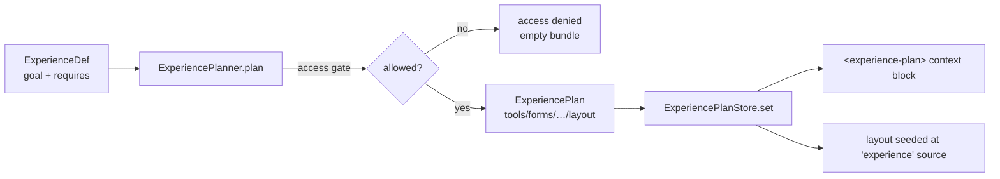

# Compose an Experience (AEP Seams A–F)

> **Status:** ships with the Agentic Experience Platform (AEP) · **Plan:** [agentic-experience-platform-plan.md](../plans/agentic-experience-platform-plan.md) · **ADR:** [051](../adr/0051-agentic-experience-platform.md) · **Seams:** A (capability graph) · B (new registries) · C (Experience registry) · D (planner) · E (studio) · F (catalog API)

An **Experience** is a business intent — *"Create Legal Matter"* — decoupled
from the capabilities that satisfy it. You declare the *goal* and the
*requirements*; the **Experience Planner** resolves them into a concrete bundle
(tools, forms, components, a layout, prompts, skills, knowledge, memory) at
runtime, gated by who's asking. The agent then *personalizes and streams* that
plan rather than re-deriving scope from scratch.

The flow is **goal → plan → render**:



This page is the **code** way to compose an Experience. The no-code way is the
[`agentic-experience-studio`](../../platform/agentic-experience-studio/README.md)
app (Seam E), where business users author, preview the dependency graph, plan,
and approve Experiences against the same catalog API. Both produce the same
`ExperienceDef` shape.

## What you'll build

A `legalIntake` Experience whose goal is *"Create Legal Matter"*. It requires a
conflict-check tool, a customer-search form, and an intake prompt — each a
first-class registered capability with its own `requires`/`produces` edges. You
plan it for a user, watch the access gate deny an unauthorized persona, feed the
plan into the runtime, then walk it through the `draft → review → approved`
approval workflow.

Everything below uses the **real shipped APIs** from
[`lib/experience`](../../projects/agentic-ui/src/lib/experience) and
[`lib/registries`](../../projects/agentic-ui/src/lib/registries) — all exported
from `@infra-tools/agentic-ui`.

## Step 1 — register the building-block capabilities

An Experience resolves against whatever is already in the registries. Register
your building blocks through their validating `agentic*` factories, and wire the
dependency edges with `requires` (what it needs) and `produces` (what it emits).
These edges are [Seam A](../../projects/agentic-ui/src/lib/registries/capability-graph.ts) —
the substrate the planner traverses.

```ts
import {
  agenticTool, agenticForm, agenticPrompt,
  ToolRegistry, FormRegistry, PromptRegistry,
} from '@infra-tools/agentic-ui';
import { inject } from '@angular/core';
import { z } from 'zod';

// A tool that needs the customer entity data source and produces a status.
inject(ToolRegistry).register(
  agenticTool({
    name: 'conflictCheck',
    description: 'Screen the parties for conflicts of interest.',
    schema: z.object({ parties: z.array(z.string()) }),
    handler: async ({ parties }) => ({ cleared: parties.length > 0 }),
    requires: [{ kind: 'dataSource', name: 'customerEntity', reason: 'look up parties' }],
    produces: ['conflict-status'],
  }),
);

// A form the intake experience surfaces.
inject(FormRegistry).register(
  agenticForm({
    name: 'customerSearch',
    description: 'Find or create the client of record.',
    fieldsSchema: z.object({ query: z.string() }),
    submit: async () => {},
    produces: ['customer-entity'],
  }),
);

// A reusable prompt (PromptRegistry is one of the six new Seam-B registries).
inject(PromptRegistry).register(
  agenticPrompt({
    name: 'intakeGuidance',
    template: 'Guide the user through opening matter "{{matterName}}". Run conflictCheck first.',
    variables: ['matterName'],
  }),
);
```

Each factory validates its def at author time (`AgenticCapabilityError`,
`AgenticExperienceError`) so a malformed capability fails loudly at boot instead
of surfacing as a `TypeError` deep in the planner. Raw `registry.register({...})`
still works — the factories are the sanctioned path for authored/federated
content.

The other new Seam-B registries follow the same pattern: `SkillRegistry` +
`agenticSkill({ name, description, tools, prompt? })`, `KnowledgeRegistry` +
`agenticKnowledge`, `MemoryRegistry` + `agenticMemory`, `WorkflowRegistry`, and
`NavigationRegistry` + `agenticNavigation`. A **skill** is special: the planner
expands each resolved skill into its bundled `tools` so the per-turn tool filter
covers everything the skill needs.

## Step 2 — define the Experience

`agenticExperience(def)` is the validating factory for an
[`ExperienceDef`](../../projects/agentic-ui/src/lib/experience/experience-registry.ts).
It throws `AgenticExperienceError` on an empty goal, a self-referential
requirement, or a requirement that sets neither `name` nor `tag`.

```ts
import { agenticExperience, ExperienceRegistry } from '@infra-tools/agentic-ui';

inject(ExperienceRegistry).register(
  agenticExperience({
    name: 'legalIntake',
    title: 'Legal Intake',
    goal: 'Create Legal Matter',
    intents: ['open a new matter', 'start intake'],
    requires: [
      { kind: 'tool', name: 'conflictCheck', reason: 'clear parties before opening' },
      { kind: 'form', name: 'customerSearch', reason: 'identify the client' },
      { kind: 'prompt', name: 'intakeGuidance' },
      // Late-binding by tag: any approved summariser satisfies this.
      { kind: 'tool', tag: 'summariser', optional: true },
    ],
    personas: ['lead-counsel', 'paralegal'],
    requiredPermissions: ['matter:create'],
    defaultLayout: 'legal-intake-layout',     // an approved LayoutTemplateRegistry entry
    approvalState: 'draft',                    // defaults to 'draft'
  }),
);
```

Because `ExperienceDef extends RegistryEntry`, an Experience is itself a
first-class capability: it participates in the dependency graph, is
persona-scopable via `setScopePolicy`, and is federation-symmetric via
`removeBySource` (an MFE that contributes Experiences has them stripped cleanly
on unload).

A requirement selects a target **by exact `name`** (one pinned implementation)
or **by `tag`** (late binding — any capability of that `kind` carrying the tag
satisfies it, possibly resolving to several). Set `name` XOR `tag`. Mark a
requirement `optional: true` to report an unmet gap without blocking the plan.

## Step 3 — wire the platform into `app.config`

The registries (`ExperienceRegistry`, `ExperiencePlanner`, `ExperiencePlanStore`)
are all `providedIn: 'root'` — nothing to register. `provideExperiencePlatform()`
plugs the active plan into the two runtime pipelines: the agent-context block and
the layered layout engine.

```ts
import { provideAgentContext, provideExperiencePlatform } from '@infra-tools/agentic-ui';

export const appConfig: ApplicationConfig = {
  providers: [
    provideAgentContext(),        // route / persona / layout-state contributors
    provideExperiencePlatform(),  // + <experience-plan> block + layout seeding
  ],
};
```

`provideExperiencePlatform(config)` takes two opt-outs, both default `true`:

| Option | Effect | Requires |
|---|---|---|
| `includePlanContext` | Registers `ExperiencePlanContextContributor` → serializes the plan into the `<experience-plan>` context block. | `provideAgentContext(...)` wired so the fragment reaches the model. |
| `includeLayoutInput` | Registers `ExperienceLayoutInput` → seeds the plan's `defaultLayout` at the `experience` precedence source. | A root `LayoutResolver` + an **approved** `LayoutTemplateRegistry` entry matching the layout name. |

It is purely additive — omit it and nothing changes.

## Step 4 — plan it

Call
[`ExperiencePlanner.plan(input)`](../../projects/agentic-ui/src/lib/experience/experience-planner.ts).
Resolve by `experienceId`, else by `intent` (matches `ExperienceDef.intents`),
else by `goal` substring. Returns `null` if nothing resolves.

```ts
import { ExperiencePlanner, ExperiencePlanStore } from '@infra-tools/agentic-ui';

const planner = inject(ExperiencePlanner);
const store = inject(ExperiencePlanStore);

const plan = planner.plan({
  experienceId: 'legalIntake',
  user: { id: 'u-42', persona: 'lead-counsel', permissions: ['matter:create'] },
  context: { route: '/matters/new' },   // opaque runtime context
});
```

The resulting `ExperiencePlan` is a deterministic, auditable bundle:

```ts
{
  experienceId: 'legalIntake',
  goal: 'Create Legal Matter',
  access: { allowed: true },
  layout: 'legal-intake-layout',
  tools: ['conflictCheck', 'aiSummary'],   // tag-resolved summariser folded in
  forms: ['customerSearch'],
  components: [],
  dataSources: ['customerEntity'],         // pulled in transitively via conflictCheck
  prompts: ['intakeGuidance'],
  knowledge: [], memory: [], skills: [],
  workflow: undefined,
  policies: [],
  unmet: [],                               // non-optional requirements that resolved to nothing
  rationale: [                             // one audit line per capability, with the reason
    { capability: 'experience:legalIntake', kind: 'experience', reason: 'goal: Create Legal Matter' },
    { capability: 'tool:conflictCheck',     kind: 'tool',       reason: 'clear parties before opening' },
    // …
  ],
}
```

`tools` is what narrows the per-turn `TOOL_FILTER`; `layout` seeds the workspace;
`rationale` makes every inclusion explainable; `unmet` surfaces gaps rather than
hiding them.

### The access gate (denied example)

Access is evaluated **before** any capability resolution, so a forbidden
Experience is never planned. The gate enforces, in order: approval state, the
`personas` allow-list, then `requiredPermissions` (the user must hold **all**).

```ts
const denied = planner.plan({
  experienceId: 'legalIntake',
  user: { id: 'u-7', persona: 'vendor-reviewer' },   // not in personas, no permission
});
// denied.access → { allowed: false, reason: 'persona "vendor-reviewer" is not permitted for "legalIntake"' }
// denied.tools  → []   (nothing resolved; the denial IS the audit record)
```

A denied plan carries empty capability arrays and a single `rationale` line
explaining the refusal — and emits `agentic.experience.access_denied` telemetry.

### Feed the plan into the runtime

Set the plan on the store. The `ExperiencePlanContextContributor` reads it and
emits the `<experience-plan>` block into the next agent turn; `ExperienceLayoutInput`
seeds the layout.

```ts
store.set(plan);   // → <experience-plan id="legalIntake" goal="…" layout="legal-intake-layout">…
// store.clear() when the experience ends.
```

The emitted context block (only when a plan is active **and** access was allowed):

```xml
<experience-plan id="legalIntake" goal="Create Legal Matter" layout="legal-intake-layout">
  <tools>conflictCheck, aiSummary</tools>
  <forms>customerSearch</forms>
  <dataSources>customerEntity</dataSources>
  <prompts>intakeGuidance</prompts>
</experience-plan>
```

Layout seeding lands at the new **`experience`** precedence source (weight 900):
below the volatile `agent` layer (1000, per-turn overrides still win) and above
`user-saved` (800). Opening an Experience pivots the workspace to its layout
without stealing the agent's or the user's precedence — exactly the
[layered layout engine](../adr/0046-layered-layout-engine.md) contract. It
contributes nothing when the plan names no layout, or the template is missing or
unapproved.

## Step 5 — the approval workflow

By default the planner only plans **approved** Experiences — the gate rejects
anything else. Walk a new Experience through the state machine via
`ExperienceRegistry.transition(name, action, { actor, comment? })`. Actions are
`submit` / `approve` / `reject` / `deprecate` / `revoke`; the path is
`draft → review → approved` (the same machine as the layout/dashboard template
catalogs, [ADR-046 D6](../adr/0046-layered-layout-engine.md)).

```ts
const registry = inject(ExperienceRegistry);

registry.transition('legalIntake', 'submit',
  { actor: { userId: 'author@firm.com' }, comment: 'ready for review' });   // draft → review

registry.transition('legalIntake', 'approve',
  { actor: { userId: 'arb@firm.com' } });                                   // review → approved

registry.stateOf('legalIntake');       // 'approved'
registry.approvalChain('legalIntake'); // the full audited ApprovalEvent[]
registry.approved();                   // computed list of approved experiences
registry.pendingReview();              // computed list awaiting review
```

An illegal transition throws; every legal one appends an `ApprovalEvent` to the
chain and emits `agentic.experience.approval_transition` telemetry.

Need to plan a not-yet-approved Experience — for a preview or a test? Pass
`allowUnapproved: true` to `plan(...)`. It bypasses only the approval check; the
persona and permission gates still apply.

## Governance & observability

- **In-runtime denial is `personas` + `requiredPermissions`.** Simple ABAC that
  needs no OPA in the bundle — the planner enforces both directly.
- **`policies` are advisory pass-through.** OPA rule paths / `ApprovalRegistry`
  policy ids listed on the Experience are forwarded verbatim into
  `ExperiencePlan.policies` for a **downstream** policy layer (the OPA sidecar /
  catalog `/policy/decide`) to enforce. **The runtime does not evaluate OPA** — a
  deliberate non-goal. "Denied here" is a subset of the full policy decision.
- **Scope policy still applies.** Experiences honour `setScopePolicy` like every
  other registry entry, so an Experience can be hidden from a persona entirely.
- **Everything is observable.** Four telemetry events flow to the
  `AGENTIC_TELEMETRY_SINK`:

  | Event | When |
  |---|---|
  | `agentic.experience.plan` | a plan is produced (with tool/unmet/truncated counts) |
  | `agentic.experience.access_denied` | the access gate refuses — an audit-critical decision point |
  | `agentic.experience.unresolved` | the plan has unmet non-optional requirements |
  | `agentic.experience.approval_transition` | an approval action lands |

## Cataloguing at the control plane

Runtime Experiences are ephemeral (in-memory registries). To govern them across
tenants and sessions, mirror them into the catalog server via the
[`/experiences` API](../../platform/agentic-catalog-server/src/routes/experiences.ts)
(Seam F) — RLS-scoped per tenant, every write audited and SSE-published:

```
GET    /v1/catalogs/:tenant/experiences
GET    /v1/catalogs/:tenant/experiences/:id
POST   /v1/catalogs/:tenant/experiences
PATCH  /v1/catalogs/:tenant/experiences/:id          # name is immutable post-create
POST   /v1/catalogs/:tenant/experiences/:id/transition   # approval action
POST   /v1/catalogs/:tenant/experiences/:id/plan         # direct-requirement dry-run
DELETE /v1/catalogs/:tenant/experiences/:id          # soft-delete
```

The catalog `POST …/:id/plan` is a **server-side dry-run** that resolves the
Experience's *direct* requirements against the tenant catalog (returns
`matched` / `unmet` / `complete`). Full **transitive** graph planning is the
runtime `ExperiencePlanner`'s job — the catalog does not walk the whole DAG.

For business users, the [`agentic-experience-studio`](../../platform/agentic-experience-studio/README.md)
app is the front end over this API: list/create/edit Experiences, preview the
cytoscape dependency graph (Seam A), run the plan dry-run, and drive approvals —
plus authoring studios for every Seam-B registry kind.

## What you get

- **Business intent as a first-class, versioned, approval-gated capability** —
  authored in code or in the studio, catalogued per tenant.
- **Deterministic, auditable planning** beside the LLM run-loop, not inside it:
  scope decisions stay in a testable layer; the model gets the plan and
  personalizes.
- **One access gate** (approval → persona → permission) run before resolution,
  with denial as an observable audit record.
- **Automatic runtime wiring** — `<experience-plan>` context block + layered
  layout seeding — from a single `provideExperiencePlatform()`.

## See also

- [AEP plan](../plans/agentic-experience-platform-plan.md) — the six seams,
  verification verdict, and non-goals.
- [`capability-graph.ts`](../../projects/agentic-ui/src/lib/registries/capability-graph.ts) —
  Seam A: `requires`/`produces`, `resolveCapabilityGraph`, unmet + cycle detection.
- [ADR-046 — layered layout engine](../adr/0046-layered-layout-engine.md) —
  the precedence sources the `experience` layer (weight 900) slots into.
- [ADR-047 — agentic-ui coordination layer](../adr/0047-agentic-ui-coordination-layer.md) —
  how the agent-context pipeline coordinates self-serve and agent-driven surfaces.
- [Composable intake form (F1)](./composable-intake-form.md) — the forms an
  Experience surfaces; [Conversational dashboards](./conversational-dashboards.md)
  and [Context-aware agent](./context-aware-agent.md) — the registry-as-substrate
  pattern this builds on.
- [ADR-051](../adr/0051-agentic-experience-platform.md) — the AEP architecture decision record.
</content>
</invoke>
