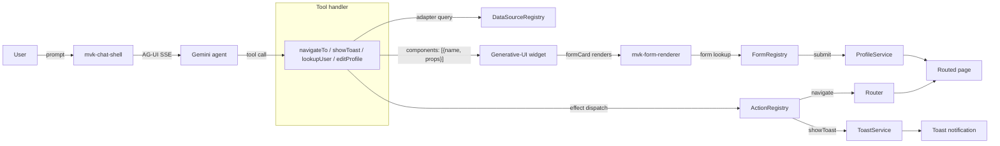

# Extended registries — feature tour

[`examples/demo-feature-tour`](../../examples/demo-feature-tour) (port 4206)
shows the four library capabilities that aren't covered by the simpler
demos:

| Feature | Demonstrated by | Try it |
|---|---|---|
| **`ActionRegistry`** — agent dispatches host-side effects | `navigate`, `showToast` actions; `navigateTo`, `showToast` tools | *"Take me to the dashboard"*; *"Show a success toast saying my booking is confirmed"* |
| **`FormRegistry`** + `<mvk-form-renderer>` — agent-rendered, schema-driven forms | `profileForm` registered; `editProfile` tool returns a `formCard` widget that renders the form | *"Edit my profile, set newsletter to true"* |
| **`DataSourceRegistry`** — typed REST adapters consumed by tools | `users` source built with `restDataSource(...)` (mock fetch); `lookupUser` tool queries it | *"Look up user U-1042"* |
| **`IntentRegistry`** — phrase-to-route mapping for pre-LLM short-circuit | `goHomeIntent` registered (consumer wires the dispatcher) | Inspect `IntentRegistry.signal()` after the app boots |

> All four use the chat shell's normal AG-UI flow — no library changes,
> no orchestrator extensions. Tools delegate to registries; widgets
> render results.

## How each piece fits together



## Why this matters

Without these registries, the canonical patterns leak into tool
handlers — every tool inlines `Router.navigateByUrl(...)`, every form
becomes its own component with hand-rolled state, every fetch URL
ends up duplicated. The extended registries push those concerns
behind named registry entries:

- A tool says *"navigate to `/dashboard`"* by dispatching the
  `navigate` action — it doesn't know about Router. Swapping
  to a different navigation backend (programmatic in-app overlay,
  cross-app deep-link) means rewriting one action's effect, not N
  tools.
- A form says *"render `profileForm`"* — the field schema, validation,
  rendering, and submission live in the registry entry. Tools, A2UI
  events, and direct user clicks can all open the same form by name.
- A data source says *"REST users at `https://api.example.com/users/`"* —
  tools just ask for `users` and get a typed adapter. Swap base URLs
  per env without touching tool code; mock for tests.

## Wiring overview

The registrations happen in
[`agentic.ts`](../../examples/demo-feature-tour/src/app/agentic/agentic.ts)
under `registerExtendedCapabilities(env)`, called from `provideAppInitializer`
so registries are populated before the chat shell renders. The trick:
each registration captures the host's `EnvironmentInjector`, then the
effect / submit body uses `runInInjectionContext(env, () => env.get(...))`
to reach Angular services from outside the normal DI flow.

```ts
actions.register(
  agenticAction({
    type: 'navigate',
    payloadSchema: z.object({ path: z.string() }),
    effect: ({ path }) => {
      runInInjectionContext(env, () => env.get(Router).navigateByUrl(path));
    },
  }) as ActionDef,
);
```

Tools get the same treatment in `buildTools(env)` — they capture the
injector at registration time and use it inside the handler to find
the right registry.

```ts
function navigateTool(env: EnvironmentInjector) {
  return agenticTool({
    name: 'navigateTo',
    schema: z.object({ destination: z.enum(['/', '/dashboard', '/profile']) }),
    handler: async ({ destination }, ctx) => {
      const action = env.get(ActionRegistry).get('navigate');
      await action?.effect({ path: destination }, { ...ctx, actionId: ctx.toolCallId });
      return { ok: true, components: [{ name: 'navConfirmation', props: { destination } }] };
    },
  });
}
```

## Run it

```bash
# In one terminal — agent server (needs Gemini API key in .env)
cd examples/demo-server && npm run dev

# In another — feature-tour app
npm run build:lib
npm install ./dist/agentic-ui --no-save
npx ng serve demo-feature-tour
```

Open <http://localhost:4206> and try the four prompts from the table at the top.

## Where to go from here

- [Multi-agent orchestration](./multi-agent-orchestration.md) — adds a
  router agent on top so each domain has its own specialist.
- [Federate an MFE](./federate-an-mfe.md) — extract one of these tools
  + actions into its own remote so a different team can ship it.
- [Schematics reference](./schematics.md) — `ng g
  @maverick/agentic-ui:action` / `:form` / `:intent` generate the same
  shape of files used here.
