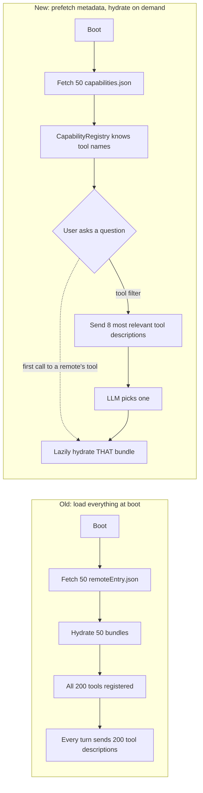
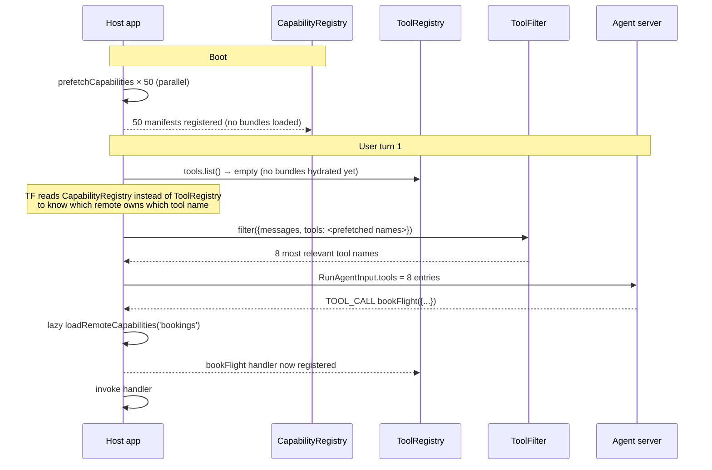

# Federation at scale — capability prefetch + per-turn tool filter

The federated demo at `localhost:4200` works comfortably with three
remotes contributing five tools. **At fifty remotes contributing two
hundred tools, two things break:**

1. **Boot cost.** Every remote's federation bundle is fetched at boot
   so its `Capability` module can register tools. Even with parallel
   loading, fifty bundles is multiple megabytes the user waits on
   before the chat renders.
2. **System-prompt blowout.** Every registered tool description is
   sent to the LLM in `RunAgentInput.tools`. Two hundred tools at ~80
   tokens each is 16 000 tokens of tool catalogue — gone before the
   model has even seen the conversation. With Gemini 2.5 Flash's 1M
   context window you survive; with most cheaper models you don't.

This cookbook covers the two primitives that fix both:
**capability prefetch** (manifest-only registration) and **per-turn
tool filtering** (narrowing tools sent to the LLM).



## Capability prefetch

`prefetchCapabilities({ remote, injector })` reads a remote's
`capabilities.json` over HTTP and registers a `CapabilityDef` with the
host's `CapabilityRegistry` — **without loading the federation
bundle**. The registry signal carries every remote's tool names and
component names; consumers reading it (the system-prompt builder, the
tool filter, an MFE explorer UI) work with full topology while paying
only the cost of the JSON manifests.

```ts
// app.config.ts
import { provideAppInitializer, EnvironmentInjector, inject, runInInjectionContext } from '@angular/core';
import { MfeRegistryClient, prefetchCapabilities, provideStaticJsonMfeRegistry } from '@infra-tools/agentic-ui';

function prefetchAllRemotes() {
  return provideAppInitializer(() => {
    const injector = inject(EnvironmentInjector);
    const client = inject(MfeRegistryClient);
    return runInInjectionContext(injector, async () => {
      const remotes = await client.discover('production');
      // Fan out — each manifest is a few KB, parallelism is fine.
      await Promise.allSettled(remotes.map((remote) =>
        prefetchCapabilities({ remote, injector }).catch((err) => {
          console.warn(`[capabilities] ${remote.remoteName}:`, err.message);
        }),
      ));
    });
  });
}

export const appConfig: ApplicationConfig = {
  providers: [
    provideAgenticUi(),
    provideAgUiBackend({ url: '/api/agents/orchestrator/run' }),
    provideStaticJsonMfeRegistry({ url: '/mfes.json' }),
    prefetchAllRemotes(),
  ],
};
```

The bundle still loads later — `loadRemoteCapabilities(...)` runs on
the first call to one of that remote's tools, and the prefetch entry
is replaced with the hydrated registration. Today the demo loads
everything at boot; the prefetch-then-hydrate pattern is the
production migration path.

### Manifest URL convention

`capabilities.json` is a sibling of `remoteEntry.json` by default —
e.g., a remote at `https://team-a.example.com/remoteEntry.json` is
expected to publish `https://team-a.example.com/capabilities.json`.
If your deploy doesn't fit that shape, set `capabilityManifestUrl`
explicitly on the `RemoteSpec` returned by your registry source:

```ts
{
  "remoteName": "bookings",
  "version": "1.4.2",
  "remoteEntry": "https://cdn.example.com/bookings/v1.4.2/remoteEntry.json",
  "capabilityManifestUrl": "https://manifests.example.com/bookings/v1.4.2.json",
  "env": "production"
}
```

## Per-turn tool filtering

`provideToolFilter(filter)` registers a function called once per user
turn with `{ messages, tools }` and returning a (possibly narrowed)
tool array. The chat shell sends the result to the agent's
`RunAgentInput.tools`. Default is the identity filter — apps not
calling `provideToolFilter` behave exactly as before.

The library ships a reference `keywordToolFilter` that scores each
tool's `name + description` corpus against the user's last message,
sorts descending, and returns the top-N. Cheap (no LLM call),
deterministic, and good enough for "trim 200 tools to 8 relevant
ones."

```ts
import { provideToolFilter, keywordToolFilter } from '@infra-tools/agentic-ui';

export const appConfig: ApplicationConfig = {
  providers: [
    provideAgenticUi(),
    provideAgUiBackend({ url: '/api/agents/orchestrator/run' }),

    provideToolFilter(keywordToolFilter({
      maxTools: 8,        // never send more than 8 tools
      minScore: 1,        // require ≥1 keyword overlap
      floor: 3,           // pad to 3 if fewer match (so the agent has options)
    })),
  ],
};
```

### Replace with embedding similarity

Once vocabulary stops being the right primitive, swap in an
embedding-based filter. The hook signature is unchanged:

```ts
import { provideToolFilter, type ToolFilter } from '@infra-tools/agentic-ui';

const embeddingFilter: ToolFilter = ({ messages, tools }) => {
  const query = messages.at(-1)?.content ?? '';
  // Look up cached embedding for `query`; the filter is per-turn so caching matters.
  const queryVec = embed(query);
  return tools
    .map((t) => ({ tool: t, score: cosine(queryVec, embed(t.description)) }))
    .sort((a, b) => b.score - a.score)
    .slice(0, 8)
    .map((s) => s.tool);
};

provideToolFilter(embeddingFilter);
```

You'd typically run the embedding service in your Angular app via a
small fetch to your backend and cache aggressively (every tool
description is static; embed each one once at startup).

## Combining the two

Prefetch and filter compose naturally:



For a working concrete example, `examples/demo-shell` is the simplest
ground to extend — start with prefetch, then add the keyword filter,
then introduce the lazy-hydrate path on first tool invocation. The
codebase has all three primitives wired in the public API; the
piece-by-piece extension is what your team applies.

## Performance budget

What this buys you, roughly:

| Setup | Boot bundle fetch | First-turn token cost (~80 tok/tool) |
|---|---|---|
| 3 remotes, no prefetch (today's demo) | 3 bundles, ~200 KB each = 0.6 MB | 5 tools × 80 tok = 400 tok |
| 50 remotes, no prefetch (naive) | 50 bundles, ~10 MB | 200 tools × 80 tok = 16 000 tok |
| 50 remotes, prefetch only | 50 manifests, ~50 KB total | 200 tools × 80 tok = 16 000 tok (still) |
| 50 remotes, prefetch + filter to 8 | 50 manifests, ~50 KB total | 8 tools × 80 tok = 640 tok |

Filter-only (without prefetch) saves the LLM tokens but still pays the
boot cost. Prefetch-only saves the boot cost but the LLM still drowns
in tool descriptions. Both together is what makes a 50-remote
deployment realistic.

## Where to next

- [Production deployment](./production-deployment.md) — the
  `ThreadStateStore` abstraction needed for multi-pod runs.
- [Federate an MFE](./federate-an-mfe.md) — the basic federation flow
  you're scaling here.
- [Sample prompts](./sample-prompts.md) — the verification prompts to
  make sure you didn't break tool selection while filtering.
