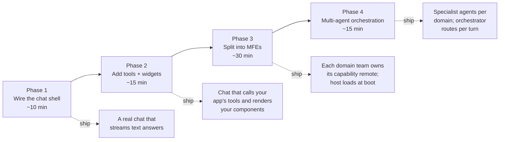
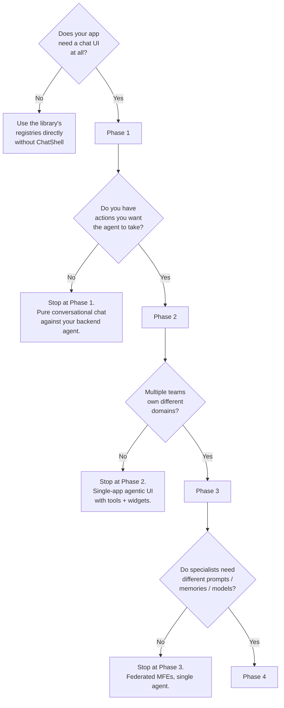
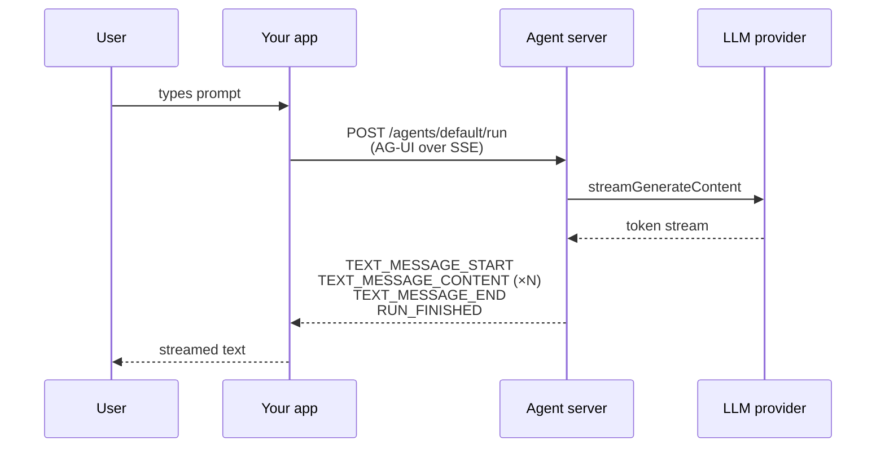
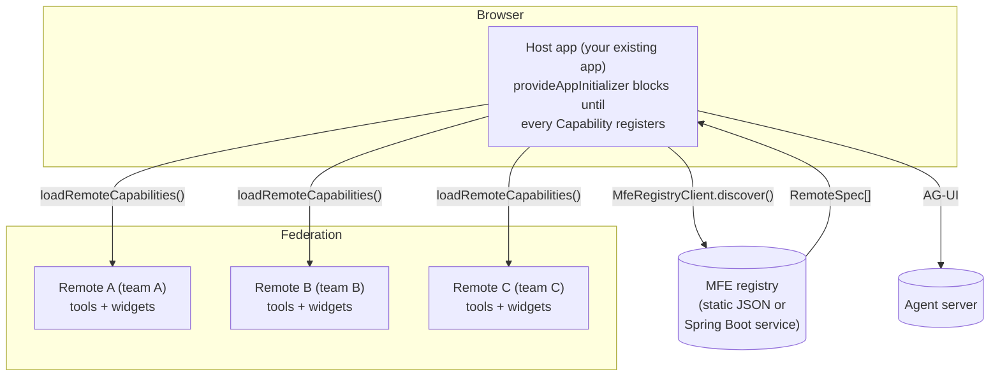

# Integrate `@infra-tools/agentic-ui` into an existing Angular app

Step-by-step guide for adding agentic UI — chat, tools, generative-UI
widgets, federation, multi-agent orchestration — to an Angular 21 app you
already own. Each phase is independently useful, so you can stop at any
phase and still ship something real.

> **Prerequisites.** Angular 21+, Node 20.19+, a standalone-bootstrap app
> (we don't support `NgModule` apps), and an LLM provider key (the demo
> uses Google Gemini; the same shape works for OpenAI / Anthropic /
> custom backends).

## The journey



Each box is a checkpoint — your app works end-to-end at the end of every
phase. You get a usable system at Phase 1 and add capability without
breaking what's there.

### Decision tree — how far do I need to go?



---

## Phase 1 — wire the chat shell (≈10 min)

### What you'll have at the end

```
┌──────────────────────────────────────────────────────────┐
│  Your existing Angular app (browser)                      │
│                                                           │
│   <existing routes, components, providers>                │
│                                                           │
│   + <mvk-chat-shell> on one route or as a side panel      │
│       │                                                   │
│       │ AG-UI SSE                                          │
│       ▼                                                   │
└────────┬──────────────────────────────────────────────────┘
         │
┌────────▼──────────────────────────┐
│  Agent server (Node)              │
│  POST /agents/<id>/run            │
│  streams text deltas back         │
└───────────────────────────────────┘
```

A chat input that speaks to a backend agent and streams text back.
No tools, no widgets — just text in, text out.

### Step 1.1 — install

> 💡 **Skip Steps 1.1 → 1.4 with `ng add`.**
> The schematic installs peer deps, patches `app.config.ts` with the providers, and writes seed `tools.ts` / `widgets.ts`. See [Schematics reference](./schematics.md).
> ```bash
> ng add @infra-tools/agentic-ui --backend=ag-ui --server=mastra
> ```
> Continue from Step 1.5 to verify.

```bash
npm install @infra-tools/agentic-ui zod
# Optional: peer for the AG-UI backend transport (SSE)
npm install @ag-ui/client
```

> The library has zero NgModule code; `peerDependencies` only touch
> `@angular/core@^21`, `zod`, and (optionally) `@ag-ui/client`.

### Step 1.2 — stand up an agent server

> 💡 **Skip the Node setup with `agent-server`.**
> ```bash
> ng g @infra-tools/agentic-ui:agent-server --framework=mastra --route=/api/ag-ui
> ```
> Generates a new `<your-project>-server/` directory with a Hono app, a sample `EchoAgent`, and a `.env.example`. Drop in your API key and run.

You need an HTTP endpoint that accepts AG-UI requests and streams events
back. Two options:

| Option | When to use |
|---|---|
| **Reuse `examples/demo-server` as a template** | You're prototyping. Copy `examples/demo-server/` into your repo, swap the API key in `.env`, change the `systemInstruction`. Done in 5 minutes. |
| **Add the route to your existing Node service** | You already run a Node API. Install `@infra-tools/agentic-ui-server` and `hono`; add a single route. |

Minimal `/agents/:id/run` route with one Gemini-backed agent:

```ts
import { Hono } from 'hono';
import { agUiRouteHandler, type AgentResolver } from '@infra-tools/agentic-ui-server';
import { GeminiAgent } from './gemini-agent';  // copy from demo-server

const agents = new Map<string, ServerAgent>();
agents.set('default', new GeminiAgent('default', {
  apiKey: process.env.GOOGLE_GENERATIVE_AI_API_KEY!,
  systemInstruction: 'You are a helpful assistant for <YOUR APP NAME>.',
}));

const resolver: AgentResolver = { resolve: (id) => agents.get(id) };
const handler = agUiRouteHandler({ resolver });

const app = new Hono();
app.post('/agents/:id/run', (c) => handler(c.req.raw));
serve({ fetch: app.fetch, port: 4111 });
```

Verify it responds: `curl http://localhost:4111/health` (if you copy the
demo-server's `/health` route too).

### Step 1.3 — wire `provideAgenticUi` in your existing app

Open your app's `app.config.ts` (or wherever your `ApplicationConfig`
lives) and add two providers:

```ts
import { ApplicationConfig } from '@angular/core';
import { provideAgenticUi, provideAgUiBackend } from '@infra-tools/agentic-ui';

export const appConfig: ApplicationConfig = {
  providers: [
    // ... your existing providers ...
    provideAgenticUi(),                                  // registers core registries
    provideAgUiBackend({ url: '/api/agents/default/run' }),  // pick the URL of your route
  ],
};
```

If your agent server is on a different origin, set the absolute URL:
`{ url: 'http://localhost:4111/agents/default/run' }`.

### Step 1.4 — drop `<mvk-chat-shell>` somewhere

The chat shell is a single standalone component — drop it on a route, in
a side panel, or behind a feature flag. Anywhere your app already shows
content.

```ts
// my-page.component.ts
import { Component } from '@angular/core';
import { ChatShellComponent } from '@infra-tools/agentic-ui';

@Component({
  selector: 'app-my-page',
  standalone: true,
  imports: [ChatShellComponent],
  template: `
    <div class="page-layout">
      <main><!-- your existing content --></main>
      <aside>
        <mvk-chat-shell />
      </aside>
    </div>
  `,
})
export class MyPageComponent {}
```

### Step 1.5 — verify

Start your app and the agent server. Open the page with the chat shell
and type a prompt. You should see the LLM's response stream in word by
word.



**Stop here if** your use case is "let users converse with an LLM about
your domain knowledge." That's a real product. You don't need tools or
widgets unless the agent needs to *do* something.

---

## Phase 2 — add tools and widgets (≈15 min)

### What you'll have at the end

The agent can call **your app's tools** and the chat transcript renders
**your app's components** for the results.

```mermaid
sequenceDiagram
    participant U as User
    participant Shell as &lt;mvk-chat-shell&gt;
    participant Reg as ToolRegistry +<br/>ComponentRegistry
    participant Agent as Server agent
    participant Handler as Tool handler<br/>(your code)
    participant Comp as Your widget<br/>component

    U->>Shell: "Book me a flight LAX→JFK"
    Shell->>Agent: POST /run<br/>(messages, tools snapshot)
    Agent-->>Shell: TOOL_CALL bookFlight({…})
    Shell->>Reg: lookup 'bookFlight'
    Reg-->>Shell: handler ref
    Shell->>Handler: invoke({from,to,date}, ctx)
    Handler-->>Shell: { …data, components: [{name, props}] }
    Shell->>Reg: lookup 'flightCard'
    Reg-->>Shell: component class
    Shell->>Comp: render with props
    Shell->>Agent: POST /run again<br/>(with tool result)
    Agent-->>Shell: TEXT "Booked: BK-XYZ…"
    Shell-->>U: text + your component
```

### Step 2.1 — define a tool

> 💡 **Skip the boilerplate with `tool`.**
> ```bash
> ng g @infra-tools/agentic-ui:tool bookFlight --executeIn=host
> ```
> Generates `book-flight.tool.ts` with the `agenticTool({...})` skeleton, a Zod schema stub, and an auto-import in your nearest `tools.ts` barrel.

```ts
// app/agentic/tools/book-flight.tool.ts
import { agenticTool } from '@infra-tools/agentic-ui';
import { z } from 'zod';

export const bookFlightTool = agenticTool({
  name: 'bookFlight',
  description: 'Book a flight from one airport to another on a given date.',
  schema: z.object({
    from: z.string().describe('Origin airport code, e.g. LAX'),
    to:   z.string().describe('Destination airport code, e.g. JFK'),
    date: z.string().describe('Departure date in YYYY-MM-DD'),
  }),
  handler: async ({ from, to, date }, ctx) => {
    // Call YOUR backend, your store, whatever.
    // Return a JSON-serialisable object the agent will see next turn.
    const booking = await yourBookingService.book({ from, to, date });
    return {
      ...booking,
      // Optional: ask the chat shell to render a widget under the tool result.
      components: [{ name: 'flightCard', props: booking }],
    };
  },
});
```

Schema is Zod — the type-system enforces the handler's `args` shape and
the chat shell validates real arguments before invoking the handler.

### Step 2.2 — define a widget (generative UI)

> 💡 **Skip with `widget`.**
> ```bash
> ng g @infra-tools/agentic-ui:widget FlightCard --inputs=bookingId:string,from:string,to:string,date:string,status:string
> ```
> Scaffolds the standalone component, the `agenticWidget(...)` factory file, and a Zod props schema matching your `--inputs`.

A *widget* is just a standalone Angular component you've registered with
a name. The chat shell renders it via `*ngComponentOutlet` whenever a
tool result asks for it by name.

```ts
// app/agentic/widgets/flight-card.component.ts
import { Component, input } from '@angular/core';

@Component({
  selector: 'app-flight-card',
  standalone: true,
  template: `
    <article class="card">
      <header>{{ from() }} → {{ to() }} <span>{{ status() }}</span></header>
      <p>{{ date() }}</p>
      <p>Booking: <code>{{ bookingId() }}</code></p>
    </article>
  `,
})
export class FlightCardComponent {
  readonly bookingId = input.required<string>();
  readonly from = input.required<string>();
  readonly to = input.required<string>();
  readonly date = input.required<string>();
  readonly status = input.required<string>();
}
```

```ts
// app/agentic/widgets/flight-card.widget.ts
import { agenticWidget } from '@infra-tools/agentic-ui';
import { z } from 'zod';
import { FlightCardComponent } from './flight-card.component';

export const flightCardWidget = agenticWidget({
  name: 'flightCard',
  component: FlightCardComponent,
  propsSchema: z.object({
    bookingId: z.string(),
    from: z.string(),
    to: z.string(),
    date: z.string(),
    status: z.string(),
  }),
});
```

### Step 2.3 — register them

```ts
// app.config.ts
import { provideAgenticUi, provideAgUiBackend } from '@infra-tools/agentic-ui';
import { bookFlightTool } from './agentic/tools/book-flight.tool';
import { flightCardWidget } from './agentic/widgets/flight-card.widget';

export const appConfig: ApplicationConfig = {
  providers: [
    provideAgenticUi({
      tools: [bookFlightTool],
      widgets: [flightCardWidget],
    }),
    provideAgUiBackend({ url: '/api/agents/default/run' }),
  ],
};
```

### Step 2.4 — instruct the agent

Update the agent's `systemInstruction` so it knows when to call the tool:

```ts
new GeminiAgent('default', {
  apiKey: process.env.GOOGLE_GENERATIVE_AI_API_KEY!,
  systemInstruction:
    'You are a flight booking assistant. ' +
    'When the user asks to book a flight, call the bookFlight tool. ' +
    'After receiving tool results, respond with a brief natural-language confirmation.',
});
```

The chat shell automatically sends the registered tool list to the
server in each `RunAgentInput` — Gemini (or any compliant LLM) sees them
as function declarations and decides when to call.

### Step 2.5 — verify

```mermaid
flowchart LR
    A[User: 'Book LAX→JFK 2026-05-05'] --> B[Shell sends tools list to server]
    B --> C[LLM emits TOOL_CALL bookFlight]
    C --> D[Shell looks up handler in ToolRegistry]
    D --> E[Your handler runs]
    E --> F[Result includes components: flightCard]
    F --> G[Shell looks up component in ComponentRegistry]
    G --> H[Renders your FlightCardComponent inline]
    H --> I[Shell sends result back to LLM]
    I --> J[LLM emits final text]
    J --> K[Shell streams text under the card]
```



**Stop here if** your app is one team's domain. You have a working
chat-with-tools experience. Phase 3 only matters when *multiple teams*
need to ship capabilities independently.

---

## Phase 3 — split into MFEs (≈30 min)

### What you'll have at the end



### Step 3.1 — decide whether you need MFE federation

| Drivers for federating | Reasons NOT to |
|---|---|
| Different teams own different domains and ship at different cadences | Single-team app |
| Some domains are deployed independently of the main app | Mature dev infrastructure cost is non-trivial |
| You want capabilities loaded *at runtime* without a host redeploy | Runtime version skew across remotes |
| The existing app is an MFE host already | All capabilities ship with the app's release |

If your answer to all of the above is "no", **stop at Phase 2**. Phase 3
is real engineering investment.

### Step 3.2 — turn your existing app into a Native Federation host

```bash
ng add @angular-architects/native-federation --project=<your-app> --type=host --port=4200
```

This generates:
- `federation.config.js` (host config)
- `tsconfig.federation.json`
- A new `bootstrap.ts` split (federation initializes before the app boots)

### Step 3.3 — create the registry

The host needs to know *where* to load remotes from. The library ships
two `MfeRegistrySource` adapters:

| Adapter | When to use | Provider call |
|---|---|---|
| Static JSON | Demo, dev, simple deploys (CDN-hosted file) | `provideStaticJsonMfeRegistry({ url })` |
| Spring Boot service | You're using the `mfe-registry-platform` Java service or any HTTP-equivalent | `provideSpringBootMfeRegistry({ url })` |

**Example: static JSON.** Drop this file at `src/public/mfes.json`:

```json
{
  "remotes": [
    { "remoteName": "remote-a", "version": "1.0.0", "remoteEntry": "http://localhost:4201/remoteEntry.json", "env": "dev" },
    { "remoteName": "remote-b", "version": "1.0.0", "remoteEntry": "http://localhost:4203/remoteEntry.json", "env": "dev" }
  ]
}
```

In your host `app.config.ts`:

```ts
import {
  provideAgenticUi, provideAgUiBackend, provideStaticJsonMfeRegistry,
  loadRemoteCapabilities, MfeRegistryClient, type CapabilityModule,
} from '@infra-tools/agentic-ui';
import { provideAppInitializer, EnvironmentInjector, inject, runInInjectionContext } from '@angular/core';
import { loadRemoteModule } from '@angular-architects/native-federation';

function loadAllRemotes() {
  return provideAppInitializer(() => {
    const injector = inject(EnvironmentInjector);
    const client = inject(MfeRegistryClient);
    return runInInjectionContext(injector, async () => {
      const remotes = await client.discover('dev');
      await Promise.allSettled(
        remotes.map((remote) =>
          runInInjectionContext(injector, () =>
            loadRemoteCapabilities({
              remote,
              loader: async () => {
                const mod = await loadRemoteModule<{ capability: CapabilityModule }>({
                  remoteName: remote.remoteName,
                  exposedModule: './Capability',
                });
                return { capability: mod.capability };
              },
            }),
          ),
        ),
      );
    });
  });
}

export const appConfig: ApplicationConfig = {
  providers: [
    provideAgenticUi({ tools: [], widgets: [] }),  // start empty; remotes fill these in
    provideAgUiBackend({ url: '/api/agents/default/run' }),
    provideStaticJsonMfeRegistry({ url: '/mfes.json' }),
    loadAllRemotes(),
  ],
};
```

> **Why `provideAppInitializer` and not just calling on click**: blocking
> bootstrap until remotes register guarantees the chat shell never
> renders without tools. Otherwise the user can send a prompt before any
> tool exists, and the LLM has nothing to call.

### Step 3.4 — build a remote

> 💡 **Use `mfe-capability` to scaffold the federation surface.**
> Inside the remote project:
> ```bash
> ng g @infra-tools/agentic-ui:mfe-capability --remoteName=remote-a --federation=native
> ```
> Generates `capability.ts` with the `defineCapabilityModule({...})` block, updates `federation.config.js` to expose `./Capability`, and writes a `capabilities.json` manifest sibling for the host's prefetch step.

In a separate Angular project (or another package in your monorepo):

```bash
ng new remote-a --standalone
cd remote-a
ng add @angular-architects/native-federation --project=remote-a --type=remote --port=4201
```

In `remote-a/src/app/capability.ts`:

```ts
import { defineCapabilityModule, type ToolDef } from '@infra-tools/agentic-ui';
import { bookFlightTool } from './tools/book-flight.tool';
import { flightCardWidget } from './widgets/flight-card.widget';

export const capability = defineCapabilityModule({
  remoteName: 'remote-a',
  version: '1.0.0',
  tools: [bookFlightTool as ToolDef],
  components: [flightCardWidget],
});
```

Update `remote-a/federation.config.js`:

```js
exposes: {
  './Capability': './src/app/capability.ts',
},
shared: {
  ...shareAll({ singleton: true, strictVersion: true, requiredVersion: 'auto' }),
  '@infra-tools/agentic-ui': { singleton: true, strictVersion: false, requiredVersion: 'auto' },
},
features: {
  ignoreUnusedDeps: false,  // CRITICAL — true silently drops the lib from the shared list
},
```

> The `ignoreUnusedDeps: false` line is non-negotiable. Without it,
> federation's static analysis filters `@infra-tools/agentic-ui` out as
> "unused" and the host + remote end up with two different copies of
> registry classes — your tools register into a registry the chat shell
> can't see.

### Step 3.5 — federation handoff sequence

```mermaid
sequenceDiagram
    participant Host as Host app boot
    participant Reg as MfeRegistryClient
    participant JSON as /mfes.json
    participant NF as Native Federation runtime
    participant Remote as remote-a (browser bundle)
    participant Tools as ToolRegistry
    participant Widgets as ComponentRegistry

    Host->>Reg: discover('dev')
    Reg->>JSON: GET /mfes.json
    JSON-->>Reg: [{remote-a, ...}, {remote-b, ...}]
    Reg-->>Host: RemoteSpec[]
    loop for each remote
      Host->>NF: loadRemoteModule({remoteName, exposedModule})
      NF->>Remote: import remoteEntry.json + bundle
      Remote-->>NF: { capability }
      NF-->>Host: capability module
      Host->>Tools: register(...capability.tools)
      Host->>Widgets: register(...capability.components)
    end
    Note over Host,Widgets: Bootstrap completes; chat shell renders<br/>with all tools and widgets in place
```

### Step 3.6 — verify

Open the host. The browser console should log:

```
[host] Loaded remote-a (1 tool(s), 1 widget(s))
[host] Loaded remote-b (2 tool(s), 1 widget(s))
```

In Chat: prompt with anything that triggers one of the registered tools.
The widget should render even though the host's `app.config` registered
zero widgets at boot — they came from the remotes.

**Live-update test:** kill the `remote-a` dev server; reload the host;
chat. The host loses access to remote-a's tools but remote-b still
works. That's MFE-aware capability teardown — `removeBySource('remote:remote-a')`
runs automatically.

**Stop here if** all your domains share one agent persona. Add Phase 4
when each domain needs its own system prompt or its own LLM model.

---

## Phase 4 — multi-agent orchestration (≈15 min)

### What you'll have at the end

Multiple specialist agents on the server, each with its own system
prompt and (optionally) its own model, plus an orchestrator that
classifies each user turn and routes to the right specialist — without
the host needing to change.

```mermaid
flowchart LR
    Host["Host app<br/>(unchanged from Phase 3)"]
    Orch["OrchestratorAgent<br/>/agents/orchestrator/run"]
    SA["bookings specialist<br/>(GeminiAgent)"]
    SB["loyalty specialist<br/>(GeminiAgent)"]
    SC["support specialist<br/>(GeminiAgent)"]
    LLM[(LLM)]

    Host -- POST /run --> Orch
    Orch -- "classify(window)" --> LLM
    LLM -- "agent: 'bookings'" --> Orch
    Orch -. "forwards events verbatim" .-> SA
    Orch -. .-> SB
    Orch -. .-> SC
    SA --> LLM
    SB --> LLM
    SC --> LLM
```

### Step 4.1 — add specialists to your agent server

In your server file (next to where you constructed `GeminiAgent('default', ...)`):

```ts
const bookingsAgent = new GeminiAgent('bookings', {
  apiKey,
  systemInstruction: 'You are a flight booking specialist. Call tools when needed. ' +
    'Stay focused on flights; if asked about loyalty or support, briefly say so and stop.',
});

const loyaltyAgent  = new GeminiAgent('loyalty',  { apiKey, systemInstruction: '...' });
const supportAgent  = new GeminiAgent('support',  { apiKey, systemInstruction: '...' });
```

Each specialist sees the *same* tool list (the host's full registry) but
its system prompt biases it toward calling only the tools relevant to
its domain.

### Step 4.2 — add the orchestrator

The library exports a `createSpecialist` helper that bundles "build the
agent" + "write the orchestrator metadata" into one call site. Cuts the
~30 lines of boilerplate that accumulate when you have multiple
specialists.

```ts
import {
  createSpecialist, registerSpecialists, type ServerAgent,
} from '@infra-tools/agentic-ui-server';
import { OrchestratorAgent } from './orchestrator-agent';  // copy from demo-server
import { GeminiAgent } from './gemini-agent';

const agents = new Map<string, ServerAgent>();

const specialists = registerSpecialists(agents, [
  createSpecialist({
    id: 'bookings',
    factory: (id) => new GeminiAgent(id, { apiKey, systemInstruction: '...' }),
    description: 'flight search, booking, cancellation, schedule changes',
    examples: ['Book a flight from LAX to JFK on March 5', 'Cancel my booking BK-XXX'],
  }),
  createSpecialist({
    id: 'loyalty',
    factory: (id) => new GeminiAgent(id, { apiKey, systemInstruction: '...' }),
    description: 'points balance, tier status, reward redemption',
    examples: ['How many points do I have?', 'Redeem 25,000 points for a flight'],
  }),
  createSpecialist({
    id: 'support',
    factory: (id) => new GeminiAgent(id, { apiKey, systemInstruction: '...' }),
    description: 'support tickets, account problems, complaints',
    examples: ['Open a ticket for my refund', 'My account is locked'],
  }),
]);

const orchestrator = new OrchestratorAgent('orchestrator', {
  apiKey,
  subAgents: specialists,
});
agents.set('orchestrator', orchestrator);
```

`registerSpecialists` adds each agent to the resolver map (so they're
also reachable directly via `/agents/<id>/run`) and returns the same
array of specs that the orchestrator's `subAgents` config expects — no
`.toSpec()` step.

### Step 4.3 — flip the agent URL

In your host's `app.config.ts`, change the backend URL from your
single-domain agent to the orchestrator:

```diff
- provideAgUiBackend({ url: '/api/agents/default/run' }),
+ provideAgUiBackend({ url: '/api/agents/orchestrator/run' }),
```

That's the whole host change. Tools and widgets keep working — they're
forwarded to whichever specialist the orchestrator picks.

### Step 4.4 — orchestrator routing flow

```mermaid
flowchart TD
    A[Run input arrives] --> B{Tool follow-up?<br/>(last msg is tool result<br/>or assistant tool-call)}
    B -- Yes --> C{Sticky specialist<br/>for this thread?}
    C -- Yes --> D[Reuse sticky<br/>NO classifier call]
    C -- No --> E[Classifier]

    B -- No (fresh user turn) --> E
    E --> F{LLM call OK?}
    F -- "Yes (200, valid JSON)" --> G[Use LLM choice]
    F -- "Transient (429, 5xx, network)" --> H[Retry up to 3×<br/>with exp backoff]
    H --> F
    F -- "All retries failed" --> I[Keyword fallback<br/>token-overlap scoring]
    I --> J{Score > 0?}
    J -- Yes --> G
    J -- No --> K{Sticky exists?}
    K -- Yes --> L[Stay with sticky]
    K -- No --> M[Return 'none' →<br/>fallback message]

    G --> N[Set sticky<br/>+ forward specialist's stream]
    L --> N
    D --> N
    N --> O{Specialist<br/>RUN_ERROR?}
    O -- No --> P[RUN_FINISHED]
    O -- Yes --> Q[Emit visible error<br/>+ propagate RUN_ERROR]
```

### Step 4.5 — verify

Try one prompt per domain in the chat. You should see a small italic
banner like `_Routed to **bookings** specialist._` followed by that
specialist's tool call and answer. The banner only shows on a domain
switch — follow-up turns don't repeat it.

---

## Troubleshooting matrix

| Symptom | Likely cause | Fix |
|---|---|---|
| Chat says nothing when you submit | Agent server unreachable | Check `provideAgUiBackend({ url })`; check CORS on the server |
| Header says `0 tool(s) across 0 remote(s)` | `provideAppInitializer` did not block on remote loading | Confirm the initializer returns a `Promise`, not fire-and-forget |
| Browser error: `NG0912: component ID collision` | Library duplicated across host + remote | `ignoreUnusedDeps: false` in BOTH federation configs; share `@infra-tools/agentic-ui` as singleton |
| LLM never calls your tool | Tool description too vague, or system prompt doesn't mention it | Tighten the tool description; mention the tool by purpose in the system instruction |
| Tool calls succeed but no widget renders | Tool result is missing `components: [{name, props}]` OR widget name doesn't match | Log the tool's return; check `ComponentRegistry` for the registered name |
| Same tool called multiple times per turn | `functionResponse.name` mismatch in your Gemini wrapper | Look up the original function name from prior tool-call messages, don't pass the call id |
| Orchestrator routes to `none` for clear domain prompts | Classifier hit rate-limit AND keyword fallback corpus is sparse | Add more concrete `examples:` to each `SubAgentSpec` so token-overlap scores higher |
| Specialist returns "" with no error | Sub-agent emitted `RUN_ERROR` but the orchestrator swallowed it | Use the latest orchestrator that surfaces sub-agent errors as visible messages |

## What's next

- **[Sample prompts](./sample-prompts.md)** — canonical prompts for every demo and every library feature, plus adversarial / boundary prompts for stress-testing.
- **[Domain MFEs as standalone apps + capability providers](./domain-mfe-standalone-and-federated.md)** — give each remote its own UI in addition to its capability surface so each domain is a real Angular app, not just a chat shim.
- **[Multi-agent orchestration deep-dive](./multi-agent-orchestration.md)** — sequence and flow diagrams for the orchestrator's internals; classification + forwarding vs. delegate-as-tool trade-offs.
- **[Observability](./observability.md)** — wire `provideAgenticTelemetry` to push spans across the SSE boundary so a single trace covers `chat shell → backend → agent → LLM → tool`.
- **[Swap the backend](./swap-backend.md)** — the same chat shell + tools + widgets work against AG-UI, Hashbrown, and A2UI by changing one provider call.

If you hit something that isn't covered here, the running demos in
`projects/` are the source of truth — `demo-monolith` matches Phase 2,
`demo-shell` + the three remotes match Phase 3, and the
`OrchestratorAgent` registered in `demo-server/src/server.ts` matches
Phase 4. Read the code; everything in this guide is pulled directly
from those examples.
