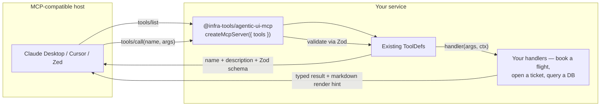

# Expose your tools as a Model Context Protocol server

Take the same `ToolDef`s your `<mvk-chat-shell>` consumes and make them
callable from **any** MCP-compatible host — Claude Desktop, Cursor,
Continue, Zed, Windsurf, the upcoming Copilot MCP support. One handler,
two consumer surfaces, zero forks.



## Five-step quickstart

```bash
# 1. Add the package
npm install @infra-tools/agentic-ui-mcp
```

```ts
// 2. Build a Node entry that exposes your tools as MCP
// e.g. mcp-server.ts
import { createMcpServer } from '@infra-tools/agentic-ui-mcp';
import { bookFlightTool, checkPointsTool, openTicketTool } from './your-tools';

const handle = createMcpServer({
  name: 'my-app',
  version: '1.0.0',
  tools: [bookFlightTool, checkPointsTool, openTicketTool],
});

await handle.startStdio();
console.error('[mcp] my-app server connected');
```

```bash
# 3. Build it
tsc mcp-server.ts
# now you have dist/mcp-server.js
```

```jsonc
// 4. Mount in Claude Desktop's config
// macOS: ~/Library/Application Support/Claude/claude_desktop_config.json
// Windows: %APPDATA%\Claude\claude_desktop_config.json
{
  "mcpServers": {
    "my-app": {
      "command": "node",
      "args": ["/abs/path/to/dist/mcp-server.js"]
    }
  }
}
```

5. Restart Claude Desktop. Type *"Book a flight from LAX to JFK on May 5"*. The host calls your tool, your handler runs, the result lands in the chat.

## The same tool, two surfaces

The fundamental property: **one tool definition, multiple consumer surfaces**.

> ⚠️ **Authoring tools for Node-only consumption.**
> The `agenticTool({...})` factory is re-exported from
> `@infra-tools/agentic-ui`'s public-api barrel. Importing **anything** from
> that barrel (even a free function) pulls in Angular's static
> initializers (`PlatformLocation`, `ɵɵngDeclareFactory`, etc.) which
> require `@angular/compiler` at runtime. That's fine inside an Angular
> app — fatal in pure Node like Claude Desktop's MCP server host.
>
> **Symptom:** Claude Desktop shows
> `MCP <name>: Server disconnected` and the log file
> `~/Library/Logs/Claude/mcp-server-<name>.log` contains
> `JIT compilation failed for injectable [class PlatformLocation]`.
>
> **Fix:** in your MCP server entry, build `ToolDef` literals directly
> instead of calling `agenticTool`. The factory adds zero runtime
> behaviour beyond returning the same object with type inference, so
> the literal works identically. **Type-only imports are erased at
> compile time** and don't pull Angular into runtime — `import type
> { ToolDef, ToolResultRenderHints } from '@infra-tools/agentic-ui'` is
> safe.

### When the same tool is shared with `<mvk-chat-shell>` (Angular app)

```ts
// In your Angular project — agenticTool is fine here.
import { agenticTool } from '@infra-tools/agentic-ui';

export const bookFlightTool = agenticTool({
  name: 'bookFlight',
  description: 'Book a flight.',
  schema: z.object({ from: z.string(), to: z.string(), date: z.string() }),
  handler: async ({ from, to, date }) => {
    const booking = await yourBookingService.book({ from, to, date });
    return {
      ...booking,
      components: [{ name: 'flightCard', props: booking }],
      markdown:
        `**Booked** ${booking.bookingId}\n\n` +
        `| From | To | Date |\n|---|---|---|\n` +
        `| ${from} | ${to} | ${date} |`,
    };
  },
});
```

### When the tool lives in a Node-only MCP server

Same shape, declared as a literal so no Angular DI runs:

```ts
// In your MCP server — agenticTool would crash here. Use a literal.
import type { ToolDef, ToolResultRenderHints } from '@infra-tools/agentic-ui';
import { z } from 'zod';

export const bookFlightTool: ToolDef = {
  name: 'bookFlight',
  description: 'Book a flight.',
  schema: z.object({ from: z.string(), to: z.string(), date: z.string() }),
  handler: async (args) => {
    const { from, to, date } = args as { from: string; to: string; date: string };
    const booking = await yourBookingService.book({ from, to, date });
    return {
      ...booking,
      components: [{ name: 'flightCard', props: booking }],
      markdown: `**Booked** ${booking.bookingId}\n\n…`,
    } satisfies ToolResultRenderHints & typeof booking;
  },
};
```

**Same shape, identical wire behaviour, no runtime difference for the MCP host.** Sharing one tool across both surfaces — Angular app + standalone MCP server — typically means putting the tool definition in a small framework-agnostic package that both consumers import.

| Consumer | Reads |
|---|---|
| `<mvk-chat-shell>` | `components` (renders the `flightCard` widget) |
| Claude Desktop / Cursor / Zed via MCP | `markdown` (renders the table) |
| MCP host without markdown support | JSON-stringified domain fields (`bookingId`, `from`, `to`, `date`, `status`) |

The `markdown` and `image_url` fields are declared in the
`ToolResultRenderHints` interface exported from `@infra-tools/agentic-ui`
— purely additive, every field optional, consumers ignore unrecognised
fields.

## Transports

`createMcpServer({...})` returns a handle with three ways to start:

| Method | When to use |
|---|---|
| `startStdio()` | Desktop MCP hosts (Claude Desktop, Cursor local, Zed). The default. |
| `startHttp({ port, cors? })` | Remote MCP hosts. Self-hosted MCP behind a reverse proxy. |
| `handleRequest(req)` | Embedding inside an existing HTTP server (Hono, Express, Fastify). Wraps the SDK's request handler so you don't import the SDK yourself. |

```ts
// Hono integration — embed alongside your AG-UI route
app.post('/mcp', async (c) => {
  const body = await c.req.json();
  const response = await handle.handleRequest(body);
  return c.json(response);
});
```

## beforeCall / afterCall hooks

The seam for auth, audit, rate-limiting, and telemetry.

```ts
const handle = createMcpServer({
  name: 'my-app',
  version: '1.0.0',
  tools,
  beforeCall: async ({ name, args, callId }) => {
    // Throw to reject — the MCP host sees an error response.
    if (!isAuthenticated()) throw new Error('Not authenticated');
    if (await isRateLimited()) throw new Error('Rate limit exceeded');
    auditLog({ name, args, callId, when: Date.now() });
  },
  afterCall: async ({ name, callId, durationMs, ok, error }) => {
    // Telemetry-only — exceptions here are logged, never change the response.
    metrics.histogram('mcp.tool_call.ms', durationMs, { name });
    metrics.counter('mcp.tool_call.total', 1, { name, ok: String(ok) });
    if (error) errorTracker.capture(error, { name, callId });
  },
});
```

`beforeCall` throwing is the *only* way to reject a call from outside
the tool handler — use it for cross-cutting concerns the tools shouldn't
have to know about.

## Production checklist

The package is library-grade. The deployment surface is consumer-side.
What you'll likely add for production:

- [ ] **Auth in `beforeCall`** — JWT validation, OAuth flow, mTLS, depending on your environment. The hook runs before schema validation, so you can short-circuit unauthorised calls without spending time on the args.
- [ ] **Rate limit in `beforeCall`** — token-bucket or per-user budgets. Throw to reject; the MCP host surfaces the message to the user.
- [ ] **Telemetry in `afterCall`** — wire to OTel / Langfuse / your existing pipeline. The hook receives `{ name, callId, durationMs, ok, error }`.
- [ ] **CORS allowlist on HTTP transport** — `startHttp({ port, cors: ['https://app.example.com'] })`. The default is `'*'` for development; never ship `'*'` to production.
- [ ] **Reverse-proxy TLS** — terminate HTTPS at your ingress (NGINX / Caddy / cloud load balancer). The HTTP transport binds plain HTTP.
- [ ] **Process supervision** — for stdio servers, the MCP host owns the lifecycle. For HTTP servers, run under systemd / Docker / Kubernetes with `SIGTERM` handling (the SDK's transport closes cleanly on close events).

## Try it with the demo

A working sample lives under [`examples/demo-mcp-server`](../../examples/demo-mcp-server) — exposes the same bookings / loyalty / support tools the chat-shell demos use, mounted as an MCP server.

```bash
cd examples/demo-mcp-server
npm install
npm run build
# Now mount the dist/index.js path in Claude Desktop's config
```

After restarting Claude Desktop, try:

| Prompt | Tool | Output |
|---|---|---|
| *"Book a flight from LAX to JFK on May 5"* | `bookFlight` | Markdown table with the booking confirmation |
| *"How many points do I have?"* | `checkPoints` | Bullet list with balance and tier |
| *"Open a support ticket — refund pending"* | `openTicket` | Ticket id + priority breakdown |

## MCP UI — render rich HTML in Claude Desktop / Cursor

Hosts that announce the `io.modelcontextprotocol/ui` capability (Claude
Desktop and Cursor as of mid-2026) iframe-render `text/html;profile=mcp-app`
resource blocks in a sandbox. The adapter activates this whenever your
tool result includes an `html` field.

```ts
import type { ToolDef, ToolResultRenderHints } from '@infra-tools/agentic-ui';

const bookFlightTool: ToolDef = {
  name: 'bookFlight',
  description: 'Book a flight.',
  schema: z.object({ from: z.string(), to: z.string(), date: z.string() }),
  handler: async (args) => {
    const { from, to, date } = args as { from: string; to: string; date: string };
    const bookingId = `BK-${Math.random().toString(36).slice(2, 8).toUpperCase()}`;
    return {
      bookingId, from, to, date, status: 'confirmed',

      // Highest-precedence render hint — MCP UI hosts iframe-render
      // this in a sandbox.
      html: `
        <article style="font-family: system-ui; padding: 1rem;
                        border: 1px solid #d1d5db; border-radius: 0.5rem;
                        background: white; border-left: 4px solid #2563eb;">
          <h2 style="margin: 0 0 0.5rem;">${from} → ${to}</h2>
          <p style="margin: 0.4rem 0; color: #4b5563;">${date}</p>
          <p style="margin: 0; color: #6b7280; font-size: 0.85em;">
            Booking: <code>${bookingId}</code>
          </p>
        </article>
      `,

      // Fallback for hosts WITHOUT MCP UI support — markdown-only chats.
      markdown: `**Booking confirmed** — \`${bookingId}\``,
    } satisfies ToolResultRenderHints & {
      bookingId: string; from: string; to: string; date: string; status: string;
    };
  },
};
```

### Precedence

When multiple render-hint fields are present, the formatter picks
**one** in this order:

| Priority | Field | Block emitted | Where it renders |
|---|---|---|---|
| 1 | `html` | `resource` (`text/html;profile=mcp-app`) | Claude Desktop, Cursor (sandboxed iframe). Hosts without MCP UI fall back to the resource's `text` |
| 2 | `markdown` (+ optional `image_url`) | `text` | All MCP hosts |
| 3 | `image_url` alone | `text` with `` | Markdown-rendering hosts |
| 4 | (nothing) | `text` with JSON-stringified domain data | Last-resort plain-text |

### MCP UI sandboxing constraints

The HTML runs in the host's iframe sandbox. What works:

- Inline `<style>` and `style="..."` attributes
- Most JS (limited to the iframe scope; no top-window access)
- `<link rel="stylesheet" href="https://...">` for absolute URLs
- `` for inline images

What doesn't work:

- Access to the host's `localStorage` or cookies (different origin)
- Navigation to external links unless the host opts in
- Imports from `file://`, relative paths, or the host's bundled assets

Keep payloads self-contained — inline the styles you need. If the
output is large, consider compressing visually (small cards, not full
pages) since the host renders inline.

### Trying MCP UI in the demo

The included `examples/demo-mcp-server` already returns an `html` field
on `bookFlight`. Run:

```bash
cd examples/demo-mcp-server
npm run build
# restart Claude Desktop and try "Book a flight from LAX to JFK on May 5"
```

Hosts that support MCP UI render a styled flight card; hosts that don't
fall back to the markdown table — same handler, two faithful renderings.

## What's NOT in this adapter (and why)

- **No Angular widget rendering as MCP UI.** The `html` channel takes pre-rendered HTML, not live Angular components. To bridge Angular components to MCP UI, the consumer renders to HTML server-side (e.g., via `@angular/platform-server`) and includes the result in `html`. A future helper to do this from a registered `ComponentDef` is on the roadmap (Tier 2.x).
- **No live-widget iframe URL.** The `iframe_url` field is reserved on `ToolResultRenderHints` for a future patch — sandboxed live components served by URL. Not yet activated.
- **No multi-tenant auth.** One stdio MCP server is one user; the HTTP transport doesn't bake in user-extraction logic. For a hosted multi-tenant deployment, run one MCP server per user OR use the embeddable `handleRequest()` path inside your own auth-aware HTTP layer.
- **No MCP `resources` or `prompts` exposure.** The adapter handles `tools/list` + `tools/call`. Resources and prompts will be added if a consumer asks; the seam exists.

## Where to go next

- [ADR-006](../adr/0006-mcp-server-side-adapter.md) — full design rationale, alternatives considered, future-work scope.
- [Production deployment](./production-deployment.md) — `ThreadStateStore` and rate-limit patterns that complement the MCP path.
- [Sample prompts](./sample-prompts.md) — the canonical prompt list, which now includes a new section: trying the demo's tools through Claude Desktop.
