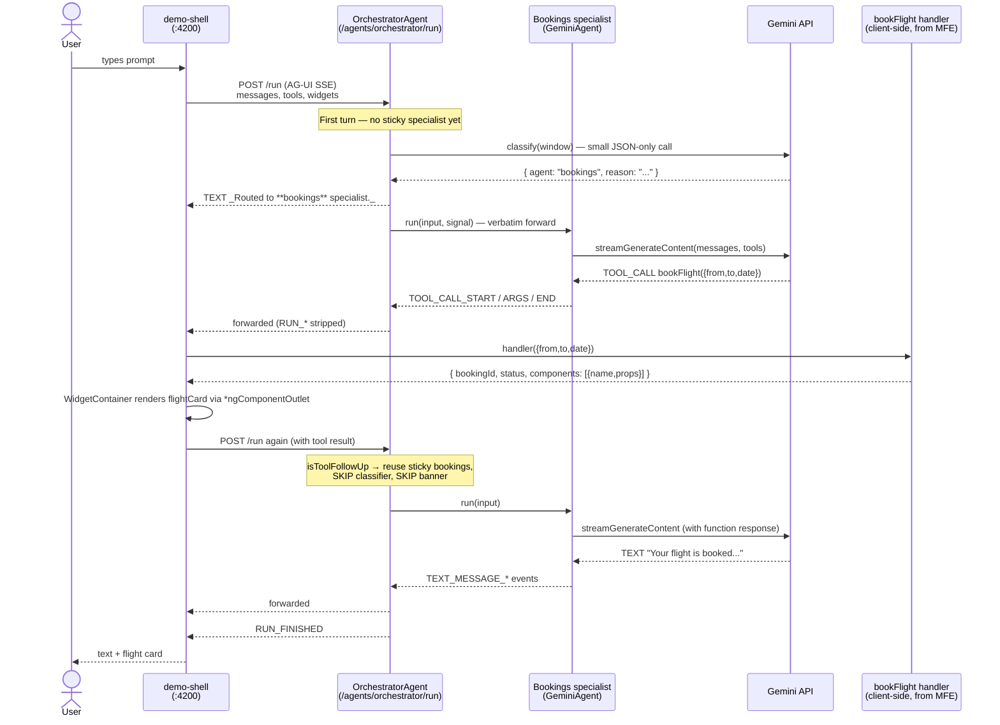

# Multi-agent orchestration

Pattern: one orchestrator agent classifies the user's intent and forwards the
event stream from a chosen specialist agent. Each specialist has its own
system prompt and focus area; the host's tool and component registries are
passed through untouched, so generative-UI widgets and client-side tool calls
keep working transparently.

This guide walks you through the working example in
[`examples/demo-multi-agent`](../../examples/demo-multi-agent) and the
[`OrchestratorAgent`](../../examples/demo-server/src/orchestrator-agent.ts)
in the demo server.

## Where things live

All six agents are constructed and registered in **one Node process**
(`examples/demo-server/`, port 4111). The Hono router exposes each at
`POST /agents/:id/run`; clients pick which agent by URL.

| Agent id | Implementation | Role |
|---|---|---|
| `echo` | [`@maverick/agentic-ui-server` → `EchoAgent`](../../projects/agentic-ui-server/src/echo-agent.ts) | No-LLM smoke-test agent — useful for testing the SSE pipeline without burning quota. |
| `gemini` | [`examples/demo-server/src/gemini-agent.ts`](../../examples/demo-server/src/gemini-agent.ts) → `GeminiAgent` | Original single-domain demo agent (still wired so `demo-monolith` works). |
| `bookings` | same `GeminiAgent` class, different `systemInstruction` | Flight specialist. |
| `loyalty` | same `GeminiAgent` class, different `systemInstruction` | Loyalty-program specialist. |
| `support` | same `GeminiAgent` class, different `systemInstruction` | Support specialist. |
| **`orchestrator`** | [`examples/demo-server/src/orchestrator-agent.ts`](../../examples/demo-server/src/orchestrator-agent.ts) → `OrchestratorAgent` | Classifier + forwarder. Picks one specialist per turn and forwards its event stream verbatim. |

Wiring lives in [`examples/demo-server/src/server.ts`](../../examples/demo-server/src/server.ts). A simplified excerpt:

```ts
const bookingsAgent = new GeminiAgent('bookings', { systemInstruction: '...' });
const loyaltyAgent  = new GeminiAgent('loyalty',  { systemInstruction: '...' });
const supportAgent  = new GeminiAgent('support',  { systemInstruction: '...' });

const orchestrator = new OrchestratorAgent('orchestrator', {
  apiKey, model,
  subAgents: [
    { id: 'bookings', agent: bookingsAgent, description: '...', examples: [...] },
    { id: 'loyalty',  agent: loyaltyAgent,  description: '...', examples: [...] },
    { id: 'support',  agent: supportAgent,  description: '...', examples: [...] },
  ],
});

agents.set('orchestrator', orchestrator);
agents.set('bookings', bookingsAgent);  // also reachable directly
agents.set('loyalty',  loyaltyAgent);
agents.set('support',  supportAgent);
```

Host apps choose which agent to talk to via `environment.ts → agentUrl`:

| App | `agentUrl` | What it gets |
|---|---|---|
| [`demo-monolith`](../../examples/demo-monolith) (4202) | `/agents/gemini/run` | Single-domain agent — simplest example. |
| [`demo-multi-agent`](../../examples/demo-multi-agent) (4204) | `/agents/orchestrator/run` | Orchestrator + three specialists. Tools and widgets registered inline in the host. |
| [`demo-shell`](../../examples/demo-shell) (4200) | `/agents/orchestrator/run` | Same orchestrator, but tools/widgets are contributed by federated MFE remotes — `demo-remote-bookings` (4201), `demo-remote-loyalty` (4203), `demo-remote-support` (4205). |

Each remote is **also a complete domain app on its own port**. Visiting `:4201` / `:4203` / `:4205` directly shows a form-driven UI that calls the same tool handler and renders the same widget the agent uses — so the MFE is a full Angular app for that domain, with the agentic capability layered on rather than replacing it.

## Sequence — one full turn

End-to-end flow for *"Book a flight from LAX to JFK on 2026-05-05"* against the federated host:



A few things worth noting in the diagram:

- **The orchestrator never calls a tool itself.** It picks a specialist and forwards events. The specialist emits the tool call; the host's `runUntilSettled` loop executes it and sends the result back as the next turn.
- **A single user prompt produces two `POST /run` calls** when there's a client-side tool. The first run yields the tool-call event; the second run feeds the tool result back to the LLM so it can compose a final natural-language answer.
- **The orchestrator is sticky-by-thread.** The second run hits `isToolFollowUp`, finds the stored specialist for this `threadId`, and skips the classifier entirely — no extra LLM call, no second routing banner.

## Flow — the routing decision tree

What `OrchestratorAgent.run()` actually decides on each invocation:

```mermaid
flowchart TD
    A[run input] --> B{Last message<br/>is tool result OR<br/>assistant tool-call?}
    B -- "Yes (tool follow-up)" --> C{Sticky specialist<br/>for this threadId?}
    C -- Yes --> D["Reuse sticky specialist<br/>(no classifier call,<br/>no routing banner)"]
    C -- No --> E[classify recent transcript window]

    B -- "No (fresh user turn)" --> E

    E --> F{LLM call OK?}
    F -- "200 / valid JSON" --> G[Use LLM choice]
    F -- "429 · 5xx · network" --> H[Retry up to 3×<br/>with exponential backoff + jitter]
    H --> F
    F -- "All retries failed<br/>or non-JSON output" --> I[Keyword fallback<br/>token-overlap scoring vs<br/>each specialist's<br/>description + examples]

    I --> J{score > 0?}
    J -- Yes --> K[Pick top-scoring specialist]
    J -- No --> L{Sticky exists?}
    L -- Yes --> M[Stay with sticky specialist]
    L -- No --> N[Return 'none' →<br/>fallback message to user]

    G --> O[Set sticky for thread]
    K --> O
    M --> P[Forward specialist's stream]
    D --> P
    O --> P

    P --> Q{Specialist<br/>RUN_ERROR?}
    Q -- No --> R[Yield RUN_FINISHED]
    Q -- Yes --> S["Emit visible error message<br/>'⚠️ The X specialist failed: ...'"]
    S --> T[Forward RUN_ERROR<br/>(terminal — no RUN_FINISHED)]

    N --> R
```

Key invariants encoded in this flow:

1. **No re-classification mid-tool-chain.** Tool follow-up runs short-circuit to the sticky specialist. This stops `bookFlight`'s tool result (which looks meaningless to the classifier) from misrouting to `none`.
2. **Routing always returns a decision.** When the LLM is exhausted, keyword scoring picks one of the specialists; if that scores zero, sticky takes over; only if both fail does the user see the "no specialist matched" banner. Quota exhaustion never leaves a turn stranded.
3. **Specialist failures are surfaced.** The earlier version silently swallowed `RUN_ERROR` from the sub-agent. The current version emits a visible `⚠️` line and forwards the error so the user (and any error-aware client) knows what went wrong.

## Architecture

```
┌──────────────────────────────────────────────────────────────────────────────┐
│ Browser — host app (demo-multi-agent, port 4204)                              │
│                                                                              │
│   <mvk-chat-shell> — speaks AG-UI to /agents/orchestrator/run                 │
│                                                                              │
│   ToolRegistry: bookFlight · cancelFlight                                     │
│                 checkPoints · redeemPoints                                    │
│                 openTicket · checkTicket                                      │
│   ComponentRegistry: flightCard · pointsCard · ticketCard                     │
└────────────────────────────────────┬─────────────────────────────────────────┘
                                     │ AG-UI SSE
                                     ▼
┌──────────────────────────────────────────────────────────────────────────────┐
│ Agent server — single Node process (demo-server, port 4111)                  │
│                                                                              │
│   /agents/orchestrator/run  →  OrchestratorAgent                             │
│                                                                              │
│       1. classify(userText)      [one quick LLM call]                        │
│              │                                                               │
│              ▼                                                               │
│       { agent: "bookings" | "loyalty" | "support" | "none", reason }         │
│              │                                                               │
│              ▼                                                               │
│       forward sub-agent events verbatim                                      │
│       (strip RUN_STARTED / RUN_FINISHED — those belong to the orchestrator)  │
│                                                                              │
│   /agents/bookings/run    →  GeminiAgent("bookings", booking system prompt)   │
│   /agents/loyalty/run     →  GeminiAgent("loyalty",  loyalty system prompt)   │
│   /agents/support/run     →  GeminiAgent("support",  support system prompt)   │
│                                                                              │
│   Each specialist can ALSO be talked to directly — the orchestrator is not    │
│   in the way; the chat shell just chooses which URL to point at.              │
└──────────────────────────────────────────────────────────────────────────────┘
```

## Why classification + forwarding (not delegate-as-tool)

Two patterns are commonly conflated:

| Pattern | How it works | Trade-off |
|---|---|---|
| **Classification + forwarding** (this example) | Orchestrator picks one specialist per turn, then forwards its event stream verbatim. The chat shell sees one continuous AG-UI stream. | Tool calls, generative-UI widgets, and text deltas all work without extra plumbing. One commit per turn — no in-turn agent hopping. |
| **Delegate-as-tool** | Orchestrator has tools like `askBookings({query})`. Each tool's handler opens a separate AG-UI stream to the specialist and collects text. | Multiple agents can be combined in one turn, but specialist tool calls / widgets must round-trip through the orchestrator's transcript, which adds layers and breaks the single-stream model. |

Both work. The classification + forwarding model is what the demo ships
because it preserves AG-UI fidelity — you don't lose anything by routing
through it. If you later need cross-specialist composition in a single turn,
graduate to a planner-executor (an `IntentRegistry`-driven planner that
issues a sequence of specialist calls).

## Server: register the orchestrator alongside specialists

[`examples/demo-server/src/server.ts`](../../examples/demo-server/src/server.ts)
wires four LLM-backed agents under one Hono process:

```ts
const bookingsAgent = new GeminiAgent('bookings', { apiKey, model, systemInstruction: '…' });
const loyaltyAgent  = new GeminiAgent('loyalty',  { apiKey, model, systemInstruction: '…' });
const supportAgent  = new GeminiAgent('support',  { apiKey, model, systemInstruction: '…' });

const orchestrator = new OrchestratorAgent('orchestrator', {
  apiKey,
  model,
  subAgents: [
    {
      id: 'bookings',
      agent: bookingsAgent,
      description: 'flight search, booking, cancellation, schedule changes',
      examples: ['Book a flight from LAX to JFK on March 5', 'Cancel my booking BK-XXX'],
    },
    {
      id: 'loyalty',
      agent: loyaltyAgent,
      description: 'points balance, tier status, reward redemption',
      examples: ['How many points do I have?', 'Redeem 25,000 points for a flight'],
    },
    {
      id: 'support',
      agent: supportAgent,
      description: 'support tickets, account problems, complaints',
      examples: ['Open a ticket for my refund', 'My account is locked'],
    },
  ],
});

agents.set('bookings',     bookingsAgent);
agents.set('loyalty',      loyaltyAgent);
agents.set('support',      supportAgent);
agents.set('orchestrator', orchestrator);
```

The `description` and `examples` you pass for each specialist anchor the
classifier — they become the prompt the routing LLM sees. Treat them like
documentation: write the way you'd want a colleague to skim them.

## Host: register tools and widgets for every domain

The orchestrator forwards `input.tools` and `input.widgets` to whichever
specialist it picks, so the host registers the union of every domain's
capabilities:

```ts
// examples/demo-multi-agent/src/app/agentic/agentic.ts
export const tools: ToolDef[] = [
  bookFlightTool, cancelFlightTool,                 // bookings
  checkPointsTool, redeemPointsTool,                // loyalty
  openTicketTool, checkTicketTool,                  // support
];

export const widgets: ComponentDef[] = [
  flightCardWidget, pointsCardWidget, ticketCardWidget,
];
```

Each specialist's system prompt instructs it to use only the tools relevant
to its domain — and to politely defer when asked something out of scope.
That's the full multi-agent contract: the host owns the toolbox, specialists
own the personality and judgment.

## Federation note

In a real federated app each domain's tools and widgets would live in its
own MFE remote (one team owns bookings, another owns loyalty, etc.) and be
loaded via [`loadRemoteCapabilities`](./federate-an-mfe.md). The orchestrator
contract is unchanged — it still forwards whatever's in the host's
registries. Per-app agent ownership is just per-team capability ownership;
the routing layer is what unifies them for the user.

## Run it

```bash
# In one terminal, with GOOGLE_GENERATIVE_AI_API_KEY in examples/demo-server/.env
cd examples/demo-server
npm install
npx tsx src/server.ts

# In another terminal, from the workspace root
npm install
npm run build:lib
npm install ./dist/agentic-ui --no-save
npx ng serve demo-multi-agent
```

Open http://localhost:4204 and try:

| Prompt | Routes to | What you should see |
|---|---|---|
| `Book a flight from LAX to JFK on March 5` | bookings | "_Routed to **bookings** specialist._" → `bookFlight` tool call → flight card |
| `How many loyalty points do I have?` | loyalty | "_Routed to **loyalty** specialist._" → `checkPoints` tool call → points card |
| `Open a support ticket — my refund hasn't arrived` | support | "_Routed to **support** specialist._" → `openTicket` tool call → ticket card |
| `What is the airspeed velocity of an unladen swallow?` | none | Orchestrator falls back to a "no specialist matched" message |

You can also bypass the orchestrator and chat with a specialist directly by
pointing `environment.agentUrl` at `http://localhost:4111/agents/bookings/run`
(or `/loyalty/run`, `/support/run`).

## Extending

- **Swap the classifier**: subclass `OrchestratorAgent`, override `classify()`.
  A keyword router (no LLM call) is one line; an `IntentRegistry`-backed
  router stays type-safe.
- **Per-specialist context**: thread custom system prompts or memory in via
  the specialist's `GeminiAgent` config — the orchestrator doesn't care.
- **Per-app agents**: in a real MFE deployment, each remote can register a
  capability that includes both its tools/widgets AND a hint about which
  specialist it expects. The orchestrator config can then be assembled at
  boot from the loaded `CapabilityRegistry` snapshot.
