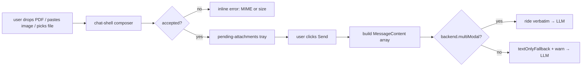

# Multi-modal input (Capability F6)

Users drag a PDF into the chat, paste a screenshot, or pick a file
via the paperclip button — and the agent receives the content as a
typed `MessageContent[]`. Backends that don't support multi-modal
gracefully fall back to text-only with an explicit warning, never
silently drop content. Capability F6 of the
[r3 dynamic-UI plan](../plans/ediscovery-dynamic-ui-plan.md#96-capability-f6--multi-modal-input-voice--image--file-upload).

> **Slice 1 status.** This entry covers the client-side composer +
> typed shape that ship now: paperclip / drag-drop / paste-image,
> MIME + size validation, multi-part transcript rendering, graceful
> fallback for non-multi-modal backends. The microphone /
> SpeechRecognition path (AC-F6-2) and the server-side upload route
> (`agUiUploadHandler` for AC-F6-5 hardening) land in slice 2.

## Why this matters

Three flavours, all common in production AI:

1. **Voice** — paralegal hits a microphone button and speaks ("mark
   docs 7891234 and 7891236 privileged"). Whisper or browser-native
   `SpeechRecognition` transcribes; the transcript is sent like
   typed input. *Slice 2.*

2. **Image** — paralegal pastes a screenshot of a deposition exhibit:
   *"What custodian is this addressed to?"* The image is sent as a
   multi-modal content part; the agent uses Gemini's vision to extract.

3. **File upload** — paralegal drags a `.pdf` into the chat: *"This
   is a new responsiveness rubric — apply it to the un-tagged set."*
   The PDF is uploaded, parsed (server-side text extraction), the
   parsed text becomes part of the agent's context.

The library exposes these as a single typed shape: `MessageContent[]`.
Backends translate to whatever wire shape the LLM provider expects.



## What you'll build

Nothing — the chat-shell ships with the composer affordances out of
the box. The cookbook walks through what's already wired so you know
the contract.

What you can configure on `<mvk-chat-shell>`:

```html
<mvk-chat-shell
  [acceptedMimeTypes]="['application/pdf', 'image/png', 'image/jpeg']"
  [maxBytes]="5 * 1024 * 1024"
  placeholder="Ask the agent…"
/>
```

`acceptedMimeTypes` and `maxBytes` are signal inputs. Defaults:

| Default | Value |
|---|---|
| `acceptedMimeTypes` | `['application/pdf', 'image/png', 'image/jpeg', 'image/gif', 'image/webp', 'application/vnd.openxmlformats-officedocument.wordprocessingml.document', 'application/vnd.openxmlformats-officedocument.spreadsheetml.sheet']` |
| `maxBytes` | `10 * 1024 * 1024` (10 MB) |

The list supports wildcard suffixes: `'image/*'` matches every image
subtype. Files outside the list are rejected client-side with a
user-visible inline error.

## The composer in detail

Three input paths, one tray:

### Paperclip button

Opens the browser's native file picker. The hidden `<input type="file"
multiple>` advertises the `acceptedMimeTypes` list via its `accept`
attribute, so the system file dialog filters at the OS level. The
chat-shell re-validates after pick (the OS dialog accepts MIME hints
loosely; the JS check is authoritative).

### Drag-and-drop

The transcript element listens for `dragover` / `drop`. While dragging
files over the area, a dashed indigo outline appears (`data-dragging`
attribute). On drop, files flow through the same validation as the
paperclip path.

### Paste-from-clipboard

Cmd/Ctrl-V on the chat panel. `clipboardData.items` walks every entry
of kind `'file'` — pasted screenshots (Cmd-Shift-Ctrl-4 on macOS)
land as `image/png` files. Same validation pipeline.

### Pending-attachments tray

Above the text input, each accepted file renders as a chip:

```
┌──────────────────────────────────────┐
│ 🖼️ screenshot.png            [×]     │
│ 📎 rubric.pdf                [×]     │
└──────────────────────────────────────┘
[ Type your message… ] [Send]
```

Image attachments show a 28×28 thumbnail (data URI). Each chip has a
remove button so the user can drop one without re-attaching everything
else.

### Send

Clicking Send (or Enter):

- If the tray is empty, the draft text is sent as a string (legacy path
  — every existing F1–F5 flow still works).
- If the tray has any attachments, the chat-shell builds a
  `MessageContent[]` payload:
  - `{ kind: 'text', text }` for the draft (omitted if empty).
  - `{ kind: 'image', mimeType, data: <data URI>, alt: filename }`
    for image files.
  - `{ kind: 'file', mimeType, filename, uri: <data URI>, sizeBytes }`
    for non-image files.
- The tray clears, the message lands in the transcript with multi-part
  rendering, the chat-ref forwards to the active backend.

## The contract — `MessageContent`

```ts
type MessageContent =
  | { kind: 'text'; text: string }
  | {
      kind: 'image';
      mimeType: string;
      data: ArrayBuffer | string;   // bytes or data-URI / signed URL
      alt?: string;
    }
  | {
      kind: 'file';
      mimeType: string;
      filename: string;
      uri: string;                  // data-URI for v1; server URI in production
      sizeBytes?: number;
    };
```

Mirrors Anthropic / OpenAI / Gemini conventions. Adapters per backend
translate to the wire shape the LLM expects:

| Backend | Translation |
|---|---|
| AG-UI (current) | `flattenContent` collapses multi-part to text — slice 1 fallback. Slice 2 of F6 extends the AG-UI server adapter to advertise `multiModal: true` and pass parts through verbatim. |
| Hashbrown (planned) | Wraps in Hashbrown's content-block format. |
| A2UI | Text-only by spec; `multiModal` stays `false`; falls back with warning. |

`AgenticMessage.content` is `string | readonly MessageContent[]`. Code
that reads `m.content` MUST handle both branches. The chat-shell's
transcript rendering does this via `isStringContent()` /
`contentParts()` helpers; tool-filter and other internal consumers
type-narrow the same way.

## Graceful degradation when the backend doesn't support multi-modal

`BackendCapabilities.multiModal?: boolean` advertises support. When a
user sends multi-part content to a backend without `multiModal: true`,
the chat-ref:

1. Logs a `console.warn` citing the backend id.
2. Emits an `agentic.run.start` telemetry event with attribute
   `agentic.multimodal.fallback: true`.
3. Synthesises a single text string from the parts:
   - text → verbatim
   - image → `[image: alt (mime)]`
   - file → `[file: filename · sizeKB]`
4. Stores the string on `AgenticMessage.content` and forwards.

The user sees the multi-part rendering in the transcript (the local
copy is untouched); only what's sent over the wire is collapsed. This
keeps the demo cohesive without silent semantic changes — the LLM
sees, at minimum, that attachments existed and what they were called.

```ts
// Wire backend capability when registering:
provideAgenticBackend({
  id: 'gemini-vision',
  factory: () => makeGeminiBackend(),
  capabilities: {
    streaming: true,
    clientTools: true,
    generativeUi: true,
    uiActions: false,
    multiModal: true,  // ← required to receive parts verbatim
  },
});
```

Without this flag, the chat-shell warns and degrades. With it, parts
ride to the backend's `run()` method as `AgenticMessage.content =
[...]`. The backend adapter is responsible for the wire-format
translation.

## Multi-part transcript rendering

The chat-shell renders multi-part user messages with three element
kinds:

```
┌─────────────────────────────────────────┐
│ Apply this rubric to the un-tagged set. │  (text)
│                                         │
│ ┌─────────────────┐                     │
│ │   [thumbnail]   │  alt: rubric.png    │  (image)
│ └─────────────────┘                     │
│                                         │
│ 📎 rubric.pdf                           │  (file — links to URI)
└─────────────────────────────────────────┘
```

Image parts render `` with `[src]` resolved from `data` (string
data-URI rides as-is; `ArrayBuffer` becomes a `URL.createObjectURL()`
on demand and is cached per-buffer in a `WeakMap` so re-renders don't
churn). File parts render as `<a>` links so users can click to open
the underlying URI.

Text parts render as plain `<span>` inside the same bubble.

## Production patterns

- **Server-side upload route.** Slice 1 inlines file bytes as data
  URIs. This works for small files but becomes painful at scale —
  every message-history payload to the LLM carries the bytes again.
  Slice 2 introduces `agUiUploadHandler({ onUpload })` mounted at
  `/uploads`. The composer POSTs each accepted file there, gets back
  a signed URI, and uses the URI as `MessageContent.uri` instead of
  inlining bytes. Hosts implement `onUpload` to AV-scan, store
  durably, and mint the signed URI.

- **AV scanning + redaction (AC-F6-5).** Client-side MIME + size
  validation are necessary but not sufficient. The server-side upload
  route MUST scan content (ClamAV or vendor) before forwarding to the
  LLM. PII redaction happens here too — the upload pipeline can strip
  SSNs / phone numbers / etc. before the LLM ever sees the content.
  The lib doesn't ship the AV step; it's a host-deployment choice
  per environment.

- **Privacy on data URIs in transcripts.** With slice-1 data-URI
  inlining, attachment bytes live in the chat-history payload. If
  history is logged or replayed, the bytes go with it. Move to
  server-uploaded URIs (slice 2) before privileged content rides the
  composer.

- **HIPAA / privileged content.** Hosts deploying for PHI MUST
  disable F6 paths (or restrict to vetted MIME types) until a
  covered BAA is in place with the LLM and storage providers (per
  the r3 plan §4.3). The simplest gate: set `acceptedMimeTypes` to
  `[]` to disable attachments entirely, or override the chat-shell's
  composer in your host wrapper.

- **Cost.** Image and file inputs hit larger per-call LLM costs.
  Wire a per-modality cost histogram via the
  `AGENTIC_TELEMETRY_SINK` token; surface in your FinOps dashboard.

## Debugging

- **"Attachment doesn't appear in the tray after I drop a file."**
  - Either MIME validation rejected it (check the inline composer
    error), or your transcript element doesn't have the
    `(dragover) (drop)` handlers — confirm you're using
    `<mvk-chat-shell>` directly and not a wrapper that swallows
    these events.
  - The browser may have intercepted the drop because the dragover
    handler didn't `preventDefault()`. The chat-shell does this in
    `onDragOver`; if you see a "navigate to file" or downloaded file,
    the event is being handled outside the chat-shell.

- **"Send button stays disabled."** The button is disabled when the
  draft is empty AND the pending tray is empty. Either type something
  or attach a file.

- **"Image renders broken in the transcript."** The data-URI is
  malformed or the MIME type doesn't match the bytes. Inspect the
  underlying `data:` URL in DevTools. For `ArrayBuffer` backed
  images, the chat-shell creates a `URL.createObjectURL()` lazily —
  if the buffer was detached / transferred, the URL is invalid.

- **"Backend warns but I never sent multi-modal."** Check
  `BackendCapabilities.multiModal` on every registered backend. The
  warning fires whenever non-string `MessageContent[]` lands on a
  backend without the flag, including from programmatic
  `chat.sendMessage([...])` calls outside the composer.

- **"AG-UI server doesn't see my image."** Slice 1's converter
  collapses parts to text via `flattenContent`. The server sees
  `[image: alt (mime)]` instead of the bytes. Slice 2 extends the
  AG-UI converter to pass parts through verbatim once the server
  advertises support.

## Related cookbook entries

- [HITL approval](./approval-flow.md) / [Long-running operations](./long-running-operations.md) /
  [Composable intake form](./composable-intake-form.md) — F4, F5, F1
  use the same `<mvk-widget-container>` rendering path. Multi-modal
  user messages and generative-UI assistant widgets coexist in the
  same transcript without conflict.
- [Production deployment](./production-deployment.md) — environment-
  routed upload endpoints + per-tenant AV scan integration land here.

## See also

- [Plan, Capability F6](../plans/ediscovery-dynamic-ui-plan.md#96-capability-f6--multi-modal-input-voice--image--file-upload) —
  acceptance criteria, NFR targets, the §9.6.6 redaction-layer spec.
- [`types/agentic-message.ts`](../../projects/agentic-ui/src/lib/types/agentic-message.ts) —
  `MessageContent` union + extended `AgenticMessage`.
- [`chat-shell.component.ts`](../../projects/agentic-ui/src/lib/components/chat-shell.component.ts) —
  composer affordances + transcript multi-part rendering.
- [`inject-agentic-chat.ts`](../../projects/agentic-ui/src/lib/chat/inject-agentic-chat.ts) —
  `sendMessage(content)` accepts both shapes; `textOnlyFallback`
  helper.
- [`backends/ag-ui/converters.ts`](../../projects/agentic-ui/src/lib/backends/ag-ui/converters.ts) —
  `flattenContent` v1 fallback; slice 2 extension lands here.
