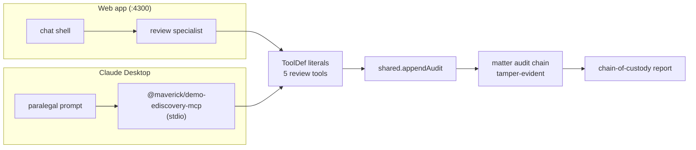

# Paralegal privilege review in Claude Desktop

Phase 6 of the [eDiscovery flagship](../plans/ediscovery-app-plan.md#phase-6--mcp-server-side-for-analyst-workstations-3-days-shipped)
ships an MCP server — `@maverick/demo-ediscovery-mcp` — that exposes the
**review and search toolset** to Claude Desktop / Cursor / Zed. The
paralegal opens their IDE, runs privilege review without switching
context, and every action lands in the **same audit chain** that the
web app's chain-of-custody report consumes. One toolset, two surfaces,
one trail.

> If you only read one page about the eDiscovery example, this is the
> one for execs and litigation-support engineers — the others are for
> Angular developers building on the chassis.

## Why this matters

Most regulated workflows look like this today:
- Counsel and litigation-support live in the web app (matter dashboard,
  custodian intake, productions).
- Paralegals live in their **IDE / desktop chat** doing privilege
  review on Word / PDF / EML extracts.
- Two systems → two audit logs → reconciliation pain at production
  hand-off.

Phase 6 collapses that. The MCP server reuses the **exact** review
tools (`searchDocuments`, `tagDocument`, `markPrivileged`,
`addToPrivilegeLog`, `runTARClassifier`) the web app's review
specialist calls — same handlers, same `appendAudit` writes, same
[Phase 5 tamper-evident chain hash](../adr/0008-registry-scope-policy.md).
The chain-of-custody report covers both surfaces transparently.



## Setup — three steps

### 1. Build the MCP server once

```bash
# From the repo root, the MCP server depends on the workspace's
# library + shared package builds.
npm run build:lib
cd examples/demo-ediscovery-shared && npx tsc -p tsconfig.json
cd ../demo-ediscovery-mcp        && npm install && npm run build
```

The output binary lives at
`examples/demo-ediscovery-mcp/dist/index.js`. It speaks MCP over stdio
and connects when an MCP host launches it.

### 2. Wire it into Claude Desktop

Edit `~/Library/Application Support/Claude/claude_desktop_config.json`
(macOS) or the equivalent on your platform:

```jsonc
{
  "mcpServers": {
    "maverick-ediscovery": {
      "command": "/abs/path/to/node",
      "args": [
        "/abs/path/to/agentic-ui/examples/demo-ediscovery-mcp/dist/index.js"
      ],
      "env": {
        "MVK_USER":   "paralegal-1@firm.example",
        "MVK_MATTER": "M-2026-0042"
      }
    }
  }
}
```

`MVK_USER` becomes the `actor` field on every audit event the
paralegal generates. `MVK_MATTER` scopes the server to one matter —
spawn one MCP server per (paralegal, matter) pair if you have several
running in parallel; the config above supports any number of named
servers under `"mcpServers"`.

### 3. Restart Claude Desktop

The host launches the binary, calls `tools/list`, and now exposes
five tools alongside whatever else the paralegal has wired up. The
log file at `~/Library/Logs/Claude/mcp-server-maverick-ediscovery.log`
shows boot:

```
[mcp] maverick-ediscovery MCP server connected over stdio
      (matter=M-2026-0042, user=paralegal-1@firm.example)
```

## A typical privilege-review session

1. **Find the unreviewed slice.**
   ```
   You: Search for documents in matter M-2026-0042 about the SEC inquiry
        that haven't been tagged yet
   ```
   The host calls `searchDocuments({ query: 'SEC inquiry', tags: [] })`.
   Response renders as an MCP-UI HTML card listing each hit with
   custodian, author, snippet, and current tag chips.

2. **Run TAR to prioritise.**
   ```
   You: Run TAR classification on the unreviewed set for this same topic
   ```
   `runTARClassifier({ topic: 'SEC inquiry', onlyUntagged: true })`.
   The host renders a per-document score table — responsive,
   privileged, and hot bars on each row, ratiionale alongside.

3. **Mark privileged with explicit basis.**
   ```
   You: DOC-7891240 is work-product — it's the litigation-strategy memo
        I drafted last Friday. Mark it.
   ```
   `markPrivileged({ documentId: 'DOC-7891240',
                     reason: 'work-product',
                     note: 'Drafted in anticipation of SEC enforcement' })`.
   The HTML card flips to red-bordered with the privilege reason chip.

4. **Snapshot the privilege log.**
   ```
   You: Add a privilege-log entry summarising today's review —
        "Privilege pass on Q1 2025 SEC-related docs, James OBrien reviewer"
   ```
   `addToPrivilegeLog({ summary: '…' })` — appends one audit event
   listing every currently-privileged document.

The matter's web app at `:4300` shows every change live: the
Documents drawer reflects the new tag, the Audit Trail page's
integrity badge ticks past the new events with a recomputed chain
head, and the chain-of-custody report (when generated for the next
production) includes today's MCP-driven mutations alongside the
web-app ones.

## Per-user audit attribution

The MCP server runs **one process per host configuration entry**.
That makes per-user attribution trivial:

| Pattern | How |
|---|---|
| One paralegal, one matter | One entry in `mcpServers` with their `MVK_USER` |
| Many paralegals on one shared workstation | Don't — each user's Claude Desktop has its own config file. The pattern doesn't fit shared logins. |
| One paralegal across multiple matters | Multiple entries (e.g. `"maverick-ediscovery-acme"`, `"maverick-ediscovery-zyx"`) each with a different `MVK_MATTER` |
| Auth-rotation | Stop overriding env in the config; instead, point `command` at a wrapper that fetches a per-call OIDC token before exec'ing the binary. The MCP `beforeCall` hook is the audit substrate. |

The audit log line always carries `actor` from `MVK_USER`, so the
chain-of-custody report can attribute every action to a specific
paralegal regardless of which surface they used to make it.

## Debugging

- **Server doesn't load.** Check
  `~/Library/Logs/Claude/mcp-server-maverick-ediscovery.log`. Common
  causes: wrong absolute path to `node` or `dist/index.js`, missing
  build (run `npm run build` in `demo-ediscovery-mcp/`), or a stale
  shared-package build (re-run `npx tsc -p tsconfig.json` in
  `demo-ediscovery-shared/`).

- **Tools don't appear in the host.** Restart Claude Desktop fully
  (Cmd+Q on macOS — closing the window doesn't reload the MCP
  config). The host fetches `tools/list` once at server connect.

- **Audit events appear in MCP but not the web app's Audit Trail.**
  The web app and the MCP server are **separate processes** — they
  share `@maverick/demo-ediscovery-shared` *as code*, but each
  process holds its own `MockStore` instance. This is by design:
  the demo's mock data is in-memory; production deployments back
  the audit log with a shared write-once store
  (see [`production-deployment.md`](./production-deployment.md))
  so both processes write to the same chain.

- **Wrong actor on audit lines.** Verify `MVK_USER` in the config
  block matches the paralegal's identity. The env var is read once
  at server boot — restart Claude Desktop after edits.

## Production hardening

The demo ships the **pattern**, not a production deployment. Three
things change between localhost and a regulated deploy:

1. **Audit storage.** Move from `MockStore` (in-memory) to an
   append-only persistent store. The `appendAudit` signature stays
   identical; swap the implementation in
   `examples/demo-ediscovery-shared/src/mock-data.ts` for a write
   to your audit pipeline. The chain hash logic in `hash.ts` stays
   unchanged — replace FNV-1a with SHA-256 keyed off an HSM-backed
   secret per matter.

2. **Authentication.** Replace the `MVK_USER` env var with a
   `beforeCall` hook that asserts a token (OIDC bearer, mTLS cert,
   etc.) and rejects unauthenticated calls. The hook signature is
   already wired:
   ```ts
   beforeCall: ({ name, callId }) => {
     // throw to abort the call; the MCP error surfaces to the host
   }
   ```

3. **Per-user MCP server lifecycle.** Spawn one server per user
   session via your identity provider's session hook. The
   one-process-per-config pattern in Claude Desktop is suitable
   for a single workstation; for an enterprise, run the MCP server
   centrally over HTTP transport (`@maverick/agentic-ui-mcp`'s
   transports include HTTP) and let your gateway terminate the
   user identity.

## Related cookbook entries

- [Production deployment](./production-deployment.md) — `ThreadStateStore` and audit-store swap.
- [Federation at scale](./federation-at-scale.md) — capability prefetch + tool filter.
- [MCP server adapter](./mcp-server.md) — the underlying `@maverick/agentic-ui-mcp` package.

## See also

- [eDiscovery plan, Phase 6](../plans/ediscovery-app-plan.md#phase-6--mcp-server-side-for-analyst-workstations-3-days-shipped)
- [ADR-006 — MCP server-side adapter](../adr/0006-mcp-server-side-adapter.md)
- The MCP server source: [`examples/demo-ediscovery-mcp/src/index.ts`](../../examples/demo-ediscovery-mcp/src/index.ts).
