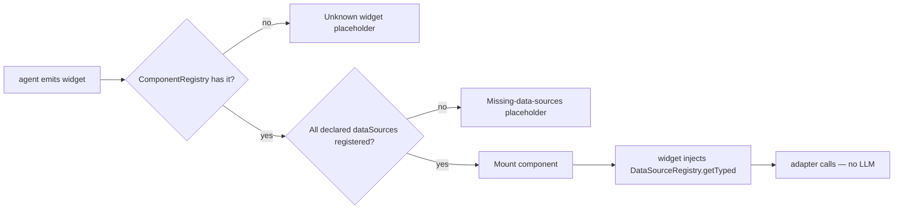

# Widgets with live data (Capability F2)

A widget mounted by the agent calls a backend lookup directly — the LLM
never sees the call, the user types and gets autocomplete suggestions
in tens of milliseconds, and a missing source surfaces a diagnostic
placeholder instead of a silently broken widget. Capability F2 of the
[r3 dynamic-UI plan](../plans/ediscovery-dynamic-ui-plan.md#92-capability-f2--apis-called-from-dynamically-generated-ui).

> Builds on [Composable intake form](./composable-intake-form.md). Read
> that first if you haven't seen the F1 widget contract.

## Tools vs data sources

The library has two complementary primitives for talking to backends:

|   | Tools | Data sources |
|---|---|---|
| Initiator | LLM | UI / widget |
| Cost | LLM tokens per call | None |
| Latency | LLM RTT + tool RTT | Backend RTT only |
| Typical use | mutate matter state, "do X" | autocomplete, dropdown options, pre-fill, lookups |
| Registry | `ToolRegistry` | `DataSourceRegistry` |
| Schema enforcement | Zod-validated args | Caller-side typing via `getTyped<TQuery, TResult>()` |
| Audit | Every call → audit chain (see Phase 5 of the eDiscovery plan) | Caller-side; usually NOT audited |

A tool is *"book a flight"*. A data source is *"give me airports
matching `LH`"*. They typically hit the same backend endpoints — the
registry just lets you swap the implementation (mock for dev, REST for
prod, GraphQL for v2) without changing the widget code.

## Why declare data sources on the widget?

In a federated, agent-driven UI, widgets are loaded at runtime from
remotes, registered into `ComponentRegistry`, and mounted whenever the
agent says so. A widget that silently expects `inject(DataSourceRegistry).get('users')`
fails at first call — *after* the user clicks something, sees a
broken-looking input, and starts diagnosing.

`ComponentDef.dataSources` flips that to **mount-time**:

```ts
agenticWidget({
  name: 'supervisor-signoff-picker',
  component: SupervisorPickerComponent,
  propsSchema: z.object({}),
  dataSources: ['users'],   // declared dependency
});
```

When the chat shell or `<mvk-form-renderer>` (composition mode) goes
to mount this widget, both run a check against `DataSourceRegistry`
first. If `users` isn't there yet, the widget renders a yellow
"missing required data sources" placeholder citing the widget name and
the missing entries. No silent breakage.



## Step 1 — register a data source

```ts
import { agenticDataSource, DataSourceRegistry } from '@infra-tools/agentic-ui';

interface DirectoryUser { email: string; name: string; role: string; }
interface DirectoryUserQuery { prefix?: string; role?: string; }

env.get(DataSourceRegistry).register(
  agenticDataSource<DirectoryUserQuery, Promise<readonly DirectoryUser[]>>({
    name: 'users',
    kind: 'rest',
    adapter: async ({ prefix, role }) => {
      const url = new URL('/api/users', baseUrl);
      if (prefix) url.searchParams.set('prefix', prefix);
      if (role)   url.searchParams.set('role', role);
      const res = await fetch(url);
      return res.json();
    },
  }),
);
```

For prod-vs-dev environment switching, register a different adapter
under the same name. Widgets keep working without modification — that's
the AC-F2-3 conformance promise.

The shorthand `restDataSource(name, baseUrl, fetchFn?)` covers the most
common case (a path-encoded GET / POST against a JSON API):

```ts
env.get(DataSourceRegistry).register(
  restDataSource('users', 'https://api.firm.example/users/'),
);
```

## Step 2 — declare the widget's dependency

```ts
agenticWidget({
  name: 'supervisor-signoff-picker',
  component: SupervisorPickerComponent,
  propsSchema: z.object({}),
  dataSources: ['users'],
});
```

`dataSources` is a `readonly string[]` of registry names. Declare what
the widget consumes; the library validates at mount.

## Step 3 — consume the source from the component

```ts
import { Component, computed, inject, signal } from '@angular/core';
import { DataSourceRegistry } from '@infra-tools/agentic-ui';

@Component({ /* ... */ })
export class SupervisorPickerComponent {
  // Typed view — the registered adapter's actual shape is the runtime
  // source of truth, but the generic narrows the call site for the
  // caller's autocomplete + type-check experience.
  private readonly directory = inject(DataSourceRegistry).getTyped<
    DirectoryUserQuery,
    Promise<readonly DirectoryUser[]>
  >('users');

  protected readonly suggestions = signal<readonly DirectoryUser[]>([]);

  protected async onPrefixChange(prefix: string): Promise<void> {
    const users = await this.directory.adapter({ prefix });
    this.suggestions.set(users);
  }
}
```

`getTyped` throws an `UnknownDataSourceError` if the source is missing,
**but** mount-time validation runs before the widget is constructed,
so in practice the call always succeeds — the placeholder catches the
authoring error earlier. You can rely on this in production code.

## Mount-time diagnostics

If `users` is missing when a widget that declares it tries to mount,
the user sees:

```
┌─────────────────────────────────────────────────────────┐
│  Widget "supervisor-signoff-picker" is missing required │
│  data sources: users                                    │
└─────────────────────────────────────────────────────────┘
```

The same diagnostic fires:
- Inside the chat shell when the agent emits the widget directly
  (`<mvk-widget-container>` resolution path).
- Inside `<mvk-form-renderer>` composition mode when the widget is a
  section in a registered form.

The diagnostic uses the same yellow `.missing` placeholder treatment
as the "Unknown widget" path, so it's immediately recognisable in CSS
audits and screenshot diffs.

## Latency: per-keystroke vs debounced

The plan's NFR target is **p95 ≤ 300 ms** (P-3) from keystroke to
suggestion render. Two design choices keep that within reach:

- **Tools never see the call.** The data source is direct browser →
  backend; no LLM RTT.
- **Adapter is registry-resolved.** Stub it in tests with a synchronous
  `() => mock` and your perf budget evaporates to single-digit ms; in
  prod, the adapter is the only network hop.

You'll typically still want client-side debounce on a per-keystroke
input. Pattern:

```ts
private readonly prefix = signal('');
private readonly debounced = computed(() => {
  // 200 ms debounce via toObservable + debounceTime
  // — wired in your widget; the registry doesn't impose a debounce.
});
```

Per-source caching is also caller-side; the registry intentionally
doesn't impose either policy because the shape of "what's cacheable"
varies per source.

## AC-F2-3 — adapter swap conformance

```ts
// In a test:
const registry = TestBed.inject(DataSourceRegistry);

// 1. Mock for unit tests
const dispose = registry.register(
  agenticDataSource<DirectoryUserQuery, Promise<readonly DirectoryUser[]>>({
    name: 'users',
    kind: 'rest',
    adapter: async () => MOCK_USERS,
  }),
);

// 2. Swap to a real REST adapter for an integration test
dispose();
registry.register(
  restDataSource('users', 'http://localhost:4001/users/'),
);

// Widget code that calls
//   inject(DataSourceRegistry).getTyped('users').adapter({prefix})
// has not changed.
```

The widget's source code is unchanged across the swap. This is what
the F2 conformance test asserts in
[`data-source-registry-typed.spec.ts`](../../projects/agentic-ui/src/lib/registries/data-source-registry-typed.spec.ts).

## Per-environment routing

Deploy-time wiring, not test-time. Your composition-root provider
function chooses the adapter:

```ts
function provideAgenticDataSources(env: 'dev' | 'staging' | 'prod') {
  return makeEnvironmentProviders([
    provideAppInitializer(() => {
      const registry = inject(DataSourceRegistry);
      registry.register(env === 'dev'
        ? agenticDataSource({ name: 'users', kind: 'rest', adapter: mockUsers })
        : restDataSource('users', usersBaseUrlFor(env)));
    }),
  ]);
}
```

The registry's `kind` field (`rest` / `graphql` / `sse` / `http`) is
opaque to the lib but consumed by tooling: telemetry tags spans by
kind, and the registry's `byKind()` filter lets a debug panel list
what's wired. Use it consistently if you have observability needs.

## Federation: a remote contributing a data source

A federated MFE remote can contribute data sources just like it
contributes tools and widgets:

```ts
defineCapabilityModule({
  remoteName: 'directory',
  version: '1.0.0',
  tools: [/* ... */],
  components: [/* ... */],
  dataSources: [
    agenticDataSource({ name: 'users', kind: 'rest', adapter: realUsersFetch }),
    agenticDataSource({ name: 'roles', kind: 'graphql', adapter: realRolesFetch }),
  ],
});
```

The same `removeBySource` teardown works on data sources — when the
remote unloads, its registered sources go with it. Widgets that
declared those sources will start showing the missing-source
placeholder, which is what you want.

## Debugging

- **Widget always shows the missing-source placeholder, even though the
  source is registered.** Two common causes:
  1. Registration ran AFTER the widget was first mounted. Register
     data sources in `provideAppInitializer` or the equivalent
     bootstrap hook before tools / forms.
  2. Source name typo. The placeholder lists the missing names — diff
     against `DataSourceRegistry.list().map(d => d.name)`.

- **`UnknownDataSourceError` thrown from a widget constructor.** This
  shouldn't happen in normal flow because mount-time validation runs
  first. It usually means a code path in the widget calls `getTyped`
  before the widget is mounted by the renderer (e.g., in a
  prematurely-constructed test fixture). Move the call into the
  component lifecycle (e.g., `ngOnInit`) or accept the error as a
  signal that you've misused the contract.

- **Adapter throws a network error.** Caller responsibility. Wrap your
  `adapter` calls in try/catch and surface the error in the widget UI
  (typically with a "couldn't load suggestions" inline note). The
  registry doesn't catch.

- **Per-environment registration silently picked the wrong adapter.**
  Add an `info`-level log on registration with the resolved environment
  + base URL, or use the registry's `kind` field as a tag in a
  debug-mode UI.

## Production patterns

- **Auth.** The `adapter` runs in the browser. Add the user's bearer
  token as a request header inside the adapter implementation. The
  registry doesn't know about auth — adapters are fully opaque to it.
- **Rate limits.** Per-source caching + debouncing are caller-side.
  Implement them in the adapter or wrap the typed view at the
  injection point.
- **Privileged content boundary.** Data sources that return privileged
  content (custodian PII, document text) MUST validate the user's
  scope **on the server side**. Don't rely on persona scope policy
  (`setScopePolicy`) being the only enforcement — that's a UX
  affordance, not a trust boundary.
- **Cancellation.** When the user types fast, you'll fire many
  adapter calls. The registry doesn't auto-cancel. Use `AbortSignal`
  in your adapter and pass a per-call signal from the widget so
  superseded requests cancel cleanly.

## Related cookbook entries

- [Composable intake form](./composable-intake-form.md) — F1; the
  primary consumer of F2 in the eDiscovery flagship.
- [Federate an MFE](./federate-an-mfe.md) — `defineCapabilityModule`
  contributes data sources alongside tools and components.
- [Production deployment](./production-deployment.md) — environment
  routing patterns at deploy time.

## See also

- [Plan, Capability F2](../plans/ediscovery-dynamic-ui-plan.md#92-capability-f2--apis-called-from-dynamically-generated-ui) —
  acceptance criteria, NFR targets, conformance approach.
- [`data-source-registry.ts`](../../projects/agentic-ui/src/lib/registries/data-source-registry.ts) —
  registry + `getTyped` + `missing` + `UnknownDataSourceError`.
- [`agentic-data-source.ts`](../../projects/agentic-ui/src/lib/factories/agentic-data-source.ts) —
  factory + `restDataSource` shorthand.
- The eDiscovery flagship's working `users` source:
  [`agentic.ts`](../../examples/demo-ediscovery-shell/src/app/agentic/agentic.ts) —
  search for `registerDataSources`.
