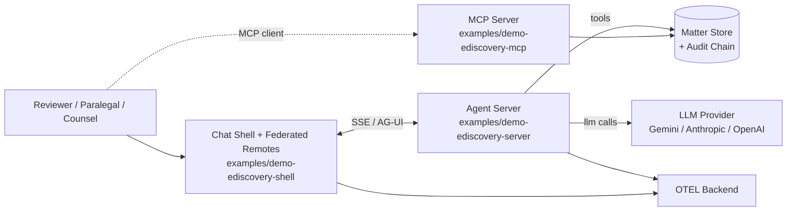
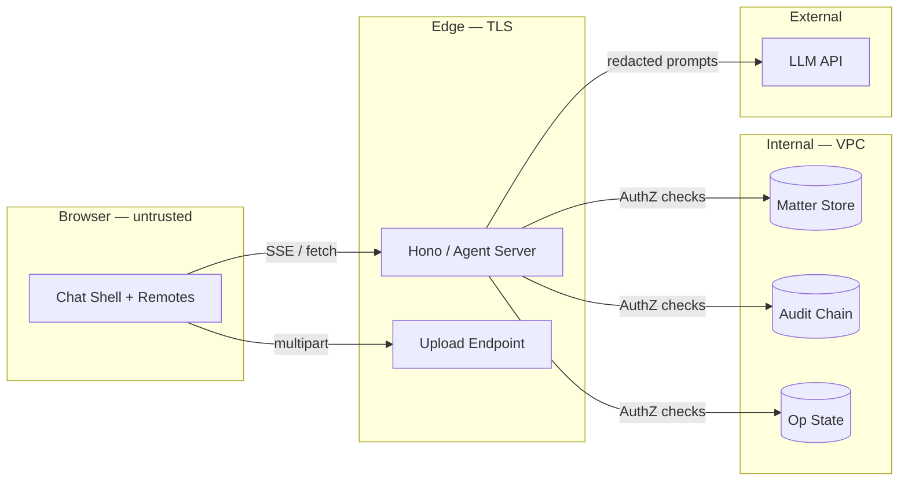
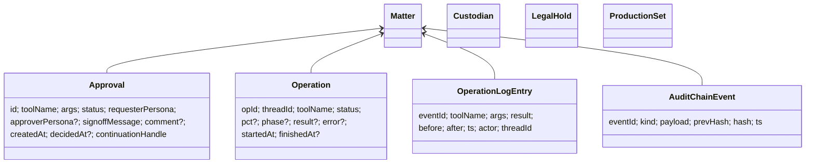
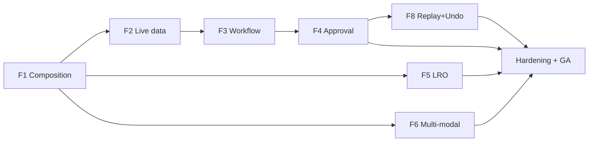

# Program Specification — Agentic-UI Capability Expansion (eDiscovery Flagship)

> **Document type**: Solution Specification + Program Plan (combined)
> **Status**: **Draft for Architecture Review Board (ARB)** — Revision 3
> **Classification**: Internal — Confidential
> **Owner**: Agentic-UI Platform Lead
> **Reviewers (required for sign-off)**: Architecture Review Board · Security & Privacy · Compliance / Legal · SRE · Engineering Lead · Design Lead · Product
> **Cadence**: Reviewed quarterly while in flight; archived at program close.
> **Adds to**: the eDiscovery flagship at `examples/demo-ediscovery-{shell,server,review,production,search,mcp,shared}`. Builds on the eight phases described in [`ediscovery-app-plan.md`](./ediscovery-app-plan.md).
>
> **Revision history**
>
> | Rev | Date | Author | Change |
> |-----|------|--------|--------|
> | r1 | — | Platform Lead | Original four features (composable form, live data, workflow, ambient agent). |
> | r2 | — | Platform Lead | Added four enterprise-buyer asks (HITL approval, LRO, multi-modal, replay/undo). |
> | **r3** | **2026-05-07** | **Platform Lead** | **Rewritten as enterprise solution specification: governance, NFRs, compliance & AI-governance framing, formal acceptance criteria per capability, observability + test + release + cost + ops sections, formal risk register, phase gates with quantified exit criteria. Honest schedule (16–18 weeks single-engineer baseline). Feature 7 split to companion RFC. Effort and DoD batching adjusted on review feedback.** |
>
> **In one paragraph.** This program adds eight agentic-UI capabilities to the eDiscovery flagship — composable forms, live data fetch, guided workflows, human-in-the-loop approval, long-running operations, multi-modal input, ambient context-driven suggestions, and replay/undo — delivered as additive, governed extensions to the existing `@infra-tools/agentic-ui` library and protocol surface. Each capability ships as a vertically integrated increment (library code + conformance tests + demo wiring + Playwright E2E + cookbook + observability + threat-model row + accessibility audit), behind feature flags, with named owners, quantified NFRs, and a documented rollback path.

---

## Table of contents

1. [Executive summary](#1-executive-summary)
2. [Business case](#2-business-case)
3. [Stakeholders, governance, and decision rights](#3-stakeholders-governance-and-decision-rights)
4. [Regulatory, compliance, and standards alignment](#4-regulatory-compliance-and-standards-alignment)
5. [Solution architecture](#5-solution-architecture)
6. [Non-functional requirements](#6-non-functional-requirements)
7. [Security and privacy](#7-security-and-privacy)
8. [AI governance](#8-ai-governance)
9. [Capability specifications](#9-capability-specifications)
10. [Data architecture](#10-data-architecture)
11. [Observability and SRE](#11-observability-and-sre)
12. [Test strategy](#12-test-strategy)
13. [Release and change management](#13-release-and-change-management)
14. [Operational readiness](#14-operational-readiness)
15. [Cost model](#15-cost-model)
16. [Phased delivery and schedule](#16-phased-delivery-and-schedule)
17. [Risk register](#17-risk-register)
18. [Dependencies and assumptions](#18-dependencies-and-assumptions)
19. [Acceptance and sign-off](#19-acceptance-and-sign-off)
20. [Appendices](#20-appendices)

> **Conventions used in this document**
> - Requirements use **RFC 2119 / RFC 8174** keywords (MUST, MUST NOT, SHOULD, SHOULD NOT, MAY) where binding.
> - "**Capability**" refers to a top-level deliverable (F1–F8). "**Feature**" is reserved for sub-functions.
> - All percentile latencies are **end-to-end** (browser → server → browser) unless qualified.
> - Acceptance criteria use **Given / When / Then** to support traceability into test artifacts.

---

## 1. Executive summary

### 1.1 Problem

The eDiscovery flagship today proves the foundation: a chat shell, federated remotes, registry-driven tools and widgets, persona-scoped policy, and a tamper-evident audit chain. What it does not yet prove is the next class of agentic-UI capabilities required by regulated, audit-grade enterprise buyers: agent-composed forms, live-data widgets, guided workflows, human approval gates, long-running operations, multi-modal input, ambient context, and replay/undo.

### 1.2 Solution

Eight capability increments delivered against the existing library + AG-UI protocol. Library extensions are minimal additions to existing seams — `FormRegistry`, `ComponentRegistry`, `DataSourceRegistry`, `ActionRegistry`, `PersistenceRegistry`, `RegistryBase.setScopePolicy` — plus three **new abstractions** scoped narrowly: `WorkflowRegistry` (provisional — see §9.3), `OperationRegistry` (LRO), and `ApprovalRegistry`. A separate **companion RFC** governs the chat-less Observer Agent (formerly Feature 7 — see §9.7).

### 1.3 Outcomes (12-month horizon)

| Outcome | Target | Measurement |
|---|---|---|
| Capabilities shipped | 7 of 8 in flagship; Observer Agent (RFC) gated on ARB | §16 phase-gate sign-off |
| README "Use cases" matrix | 10 → 17 rows (8th row = Observer Agent post-RFC) | README diff |
| Adopters reaching DoR with zero forks | ≥ 3 internal teams, ≥ 1 external pilot | Adoption tracker |
| Chat-shell P95 turn-completion latency | ≤ 2.5 s for non-LRO turns | OTEL `chat.turn.duration_ms` p95 |
| Approval-gated tool false-bypass rate | 0 in conformance + production | Audit-chain reconciliation |
| Undo round-trip correctness on undoable tools | 100% conformance suite pass | `roundTrip()` test §12.2 |
| WCAG 2.1 AA conformance on new UI | 100% of new components | Accessibility audit §12.7 |
| LLM cost per active matter / month | Within phase budget §15 | Cost dashboard |

### 1.4 Investment

Single-engineer baseline: **16–18 weeks** focused engineering plus reviews. Two-engineer split-owner option compresses to **10–12 calendar weeks**. Detail in §16. LLM-cost run-rate impact bounded by per-feature cost guardrails in §15.

### 1.5 Decisions requested at this review

1. **Scope**: ship all 8, or hold F6 (multi-modal) and the Observer RFC for the next program? See §16.4.
2. **Schedule**: single-eng 16–18 wks vs two-eng 10–12 wks. See §16.2.
3. **DoD batching**: per-capability docs/cookbook/Playwright (always) vs per-phase deck/zip/GIF (proposed). See §13.
4. **Constrained-undo policy**: F8 inverse handlers limited to matter-local mutations with no irreversible external I/O? See §9.8.
5. **Observer RFC sponsor & timeline** — name an owner now, even if delivery is deferred. See §9.7.

---

## 2. Business case

### 2.1 Strategic alignment

The library's positioning is "agentic-UI primitives with enterprise governance." Today the flagship demonstrates governance (audit chain, persona scope, MCP). It does **not** demonstrate the agentic-UI surface buyers ask about in the architect-view evaluation: composed forms, live data, workflows, approvals, LROs, multi-modal, ambient, undo. Closing that gap is required to convert architect-stage evaluations to procurement.

### 2.2 Objectives

- **O1 — Demonstrate the full agentic-UI repertoire** in one regulated reference app, so prospects can self-evaluate without a sales call.
- **O2 — Keep extensions additive**: no protocol breaks, no library forks, no demo-only escape hatches.
- **O3 — Govern every capability**: every new event, registry, and UI surface is observable, auditable, scope-policy-aware, and accessibility-compliant.
- **O4 — Make adoption mechanical**: each capability ships with a cookbook + Playwright spec + conformance test, so an adopter can copy-paste the recipe.

### 2.3 Success metrics (KPIs)

| Tier | KPI | Baseline | Target | Owner |
|---|---|---|---|---|
| Outcome | Architect-eval → pilot conversion | n/a | +25% absolute | Product |
| Outcome | Time to first agent-rendered widget for a new adopter (cookbook → green Playwright) | ~2 days | < 4 hours | DevRel |
| Output | Capabilities GA (excluding Observer RFC) | 0 | 7 | Eng Lead |
| Output | Conformance test coverage on new code | n/a | ≥ 90% line, 100% public-API | Eng Lead |
| Quality | Sev-1 production incidents attributable to new code | n/a | 0 in first 90 days post-GA | SRE |
| Quality | Audit chain reconciliation discrepancies | 0 | 0 | Compliance |
| Cost | LLM tokens per matter-month against budget | n/a | Within ±10% of §15 budget | FinOps |

### 2.4 Business value (qualitative)

- **Governance** (F4 approval, F8 undo, audit chain extensions) addresses the single largest enterprise-buyer objection: *"What if the agent does the wrong thing?"*
- **Forms / data / workflows** (F1, F2, F3) reduce custom-app build time for adopters from weeks to days.
- **LRO** (F5) enables real workloads (TAR, classification, large processing) that the current 30-second SSE window cannot support.
- **Multi-modal** (F6) closes parity with M365 / Claude / ChatGPT for workflows that already involve voice and document upload.
- **Replay** (F8) supports compliance review and post-incident analysis without bespoke tooling.

### 2.5 Out of scope

- A general-purpose forms framework. F1 composability is bounded by `FormRegistry` + simple sequencing.
- A workflow engine (BPMN, state-machine modeling). F3 is sequence-with-branching, not orchestration.
- Telemetry / observability beyond OTEL spans for new code paths.
- An event-sourced rebuild. F8 records inverse operations alongside the audit chain.
- A new agent protocol. AG-UI handles all eight cases via existing event types plus four additive event types in F5 (see §9.5).
- Replacing the existing chat shell. All capabilities augment.

---

## 3. Stakeholders, governance, and decision rights

### 3.1 RACI

| Activity | Eng Lead | Product | Architect | Security | Compliance | SRE | Design | DevRel |
|---|---|---|---|---|---|---|---|---|
| Specification (this doc) | A | C | R | C | C | C | C | C |
| Capability F1–F3 (forms, data, workflow) | R/A | C | C | I | I | I | C | I |
| Capability F4 (approval) | R | C | C | **C** | **C** | I | C | I |
| Capability F5 (LRO) | R/A | I | C | I | I | **C** | I | I |
| Capability F6 (multi-modal) | R/A | C | C | **C** | **C** | I | C | I |
| Capability F7 (Observer RFC) | C | C | **R/A** | **C** | **C** | C | C | I |
| Capability F8 (replay/undo) | R | C | C | I | **C** | I | C | I |
| Phase-gate sign-off | C | C | **R** | **R** | **R** | **R** | C | C |
| Production rollout | C | C | C | C | C | **R/A** | I | I |
| Cookbook / docs / deck | C | C | C | I | I | I | C | **R/A** |

R = Responsible, A = Accountable, C = Consulted, I = Informed.

### 3.2 Decision authority

| Decision class | Authority | Notes |
|---|---|---|
| Capability scope changes within a phase | Eng Lead + Product | Logged in change log. |
| Cross-phase scope changes | ARB | Re-baseline of §16. |
| New external dependencies (libraries, services, models) | ARB + Security | DPA / vendor review where applicable. |
| New persisted data classes | Compliance + Security | Triggers data-classification + retention review (§7.4, §10.3). |
| Production rollout to GA | SRE + Eng Lead + Product | Gated on §14 PRR. |
| Rollback execution | SRE on-call | Post-hoc review next business day. |

### 3.3 Phase gates

See §16 for full gate criteria. Each gate requires sign-off from ARB + Security + SRE + Compliance to proceed.

---

## 4. Regulatory, compliance, and standards alignment

> **Scope note.** The flagship is a *reference application*. Compliance posture is described as it applies to the application and to adopters who use the library. The library itself is a delivery vehicle; controls are wired through the application.

### 4.1 eDiscovery domain standards

| Standard | Relevance | Treatment in this program |
|---|---|---|
| **FRCP Rule 26(b)** — proportionality | Scope of preservation, search, production | F3 (workflow) + F1 (intake) capture proportionality inputs; persisted via audit chain. |
| **FRCP Rule 34** — production format | Output formats, Bates numbering | F4 approval gate on `exportProductionSet`; F5 LRO for large productions. |
| **FRCP Rule 37(e)** — preservation / spoliation | Defensibility of preservation actions | F4 approval on `releaseLegalHold`; F8 undo with audit chain `tool-undone` event. |
| **Sedona Conference Principles** (latest editions) | Best-practice posture for ESI | Cooperation, transparency, proportionality reflected in workflow + approval design. |
| **EDRM** (Electronic Discovery Reference Model) | Stage taxonomy | Existing flagship maps to EDRM stages; this program does not move that boundary. |

### 4.2 AI governance frameworks

| Framework | Relevance | Treatment |
|---|---|---|
| **NIST AI RMF 1.0** | Govern / Map / Measure / Manage | §8 documents controls along these four functions. |
| **ISO/IEC 42001:2023** (AI management systems) | AIMS controls | Inventory + approval + monitoring (§8.1). |
| **EU AI Act** (regulation 2024/1689) | Risk classification — eDiscovery agent assistive use is generally limited-risk; HITL on irreversible action is required for any deployment in EU jurisdictions. | F4 (mandatory HITL on irreversible mutations), F8 (undo + audit) satisfy core "human oversight" obligations. |
| **OWASP LLM Top 10** | Prompt injection, output handling, data leakage | §7 threat model, §8.2 prompt safety, §12.5 security tests. |

### 4.3 Data protection

| Regulation | Applicability | Treatment |
|---|---|---|
| **GDPR** (EU 2016/679) | If matter custodians or document content include EU subjects | Lawful basis = legitimate interest / legal obligation; DPIA template referenced in §7.7; data residency configurable per deployment (out-of-band of this program). |
| **CCPA / CPRA** | California subjects | Subject-rights handling delegated to host application; library stores no PII outside what hosts pass in. |
| **HIPAA** (conditional) | If matter contains PHI | Library is HIPAA-neutral; hosts deploying for PHI MUST disable F6 voice/image upload paths through the existing scope-policy mechanism unless a covered BAA is in place with the LLM and storage providers. |

### 4.4 Information security

| Standard | Treatment |
|---|---|
| **SOC 2 Type II** (CC1–CC9) | Existing audit chain (Phase 5) supports CC7.2 (system monitoring) and CC8.1 (change management). New event classes from F4, F5, F8 extend without weakening. |
| **ISO/IEC 27001:2022** Annex A controls | Mapped where new code introduces material risk: A.5.30 ICT readiness, A.8.16 monitoring, A.8.28 secure coding. |
| **CIS Controls v8** | Logging (8.x), data protection (3.x), access control (5.x, 6.x). |

### 4.5 Accessibility

- **WCAG 2.1 AA** for all new and modified UI components.
- **Section 508** (US federal) parity, satisfied by WCAG 2.1 AA conformance.
- **EN 301 549** (EU public-sector) equivalent.

### 4.6 Audit and forensics

- All state mutations introduced by this program MUST emit an event into the **existing tamper-evident audit chain** (Phase 5 deliverable).
- New event kinds (`tool-approved`, `tool-rejected`, `tool-undone`, `operation-{started,progress,finished,failed}`) extend the chain additively and MUST satisfy the existing chain-validation property test.

---

## 5. Solution architecture

### 5.1 Context (C4 L1 — sketch)



### 5.2 Containers (C4 L2 — incremental change map)

| Container | Existing | This program adds |
|---|---|---|
| Chat shell | Chat panel, federated remote loader, `<maverick-form-renderer>`, `<maverick-widget-container>`, `setScopePolicy` filter | `<maverick-workflow-renderer>` (F3), `<mvk-approval-card>` + `/approvals` (F4), `<mvk-operation-progress>` + `/operations` (F5), composer mic/file/drop (F6), `<mvk-suggestion-strip>` (F7 — RFC), `<mvk-agent-history>` + `<mvk-action-replay>` (F8) |
| Agent server | Tool dispatcher, AG-UI SSE, audit chain | Approval intercept loop (F4), LRO state machine + reconnection (F5), upload route (F6), Observer specialist (F7 — RFC), inverse-tool dispatcher (F8) |
| Persistence | Matter store, audit chain | Approval queue, operation log, agent-history log (all `PersistenceRegistry`-backed) |
| LLM provider | Gemini primary | Multi-modal content parts (F6); Observer model selection (F7 — RFC) |
| MCP server | Tool re-export | No change in this program. |

### 5.3 Trust boundaries



**Boundary controls.**
- B1 (browser ↔ edge): TLS 1.3, CSRF tokens on mutations, per-route persona policy.
- B2 (edge ↔ internal): mTLS / VPC-only; service identity via SPIFFE-style or equivalent.
- B3 (edge ↔ LLM): redaction layer in §8.2; no document content sent unless explicitly requested (§7.7).
- B4 (upload): MIME allow-list, AV scan, size cap, signed URI returned to client (§9.6).

### 5.4 Library extension map

| Existing seam | Reference path | Capability touching it |
|---|---|---|
| `FormRegistry` | `projects/agentic-ui/src/lib/registries/form-registry.ts` | F1 |
| `ComponentRegistry` | `projects/agentic-ui/src/lib/registries/component-registry.ts` | F1, F3, F4, F5, F8 |
| `DataSourceRegistry` | `projects/agentic-ui/src/lib/registries/data-source-registry.ts` | F2 |
| `ActionRegistry` | `projects/agentic-ui/src/lib/registries/action-registry.ts` | F3 |
| `PersistenceRegistry` | `projects/agentic-ui/src/lib/registries/persistence-registry.ts` | F4, F5, F8 |
| `RegistryBase.setScopePolicy` | `projects/agentic-ui/src/lib/registries/registry-base.ts` | F1, F4, F5, F7, F8 (every capability honors persona scope) |
| OTEL primitives | `projects/agentic-ui/src/lib/otel/` | All capabilities |

| New abstractions introduced | Scope | Capability |
|---|---|---|
| `ApprovalRegistry` (new) | Tool-name → approval policy; intercepts `runUntilSettled` loop. | F4 |
| `OperationRegistry` (new) | Persisted catalog of in-flight + recently-completed long-running operations. | F5 |
| `WorkflowRegistry` (**provisional** — §9.3, R2) | Prototype as thin coordinator over `FormRegistry` composition first; promote only if 3+ workflows demand. | F3 |
| `AgentContextStream` + `ObserverAgent` (**RFC, separate**) | Out of this program; companion design doc. | F7 |

---

## 6. Non-functional requirements

> **Targets are MUSTs unless marked SHOULD.** Each is mapped to one or more capabilities and is verified by a named test or runbook.

### 6.1 Performance and latency

| ID | Requirement | Target | Verification |
|---|---|---|---|
| P-1 | Non-LRO chat-turn end-to-end latency | p50 ≤ 1.5 s, **p95 ≤ 2.5 s**, p99 ≤ 5 s | OTEL `chat.turn.duration_ms`; load test §12.3 |
| P-2 | Form composition render after persona/context change | p95 ≤ 200 ms | Playwright trace; F1 |
| P-3 | DataSource autocomplete suggestion latency | p95 ≤ 300 ms | F2 load test |
| P-4 | Approval queue page first contentful paint | p95 ≤ 1.0 s | Lighthouse CI; F4 |
| P-5 | LRO progress event end-to-end | p95 ≤ 750 ms from server emit to widget update | F5 conformance |
| P-6 | Suggestion-strip render after route change (when enabled) | p95 ≤ 2.0 s including Observer call | F7 RFC |
| P-7 | Audit-chain append amortized | p99 ≤ 50 ms per event | Existing benchmark, extended for new event kinds |

### 6.2 Availability, RTO, RPO

| ID | Requirement | Target | Notes |
|---|---|---|---|
| A-1 | Agent server availability | 99.95% monthly | Excludes scheduled maintenance windows. |
| A-2 | RTO (recovery time objective) | ≤ 30 min | Restored from latest persistent snapshot. |
| A-3 | RPO (recovery point objective) | ≤ 5 min | Audit chain replication interval. |
| A-4 | LRO durability across server restart | 100% — no operation lost | F5 reconnection; verified §12.4 chaos test. |
| A-5 | Approval state durability | 100% across user sessions and server restart | F4; verified §12.2 conformance. |

### 6.3 Scalability and capacity

| ID | Requirement | Target |
|---|---|---|
| S-1 | Concurrent active matters per agent server | 1,000 |
| S-2 | Concurrent users per matter | 50 |
| S-3 | Tools per matter | 200 |
| S-4 | Concurrent in-flight LROs per matter | 25 |
| S-5 | Pending approvals per matter | 500 |
| S-6 | Audit-chain events per matter | ≥ 10⁶ before requiring partitioning |

### 6.4 Security (summary; full controls in §7)

| ID | Requirement |
|---|---|
| Sec-1 | All mutations MUST be persona-scope authorized (`setScopePolicy`) before execution. |
| Sec-2 | All persisted state changes MUST emit a tamper-evident audit event. |
| Sec-3 | All secrets MUST be loaded via environment / secrets manager; none in repo. |
| Sec-4 | Inputs from untrusted sources (chat, upload, voice) MUST be size-capped, MIME-validated, and AV-scanned where applicable. |

### 6.5 Privacy

| ID | Requirement |
|---|---|
| Pri-1 | No matter content sent to LLM unless caller opts in per turn (existing behaviour preserved). |
| Pri-2 | F6 file uploads pass through redaction layer before LLM forwarding. |
| Pri-3 | F7 Observer prompts strip identifiers per allow-list before LLM forwarding. |
| Pri-4 | All new persisted classes have data-classification + retention defined in §10.3. |

### 6.6 Auditability and forensics

| ID | Requirement |
|---|---|
| Aud-1 | Every action visible in the chat OR triggered by the agent OR triggered by the Observer MUST be reconstructable from `OperationLog` + audit chain. |
| Aud-2 | Replay (F8) MUST reproduce the input message sequence and tool-call sequence exactly, with no live LLM call. |
| Aud-3 | Audit-chain hash continuity property test MUST pass on every CI run (existing) and after each new event-class addition. |

### 6.7 Accessibility

| ID | Requirement |
|---|---|
| Acc-1 | All new interactive components MUST meet WCAG 2.1 AA (perceivable, operable, understandable, robust). |
| Acc-2 | Keyboard parity: every action reachable via mouse MUST be reachable via keyboard, with visible focus. |
| Acc-3 | Screen reader: live regions for streaming text, progress widgets, suggestion strip; tested with NVDA + VoiceOver. |
| Acc-4 | Color contrast ≥ 4.5:1 for text, ≥ 3:1 for non-text UI. |
| Acc-5 | Voice input (F6) MUST have a typed-input fallback path. |

### 6.8 Internationalization and localization

| ID | Requirement |
|---|---|
| I18n-1 | All user-visible strings introduced by this program MUST be externalized (existing `@maverick` i18n key pattern). |
| I18n-2 | Form-composition `if` DSL operates on values, not on display strings. |
| I18n-3 | Date / number / currency formatting MUST use locale from the existing PersonaService context. |

### 6.9 Maintainability and extensibility

| ID | Requirement |
|---|---|
| M-1 | Public APIs MUST be documented with TSDoc + usage example in cookbook. |
| M-2 | Breaking changes MUST go through a deprecation cycle of one minor version with a console warning + cookbook migration note. |
| M-3 | Conformance suite SHOULD reach 90% line coverage and 100% public-API coverage on new code. |

### 6.10 Cost and sustainability

| ID | Requirement |
|---|---|
| C-1 | Per-feature LLM token budget defined in §15. Capability MUST emit token-cost spans for FinOps attribution. |
| C-2 | F7 Observer rate-limit: ≥ 30 s of stable context required before invocation; per-user cap configurable. |
| C-3 | Idle Observer (no context change) MUST consume zero LLM tokens. |

---

## 7. Security and privacy

### 7.1 Trust model

- **Browser** is untrusted. All authorization decisions are server-side.
- **LLM provider** is treated as a third-party processor; no privileged content sent unless caller opts in and a vendor BAA / DPA is in place at the host deployment.
- **Internal services** trust persona claims minted by the host's IDP at session start; persona is rebound on every privileged operation, never cached past session.

### 7.2 STRIDE summary (deltas introduced by this program)

| Threat | Source | Mitigation |
|---|---|---|
| **Spoofing** of approver identity (F4) | Approval queue actions | Persona check on every approve/reject; cryptographic binding of approver to `tool-approved` audit event. |
| **Tampering** with operation results (F5) | Persisted `OperationRegistry` | Audit-chain append on every state transition; reconciliation test in §12.2. |
| **Repudiation** of agent action (F8) | Replay disputes | Replay reads from immutable audit chain; chain validated on read. |
| **Information disclosure** via Observer prompt (F7) | LLM provider receives context | Allow-list redaction; identifier hashing; provider DPA. |
| **Denial of service** via LRO storm | Malicious or buggy caller | Per-matter S-4 cap (25 concurrent), per-user rate limit, queue eviction policy. |
| **Elevation of privilege** via `ui-action` event (F3) | Action-by-another-name attack | `ActionRegistry` enforces same `setScopePolicy` filter as `ToolRegistry`; ADR. |
| **Injection** via voice transcript / image text (F6) | Multi-modal input | Treated as untrusted text; no shell / SQL / template interpolation; prompt-injection countermeasures per OWASP LLM-01. |

### 7.3 Identity, AuthN, AuthZ

- AuthN: delegated to host IDP (existing).
- AuthZ: persona + scope policy via `RegistryBase.setScopePolicy`. Every new registry (`ApprovalRegistry`, `OperationRegistry`) MUST extend `RegistryBase` and inherit the same filter contract. Documented in §9 per capability.
- ABAC attributes considered: persona, matter, jurisdiction, sensitivity tag.

### 7.4 Data classification (delta)

| Data class | Examples | Storage | Retention default |
|---|---|---|---|
| **C0 — Public** | Tool names, widget names | In-process | n/a |
| **C1 — Internal** | Form values pre-submit | Browser memory only | Session |
| **C2 — Confidential** | Approval drafts, operation results, history log | Server persistence + audit chain | Matter lifetime |
| **C3 — Privileged** | Document content, custodian PII | Matter store (existing) | Per matter retention policy |
| **C4 — Restricted** | Voice transcripts, uploaded files | Upload store + redacted copy | 30 days hot, archive per host policy |

### 7.5 Cryptography

- TLS 1.3 in transit on all public endpoints (existing).
- At-rest encryption for persisted approval, operation, and history stores using the existing matter-store KMS envelope.
- Audit-chain integrity uses the existing SHA-256 hash chain (Phase 5). New event kinds added via additive append; no key rotation triggered by this program.

### 7.6 Privileged and work-product material handling

- F4 approval diffs MUST NOT render privileged content to non-cleared personas; the diff renderer interrogates the same scope-policy filter.
- F8 replay MUST honor scope policy at read time; events that include redacted content surface a sentinel.

### 7.7 PII / PHI handling

- F6 upload pipeline includes a configurable redaction stage before LLM forwarding (default: SSN, email, phone, US driver license; configurable per-deployment).
- F7 Observer prompt construction strips ID values per allow-list (matter ID, custodian ID kept; user names, emails redacted).
- DPIA template referenced; full DPIA executed at production rollout per host deployment.

### 7.8 Audit chain spec (delta)

New event kinds introduced — all extend the existing chain primitive with a deterministic JSON-canonicalized payload + previous-hash linkage:

| Kind | Payload | Source |
|---|---|---|
| `tool-approved` | `{toolName, args, approverPersona, approvalId, signoffMessage, ts}` | F4 |
| `tool-rejected` | `{toolName, args, approverPersona, approvalId, comment, ts}` | F4 |
| `operation-started` / `-progress` / `-finished` / `-failed` | `{opId, toolName, ...}` | F5 |
| `tool-undone` | `{toolName, originalEventId, prevResult, actorPersona, ts}` | F8 |

Each MUST pass the existing chain-validation property test; conformance suite extended in §12.2.

### 7.9 Secure SDLC controls

| Control | Mechanism |
|---|---|
| SAST | Existing CI (Angular + ESLint + tsc strict). |
| Dependency / SCA | Dependabot + npm audit; new deps require Security review at ARB. |
| Secret scanning | Gitleaks on pre-commit hook + CI. |
| DAST | Per-deployment, gated by host operator (out of program scope). |
| Threat modeling | Per capability — entries in §9.x.6 and rolled into §17. |

---

## 8. AI governance

### 8.1 Model inventory and approvals (NIST AI RMF — Govern)

| Use | Default model | Approved by | Reviewed |
|---|---|---|---|
| Chat orchestration (existing) | Gemini 2.5 Pro | ARB | Existing |
| Tool selection (existing) | Same | — | — |
| Observer specialist (F7 — RFC) | Gemini 2.5 Flash (low-latency) | ARB sign-off required at RFC | Quarterly |
| Vision (F6 image) | Gemini 2.5 Pro | ARB sign-off at F6 entry | At GA |
| Voice transcription (F6) | Browser native `SpeechRecognition` first; Whisper-on-server optional | ARB | At GA |

Model substitution requires ARB + Security re-review.

### 8.2 Prompt and output safety (NIST AI RMF — Manage; OWASP LLM-01, LLM-02)

- **System-prompt isolation**: user content never modifies system instructions; existing pattern.
- **Tool-output sanitization**: tool results that re-enter the chat MUST be wrapped as user-content blocks, never as system or assistant continuations.
- **Output handling**: rendered text passes through Angular's existing sanitizer; widget args validated by schema before render.
- **Prompt-injection defenses**: F6 file-content + F7 observer context apply allow-list redaction and structural delimiters.
- **Refusal behaviour**: tool-call rejections render as text-deltas with explicit reason; do not silently no-op.

### 8.3 Human-in-the-loop policy (NIST AI RMF — Manage; EU AI Act art. 14)

- **Mandatory HITL** on irreversible mutations: `exportProductionSet`, `releaseLegalHold`, any tool flagged `reversible: false` at registration.
- **Scope-policy override** disallowed: even a privileged persona cannot bypass HITL on a flagged tool; only explicit `agenticApproval` policy with `required: () => false` can.
- **Audit**: HITL decisions are part of the audit chain (§7.8).

### 8.4 Hallucination and drift mitigation (NIST AI RMF — Measure)

- All tool calls validated against zod schemas (existing); arg drift surfaced as a tool-call error, not silent acceptance.
- F4 diffs render the *factual* tool-arg payload, not LLM-generated prose; reviewer signs off on what will execute, not on a summary.
- F7 Observer suggestions MUST cite the tool they would invoke; suggestions without a bound tool are filtered.

### 8.5 Cost controls (NIST AI RMF — Manage)

- Per-tool LLM-token telemetry (existing OTEL spans).
- Per-feature monthly budget §15; alerts at 70% / 90% / 110%.
- F7 Observer hard cap: ≤ 1 invocation per 30 s per user, ≤ N invocations per matter-day (configurable).
- Idle = zero spend (P-7).

### 8.6 Bias, fairness, equitable access

- Persona-aware suggestions (F7) MUST NOT differ in availability based on protected attributes; persona is role-based, not identity-based.
- Multi-modal (F6) MUST preserve text-only parity for users without microphone / camera permission.
- Voice transcription quality varies by accent; MUST surface transcript for user confirmation before send (existing pattern in voice UIs).

---

## 9. Capability specifications

> **Per-capability template** (uniform across F1–F8):
> - .1 User stories
> - .2 Acceptance criteria (G/W/T)
> - .3 Architecture delta
> - .4 Public contracts
> - .5 NFR targets
> - .6 Security & privacy
> - .7 Compliance impact
> - .8 Telemetry
> - .9 Test plan
> - .10 Risks & mitigations
> - .11 DoR / DoD
> - .12 Effort

### 9.1 Capability F1 — Composable intake form (widgets → form)

#### 9.1.1 User stories

- **U-F1-1** As a paralegal onboarding a custodian, I want the agent to render an intake form composed of the right fields for the matter type and persona, so that I do not have to wade through irrelevant sections.
- **U-F1-2** As a developer onboarding a new matter type, I want to declare the intake form as an ordered list of registered widgets with simple `if` predicates, so that I can ship a new variant in hours rather than days.

#### 9.1.2 Acceptance criteria

- **AC-F1-1** **Given** a matter where `type === 'securities'` **When** the agent opens `custodianIntake` **Then** the regulatory-disclosure section is rendered and the persona-conditional supervisor-signoff section is rendered for non-`lead-counsel` personas.
- **AC-F1-2** **Given** a partially completed form **When** the persona switches **Then** sections that survive the new `if` evaluation MUST retain user-entered values; sections removed MUST drop their values, with a confirmation prompt if values were entered.
- **AC-F1-3** **Given** a malformed `if` expression at registration **When** the developer registers the composition **Then** registration MUST throw a typed error citing the expression and line, before any UI mounts.
- **AC-F1-4** Composition rendering meets P-2 (p95 ≤ 200 ms).
- **AC-F1-5** All sections MUST satisfy WCAG 2.1 AA (Acc-1).

#### 9.1.3 Architecture delta

```ts
agenticForm({
  name: 'custodianIntake',
  composition: [
    { widget: 'contact-card-fields',         section: 'Identity' },
    { widget: 'regulatory-consent-checkbox', section: 'Compliance', if: 'matter.type === "securities"' },
    { widget: 'supervisor-signoff-picker',   section: 'Approval',   if: 'persona !== "lead-counsel"' },
    { widget: 'accounting-system-picker',    section: 'Discovery',  if: 'department === "Finance"' },
  ],
  submit: async (values, ctx) => { /* aggregated values */ },
});
```

- Each composition entry references a widget already in `ComponentRegistry`.
- `if` is a tiny expression DSL evaluated against `{ matter, persona, ...partialValues }`. Spec is fixed: `===`, `!==`, `&&`, `||`, dotted access, parentheses, string + number + boolean literals. No function calls, no regex, no short-circuit side effects.
- Renderer subscribes to a context signal; toggles sections with animation; preserves form state on toggle.

#### 9.1.4 Public contracts

```ts
type IfExpression = string;  // validated by AST shape at registration
interface CompositionEntry {
  widget: string;          // ComponentRegistry name
  section?: string;
  if?: IfExpression;
  predicate?: (ctx: FormContext) => boolean;  // escape hatch (R1)
}
interface FormDef {
  // existing...
  composition?: CompositionEntry[];
}
```

#### 9.1.5 NFR targets

P-2 ≤ 200 ms, Acc-1 (full WCAG 2.1 AA), I18n-1, M-1, M-3.

#### 9.1.6 Security and privacy

- Scope policy applies: a section whose widget is filtered out by `setScopePolicy` MUST NOT mount and MUST NOT be referenced in the composition view.
- `if` evaluator MUST NOT have access to anything outside the `FormContext`.

#### 9.1.7 Compliance impact

Low. No new persisted classes. No regulatory delta.

#### 9.1.8 Telemetry

- Span `form.composition.evaluate` with attributes `{form, sectionsBefore, sectionsAfter, evalDurationMs}`.
- Counter `form.composition.section_toggles` per `{form, section}`.

#### 9.1.9 Test plan

- Unit: expression-DSL parser (positive + adversarial cases including injection attempts).
- Conformance: composition rendering across backends.
- Playwright: AC-F1-1, AC-F1-2.
- A11y: axe-core scan on rendered form.

#### 9.1.10 Risks and mitigations

| ID | Risk | Mitigation |
|---|---|---|
| R-F1-A | DSL bloat (R1 in r2) | Hard-cap AST shape; offer `predicate` escape hatch; reject anything else at registration. |
| R-F1-B | Section thrash on context change | Debounce evaluator at 50 ms; preserve scroll position. |

#### 9.1.11 DoR / DoD

**DoR** — Acceptance criteria reviewed; widgets `regulatory-consent-checkbox`, `supervisor-signoff-picker`, `accounting-system-picker` enumerated and DoR'd.
**DoD** — All criteria pass; conformance + Playwright green; cookbook `composable-intake-form.md` published; OTEL spans visible; a11y audit attached; README "Use cases" matrix +1 row.

#### 9.1.12 Effort

**Medium.** ~1.5 wks single-eng (renderer + DSL + demo wiring).

---

### 9.2 Capability F2 — APIs called from dynamically generated UI

#### 9.2.1 User stories

- **U-F2-1** As a paralegal filling in a custodian intake, I want the department field to autocomplete from our directory, so that I cannot mistype.
- **U-F2-2** As a developer authoring a widget, I want to declare the data sources my widget needs and receive a typed accessor at mount, so that I do not couple my widget to a specific HTTP shape.

#### 9.2.2 Acceptance criteria

- **AC-F2-1** **Given** a widget declares `dataSources: ['users']` **When** mounted into a host that has not registered `users` **Then** mount MUST fail with a clear error citing the widget and the missing source.
- **AC-F2-2** **Given** a registered `users` source **When** the user types into the supervisor picker **Then** suggestions populate within p95 ≤ 300 ms (P-3).
- **AC-F2-3** Adapter swap (mock → REST → GraphQL) MUST require zero changes to the widget.

#### 9.2.3 Architecture delta

```ts
agenticWidget({
  name: 'supervisor-signoff-picker',
  component: SupervisorPickerComponent,
  propsSchema: z.object({ matterId: z.string() }),
  dataSources: ['users'],
});
```

```ts
const users = inject(AgenticDataSources).get<UserQuery, UserResult>('users');
await users.adapter({ op: 'search', prefix, role: 'lead-counsel' });
```

Add: validation pass at widget mount that all declared sources are registered.

#### 9.2.4 Public contracts

```ts
interface WidgetDef {
  // existing...
  dataSources?: string[];
}
class AgenticDataSources {
  get<TQuery, TResult>(name: string): TypedDataSource<TQuery, TResult>;
}
```

#### 9.2.5 NFR targets

P-3 (≤ 300 ms p95), Sec-1, M-1.

#### 9.2.6 Security and privacy

- Source registration MUST be persona-scope-aware (`setScopePolicy` on `DataSourceRegistry`).
- Source adapter calls do not transit the LLM.

#### 9.2.7 Compliance impact

Low. Lookup queries logged at host discretion.

#### 9.2.8 Telemetry

- Span `data_source.query` with `{name, op, durationMs, resultCount, cacheHit}`.

#### 9.2.9 Test plan

- Unit: typed accessor; mount-time validation.
- Conformance: adapter swap.
- Playwright: autocomplete populates from a mock source.

#### 9.2.10 Risks and mitigations

| ID | Risk | Mitigation |
|---|---|---|
| R-F2-A | Network thrash on typing | Caller-side debounce + cancellation; documented. |
| R-F2-B | Cross-source data leakage between matters | Adapter signature includes `matterId`; contract test. |

#### 9.2.11 DoR / DoD

DoR — F1 in flight or shipped (F2 wires through F1's widgets).
DoD — AC-* pass; cookbook `widgets-with-live-data.md` published; conformance green.

#### 9.2.12 Effort

**Small.** ~3–4 days.

---

### 9.3 Capability F3 — Interactive workflow (wizard) — *Provisional registry*

#### 9.3.1 User stories

- **U-F3-1** As a paralegal placing a legal hold, I want to be guided step-by-step with the agent suggesting and refining each input, so that I do not miss a required step.
- **U-F3-2** As a developer adding a workflow, I want a single declaration that ties widgets, transitions, and a final tool call, so that I do not re-invent state machines.

#### 9.3.2 Acceptance criteria

- **AC-F3-1** **Given** the four-step `placeLegalHold` workflow **When** the user completes all steps **Then** the existing `placeLegalHold` tool MUST be invoked once with the aggregated state and the matter MUST persist the hold.
- **AC-F3-2** **Given** zero custodians selected at step 2 **When** the user clicks Next **Then** the wizard MUST jump to `matter-setup`, not `date-range`.
- **AC-F3-3** **Given** the user clicks Back at any step **When** they return **Then** prior step values MUST be preserved.
- **AC-F3-4** **Given** a server-emitted `ui-action` with `op: 'workflow.transition'` **When** the workflow renderer receives it **Then** the transition MUST apply only if the target step exists in the workflow def.

#### 9.3.3 Architecture delta — provisional

> **Decision required at F3 entry-gate.** Per R2, prototype as `FormRegistry.composition` + a thin step coordinator (no new top-level registry). Promote to `WorkflowRegistry` only if a second + third workflow demand it. ARB ratifies at F3 exit.

```ts
agenticWorkflow({
  name: 'placeLegalHold',
  steps: [
    { id: 'scope',       widget: 'keyword-chip-picker',   next: 'custodians' },
    { id: 'custodians',  widget: 'custodian-multi-select',
      next: (s) => s.custodians.length === 0 ? 'matter-setup' : 'date-range' },
    { id: 'date-range',  widget: 'date-range-picker',     next: 'preview' },
    { id: 'preview',     widget: 'hold-notice-preview',   next: null },
  ],
  onComplete: async (state, ctx) => ctx.tools.placeLegalHold(state),
});
```

#### 9.3.4 Public contracts

```ts
interface WorkflowDef {
  name: string;
  description?: string;
  steps: StepDef[];
  onComplete: (state: unknown, ctx: WorkflowCtx) => Promise<unknown>;
}
interface StepDef {
  id: string;
  widget: string;
  next: string | null | ((state: unknown) => string | null);
}
```

#### 9.3.5 NFR targets

P-1 (turn latency), Acc-1, Sec-1 (every step's widget honored by scope policy).

#### 9.3.6 Security and privacy

- `ui-action` events MUST be filtered by an `ActionRegistry` predicate equivalent to `setScopePolicy`. ADR — actions are tools-by-another-name.
- Workflow state held only in memory until `onComplete` (not persisted).

#### 9.3.7 Compliance impact

Workflow completion is a single tool invocation; existing audit posture preserved.

#### 9.3.8 Telemetry

- Span `workflow.step` with `{workflow, step, durationMs, transition}`.
- Counter `workflow.completed{workflow, terminalStep}`.

#### 9.3.9 Test plan

- Unit: step transition function purity; back-navigation invariants.
- Conformance: `ui-action` -> transition routing.
- Playwright: AC-F3-1 through AC-F3-4.

#### 9.3.10 Risks and mitigations

| ID | Risk | Mitigation |
|---|---|---|
| R-F3-A | Registry overlap with FormRegistry composition (R2) | Prototype-first; ARB review at exit gate. |
| R-F3-B | `ui-action` privilege escalation (R5) | `ActionRegistry` enforces `setScopePolicy`-equivalent filter. |

#### 9.3.11 DoR / DoD

DoR — F1 + F2 shipped. ADR on `ui-action` security boundary written.
DoD — AC-* pass; cookbook `interactive-workflows.md` published; ARB decision on registry promotion logged.

#### 9.3.12 Effort

**Medium-large.** ~2 weeks (renderer + state machine + ui-action wiring).

---

### 9.4 Capability F4 — Human-in-the-loop approval

#### 9.4.1 User stories

- **U-F4-1** As lead counsel, I want to be the only persona that can approve a production export, so that no paralegal can deliver to opposing counsel without my sign-off.
- **U-F4-2** As a paralegal, I want to draft an approval-gated action and see it queued for review, so that I can keep working without blocking on counsel.
- **U-F4-3** As a compliance reviewer, I want every approval decision in the tamper-evident audit chain, so that I can defend the production set in court.

#### 9.4.2 Acceptance criteria

- **AC-F4-1** **Given** a paralegal invokes `exportProductionSet` **When** the agent attempts to execute the tool **Then** the tool MUST NOT execute and an approval record MUST be persisted with status `pending`.
- **AC-F4-2** **Given** a queued approval **When** lead counsel opens `/approvals` **Then** the diff MUST render with the exact arg payload that will be executed on approve.
- **AC-F4-3** **Given** lead counsel clicks Approve **When** the resume occurs **Then** the original chat thread MUST receive the tool result as if no pause had happened, and the audit chain MUST contain `tool-approved` then `tool-executed` events linked by `approvalId`.
- **AC-F4-4** **Given** lead counsel clicks Reject with a comment **When** the requester next loads their thread **Then** an `agent.notification` event MUST display the rejection and reason; the tool MUST NOT execute.
- **AC-F4-5** **Given** a paralegal logs out and back in mid-pending **Then** the original thread MUST resume into the pending state and continue.
- **AC-F4-6** Audit-chain reconciliation property test passes including the new event kinds.

#### 9.4.3 Architecture delta

```ts
agenticApproval({
  tool: 'exportProductionSet',
  required: (args, ctx) => ctx.persona !== 'lead-counsel',
  approverRoles: ['lead-counsel'],
  diffRenderer: 'production-summary-diff',
  signoffMessage: (args) => `Approve delivery of ${args.productionId}?`,
});
```

- Chat-shell `runUntilSettled` loop intercepts tool calls matching an approval policy.
- New widget `<mvk-approval-card>` and route `/approvals` (filtered by persona).
- New persisted entity `Approval` (see §10.2).

**Resume design (the trickiest part — explicit spec).**

```mermaid
sequenceDiagram
  participant Para as Paralegal Thread
  participant Loop as runUntilSettled
  participant Reg as ApprovalRegistry
  participant Per as PersistenceRegistry
  participant Lead as Lead Counsel Thread

  Para->>Loop: tool-call: exportProductionSet
  Loop->>Reg: required(args, ctx)?
  Reg-->>Loop: yes
  Loop->>Per: persist Approval{pending}
  Loop-->>Para: emit `pending-approval` event<br/>(thread parked w/ continuation handle)
  Note over Para: thread is durable;<br/>handle = {threadId, turnId, toolCallId, approvalId}
  Lead->>Reg: GET /approvals
  Lead->>Reg: POST approve(approvalId)
  Reg->>Per: status=approved + approverPersona
  Reg->>Loop: resume(handle)
  Loop->>Loop: execute tool with original args
  Loop-->>Para: tool-result (next time thread reopens or live if connected)
```

- Continuation handle stored with the Approval entity.
- Per-backend resume: AG-UI thread resumes via SSE on next reconnect; offline durability holds the handle until reconnect.

#### 9.4.4 Public contracts

```ts
interface ApprovalPolicy {
  tool: string;
  required: (args: unknown, ctx: AgentCtx) => boolean;
  approverRoles: string[];
  diffRenderer: string;
  signoffMessage: (args: unknown) => string;
  slaMinutes?: number;
  autoApproveAfterAuditNote?: boolean;
}
```

#### 9.4.5 NFR targets

A-5 (durability), Sec-1, Sec-2, Aud-1, Aud-2, Acc-1; P-4 (FCP ≤ 1 s).

#### 9.4.6 Security and privacy

- Approver identity bound by IDP at decision time, not at queue insertion (revocation safety).
- Diff renderer honors persona scope (privileged content not exposed to ineligible reviewers).
- Approval queue rate-limited per user; CSRF-protected.

#### 9.4.7 Compliance impact

- Direct support for FRCP 37(e) defensibility (recorded human authorization for irreversible action).
- Direct support for EU AI Act art. 14 (effective human oversight).
- New event kinds in audit chain (§7.8); chain validation extended.

#### 9.4.8 Telemetry

- Counter `approval.requested{tool, persona}`, `approval.decided{tool, decision, latencyMs}`.
- Span `approval.resume` with `{toolCallId, approvalId, durationMs}`.

#### 9.4.9 Test plan

- Unit: required-predicate; resume-handle persistence.
- Conformance: chain-validation includes new events.
- Playwright: AC-F4-1 through AC-F4-5 (LLM-free, uses echo agent for the assistant turn).
- Chaos (§12.4): server restart between queue and approve — state survives.

#### 9.4.10 Risks and mitigations

| ID | Risk | Mitigation |
|---|---|---|
| R-F4-A | Resume across backends untested (review feedback) | Per-backend resume contract test. |
| R-F4-B | Queue black hole (R6) | SLA timeouts + escalation; auto-approve-with-audit-note option. |
| R-F4-C | Diff misrepresents what executes | Diff IS the arg payload; not LLM-summarized; property test asserts equality. |

#### 9.4.11 DoR / DoD

DoR — F3 shipped (gate fits naturally as a workflow step); resume-design ADR approved by ARB.
DoD — AC-* pass; conformance + chain validation green; cookbook `approval-flow.md`; OTEL spans visible; a11y audit attached.

#### 9.4.12 Effort

**Medium-large.** ~2 weeks single-eng.

---

### 9.5 Capability F5 — Long-running operations (LRO)

#### 9.5.1 User stories

- **U-F5-1** As a paralegal running TAR classification on 50,000 documents, I want to watch progress and walk away, so that I can do other work while it runs.
- **U-F5-2** As an SRE, I want LRO state to survive server restart, so that no operation is silently lost.

#### 9.5.2 Acceptance criteria

- **AC-F5-1** **Given** a long-running tool **When** invoked **Then** the tool MUST return `{opId}` immediately and emit `operation-started`.
- **AC-F5-2** **Given** a running operation **When** the server restarts **Then** the operation MUST survive (A-4) and the next reconnect MUST reattach progress.
- **AC-F5-3** **Given** the user closes the browser and returns **When** they open `/operations` **Then** all in-flight + recent ops for that persona MUST list with current status.
- **AC-F5-4** Progress event end-to-end ≤ 750 ms p95 (P-5).
- **AC-F5-5** Audit chain has matching `operation-started`...`operation-finished|failed` for every op.

#### 9.5.3 Architecture delta

Four new event kinds:

```ts
type AgenticEvent =
  | ...
  | { type: 'operation-started';  opId; toolName; estDurationMs?; description }
  | { type: 'operation-progress'; opId; pct; phase?; partialResult? }
  | { type: 'operation-finished'; opId; result; durationMs }
  | { type: 'operation-failed';   opId; error: { code; message } };
```

> **Non-goal correction.** §2.5 forbids replacement of existing protocol types; F5 adds four event types **additively**. Backends opt in; backends without LRO support degrade to synchronous tool execution with a clear console warning.

Tool opt-in:

```ts
agenticTool({
  name: 'runTARClassifier',
  longRunning: true,
  handler: async (args, ctx) => {
    const opId = ctx.startOperation({ description: `TAR-classify ${args.topic ?? 'all'}` });
    void runClassifierBackground(args, opId, ctx);
    return { opId };
  },
});
```

Reconnection: chat-shell on SSE reconnect issues `GET /operations?threadId=X` and re-attaches widgets to in-flight ops keyed by `(threadId, opId)`.

#### 9.5.4 Public contracts

```ts
interface ToolDef {
  longRunning?: boolean;
}
interface AgentCtx {
  startOperation(meta: OperationMeta): OperationId;
  reportProgress(opId: OperationId, p: ProgressUpdate): void;
  completeOperation(opId: OperationId, result: unknown): void;
  failOperation(opId: OperationId, err: OperationError): void;
}
```

#### 9.5.5 NFR targets

P-5, A-4 (durability), S-4 (25 concurrent), Sec-2.

#### 9.5.6 Security and privacy

- Operation results may include privileged content; stored under matter-store envelope encryption.
- Persona scope honored on both `/operations` listing and on resume.

#### 9.5.7 Compliance impact

Audit chain extended (§7.8). LRO completion does not bypass any existing approval policy — F4 + F5 compose: an approval-gated, long-running tool queues for approval first, then runs as LRO.

#### 9.5.8 Telemetry

- Span `lro.run` per operation with `{toolName, opId, durationMs, finalStatus}`.
- Histogram `lro.progress.gap_ms` for healthy-stream detection.

#### 9.5.9 Test plan

- Unit: state transitions; reconnection.
- Conformance: cross-backend LRO behaviour; backends without LRO emit warning.
- Playwright: AC-F5-1, AC-F5-3 (mock 5s sleep + progress emits).
- Chaos (§12.4): kill server mid-operation; verify reattach.

#### 9.5.10 Risks and mitigations

| ID | Risk | Mitigation |
|---|---|---|
| R-F5-A | Cross-session reattach (R7) | `(threadId, opId)` keyspace; tested via chaos. |
| R-F5-B | Operation orphan if tool handler crashes mid-run | Health probe + auto-fail with stuck-detector. |

#### 9.5.11 DoR / DoD

DoR — `PersistenceRegistry` schema for `OperationLog` reviewed.
DoD — AC-* pass; cookbook `long-running-operations.md`; chaos test green.

#### 9.5.12 Effort

**Medium.** ~1.5 wks.

---

### 9.6 Capability F6 — Multi-modal input (voice / image / file upload)

#### 9.6.1 User stories

- **U-F6-1** As a paralegal in a hurry, I want to dictate a tag instruction by voice, so that I do not have to type document IDs.
- **U-F6-2** As a paralegal reviewing a deposition exhibit, I want to paste a screenshot and ask the agent about it, so that I do not need to re-describe in words.
- **U-F6-3** As a paralegal updating a rubric, I want to drop a PDF in the chat, so that the agent can apply it.

#### 9.6.2 Acceptance criteria

- **AC-F6-1** **Given** a `.pdf` dropped on the chat panel **When** the upload completes **Then** the assistant message MUST include a `{kind: 'file', uri}` content part referencing a server-stored object.
- **AC-F6-2** **Given** a microphone input **When** transcription completes **Then** the transcript MUST be displayed for user confirmation **before** sending (Acc-5).
- **AC-F6-3** Voice path MUST have a typed-input fallback indistinguishable in features (Acc-5).
- **AC-F6-4** **Given** a backend without multi-modal support (e.g. A2UI) **When** a file part is sent **Then** the adapter MUST surface a clear console + telemetry warning and either drop the part (with notice) or refuse the message — never silently change semantics.
- **AC-F6-5** All upload paths satisfy size cap, MIME allow-list, and AV scan before LLM forwarding.

#### 9.6.3 Architecture delta

```ts
type MessageContent =
  | { kind: 'text'; text: string }
  | { kind: 'image'; mimeType: string; data: ArrayBuffer | string }
  | { kind: 'file'; mimeType: string; filename: string; uri: string };

interface AgenticMessage {
  id: string;
  role: 'user' | 'assistant' | 'tool';
  content: string | MessageContent[];
}
```

- Composer: mic button, paperclip button, drag-drop, paste-from-clipboard.
- Server: optional `agUiUploadHandler({ onUpload })` mounted at `/uploads`.
- Per-backend translation: AG-UI passthrough, Hashbrown wrapper, A2UI text-fallback with explicit warning.

#### 9.6.4 Public contracts

(See above; plus `MultiModalAdapter` interface.)

#### 9.6.5 NFR targets

Acc-1, Acc-5, Sec-4, Pri-2.

#### 9.6.6 Security and privacy

- Upload AV scan (ClamAV / equivalent) before forwarding to LLM.
- Redaction stage on file-content extraction (Pri-2).
- Voice transcripts treated as untrusted text (§7.2 Injection mitigation).
- Sensitive deployments (HIPAA) MUST disable F6 unless covered.

#### 9.6.7 Compliance impact

DPIA delta — voice transcripts and image OCR are new processing classes.

#### 9.6.8 Telemetry

- Counter `upload.received{mime, sizeBucket}`, `upload.rejected{reason}`.
- Histogram `upload.scan.duration_ms`.

#### 9.6.9 Test plan

- Unit: per-adapter translation, including A2UI fallback.
- Integration: upload → AV scan → URI handoff → LLM.
- Playwright: mic mock, file drop, paste image (AC-*).
- Real-LLM gated: image vision response (cost-budgeted).

#### 9.6.10 Risks and mitigations

| ID | Risk | Mitigation |
|---|---|---|
| R-F6-A | LLM cost / PII leakage (R9) | Redaction layer + per-modality cost tracking. |
| R-F6-B | Backend semantic drift on fallback | Conformance test asserts explicit warning + measurable behaviour. |

#### 9.6.11 DoR / DoD

DoR — Upload endpoint security review; AV provider chosen; PII redaction allow-list approved.
DoD — AC-* pass; cookbook `multi-modal-input.md`; per-modality cost dashboard live.

#### 9.6.12 Effort

**Medium-large.** ~1.5 wks.

---

### 9.7 Capability F7 — Chat-less, context-driven agent — *Deferred to companion RFC*

> **Decision (r3):** F7 is split out of this program as a **companion RFC** (`docs/rfcs/observer-agent-rfc.md` — to be drafted). This program continues to ship F1–F6 and F8 as a coherent bundle. F7 is preserved here as the design seed, but does **not** count toward this program's exit criteria.
>
> **Rationale.** F7 introduces a new server-side specialist agent class, a new client-side context stream, debounce / privacy / cost controls, and a new failure mode (suggestion noise). The scope and risk profile warrant a separate ARB-driven design pass. Forcing it into this program puts the most novel feature on the critical path of seven less-novel ones.

The technical seed below is retained for the RFC author.

#### 9.7.1 Seed scenario

User on `/custodians/CUST-001` (no chat panel open). The Observer reads route + selection + persona and renders a small suggestion strip at the top of the page. Click → invoke bound tool with pre-filled args.

#### 9.7.2 Seed contracts

```ts
interface AgentContext {
  readonly route: string;
  readonly routeParams: Record<string, string>;
  readonly selection?: { type: string; id: string };
  readonly persona: string;
  readonly registries: { tools: string[]; widgets: string[] };
}
```

#### 9.7.3 RFC mandatory topics

- Cost model + per-user / per-matter caps.
- PII redaction allow-list policy + audit.
- Suggestion confidence gating; noise minimization.
- Persona scope policy interaction (no suggestions for tools the persona cannot run).
- Real-LLM evaluation harness for suggestion quality (false positive / true positive rates).
- Failure mode: Observer offline — strip MUST gracefully no-op.
- Privacy review: minimum viable context payload.

#### 9.7.4 Estimated effort (when adopted)

~2.5–3 wks single-eng + RFC review cycle.

---

### 9.8 Capability F8 — Replay + undo

#### 9.8.1 User stories

- **U-F8-1** As lead counsel, I want to undo the agent's release of a legal hold when I discover it was needed for a different production, so that I can recover without bespoke tooling.
- **U-F8-2** As a compliance reviewer, I want to replay the conversation that led to a contested action, so that I can defend the action or document the error.

#### 9.8.2 Acceptance criteria

- **AC-F8-1** **Given** a tool with `inverse: ...` registered **When** invoked successfully **Then** an `OperationLog` row MUST persist with `{toolName, args, result, before, after, ts, actor, threadId}`.
- **AC-F8-2** **Given** an undoable action **When** the user clicks Undo **Then** the inverse handler MUST execute, the matter store MUST equal `before`, and the audit chain MUST contain a `tool-undone` event linked to the original `tool-executed`.
- **AC-F8-3** **Given** a tool registered as `reversible: false` **Then** the Undo button MUST NOT render.
- **AC-F8-4** Replay MUST reproduce the original tool-call sequence verbatim with no live LLM call (Aud-2).
- **AC-F8-5** **Given** an inverse handler that does not round-trip **When** the conformance test runs **Then** the test MUST fail at registration time, not at runtime (R-F8-A).

#### 9.8.3 Architecture delta

```ts
agenticTool({
  name: 'releaseLegalHold',
  schema: z.object({ holdId: z.string(), reason: z.string() }),
  handler: async ({ holdId, reason }, ctx) => { /* mutate */ },
  inverse: async ({ holdId }, prevResult, ctx) => { /* restore */ },
  // Constrained-undo policy (decision-1.4):
  // inverse permitted ONLY for matter-local mutations with no irreversible
  // external I/O. Tools that send email / call external APIs MUST set
  // reversible: false instead.
  reversible: true,
});
```

#### 9.8.4 Public contracts

```ts
interface ToolDef {
  inverse?: (args: unknown, prevResult: unknown, ctx: AgentCtx) => Promise<unknown>;
  reversible?: boolean;  // default: !!inverse
}
class OperationLog { /* injectable, signal-backed, paginated */ }
```

#### 9.8.5 NFR targets

Aud-1, Aud-2, Sec-2, Acc-1.

#### 9.8.6 Security and privacy

- Replay rendering honors persona scope; redacted content shown as sentinel.
- Undo authorization re-checks persona at decision time.

#### 9.8.7 Compliance impact

Direct support for FRCP 37(e) (defensible posture for inadvertent action) and SOC 2 CC8.1 (change management).

#### 9.8.8 Telemetry

- Counter `undo.invoked{tool, success}`, `replay.viewed{tool, matter}`.

#### 9.8.9 Test plan

- Unit: inverse round-trip per tool.
- Conformance (§12.2): `roundTrip()` helper — call tool, snapshot store, call inverse, assert equality. Failure surfaces at registration, not runtime.
- Playwright: AC-F8-1, AC-F8-2.

#### 9.8.10 Risks and mitigations

| ID | Risk | Mitigation |
|---|---|---|
| R-F8-A | Inverse handlers can lie (R8) | Mandatory `roundTrip()` conformance + boot-time registration check. |
| R-F8-B | Cross-tool undo dependencies (review feedback) | **Constrained policy**: undo only for matter-local mutations; cross-tool dependencies documented as non-goal. |
| R-F8-C | External side effects unrecoverable | `reversible: false` on tools with external I/O (`exportProductionSet` etc.); UI hides Undo. |

#### 9.8.11 DoR / DoD

DoR — Constrained-undo policy ratified by Compliance. List of reversible vs irreversible tools published.
DoD — AC-* pass; conformance suite green; cookbook `replay-and-undo.md`; sample replay video attached to deck.

#### 9.8.12 Effort

**Medium.** ~1.5 wks (most existing mutating tools have natural inverses).

---

## 10. Data architecture

### 10.1 Domain model (delta)



### 10.2 Persistence schemas

All new entities persisted via `PersistenceRegistry`. JSON-canonicalized, versioned, schema-validated on read.

| Entity | Version | Index | Retention default |
|---|---|---|---|
| `Approval` | v1 | `(matterId, status)`, `(approverRole, status)`, `(requesterPersona)` | Matter lifetime |
| `Operation` | v1 | `(matterId, status)`, `(threadId, opId)` | Matter lifetime; finished ops compacted after 30 days |
| `OperationLogEntry` | v1 | `(matterId, ts)`, `(toolName, ts)` | Matter lifetime |
| `AuditChainEvent` | v1 (existing; extended kinds) | `(matterId, ts)`, `(kind)` | Matter lifetime + legal hold |

### 10.3 Retention and archival

- Matter-lifetime retention defaults; host can override per-deployment.
- Legal-hold MUST suspend retention on all four entity classes.
- Archival path: cold storage with hash-anchor preserved for audit-chain integrity.

### 10.4 Tamper-evident audit chain (delta)

Existing Phase 5 chain primitive preserved. New event kinds appended additively. Chain validation property test extended with new kinds; runs on every CI.

---

## 11. Observability and SRE

### 11.1 Telemetry standard

OpenTelemetry, propagating through existing `projects/agentic-ui/src/lib/otel/` primitives. Resource attributes: `service.name=agentic-ui-{component}`, `deployment.environment`, `matter.id` (when applicable, hashed for non-prod).

### 11.2 SLIs / SLOs / error budget

| SLI | SLO | Window | Error budget |
|---|---|---|---|
| Chat-turn success rate | ≥ 99.5% | 30-day rolling | 3.6 hr / 30 d |
| Chat-turn latency p95 | ≤ 2.5 s | 30-day rolling | — |
| LRO progress freshness | ≥ 99% intervals < 10 s gap | 30-day | — |
| Approval decision durability | 100% | always | 0 |

Burn-rate alerts at 2x and 6x.

### 11.3 Logging standard

Structured JSON. PII fields redacted at log-emit time. Log-level governance: `info` for boundary crossings, `debug` for internal, `warn` for degraded paths, `error` for actionable.

### 11.4 Tracing standard

Every cross-boundary call instrumented. Trace IDs propagated from chat shell through agent server through tool handler. F5 LRO operations are long-running spans with status events.

### 11.5 Metrics catalog (new metrics)

| Metric | Type | Labels |
|---|---|---|
| `form.composition.evaluate_ms` | histogram | form, sectionsBefore, sectionsAfter |
| `data_source.query_ms` | histogram | name, op, cacheHit |
| `workflow.step_ms` | histogram | workflow, step |
| `approval.requested_total` | counter | tool, persona |
| `approval.decision_latency_ms` | histogram | tool, decision |
| `lro.run_ms` | histogram | toolName, finalStatus |
| `lro.progress_gap_ms` | histogram | toolName |
| `upload.bytes` | histogram | mime |
| `undo.invoked_total` | counter | tool, success |
| `audit_chain.append_ms` | histogram | kind |
| `chat.turn.duration_ms` | histogram | persona, hadTools |

### 11.6 Alerting and pager policy

| Alert | Severity | Notify |
|---|---|---|
| Audit-chain validation failure | Sev-1 (page) | SRE primary, Compliance |
| Approval decision durability < 100% | Sev-1 | SRE primary |
| Chat-turn success rate < 99% / 1h | Sev-2 | SRE secondary |
| Observer rate-limit cap exceeded | Sev-3 (ticket) | FinOps |
| Upload AV scan failure rate > 1% | Sev-2 | Security |

### 11.7 Runbooks (new — drafted alongside capability)

- RB-F4-Approval-Stuck: stuck approval triage and manual escalation.
- RB-F4-Resume-Failure: recovering a paused thread when resume fails.
- RB-F5-LRO-Reattach: orphan operation diagnosis and cleanup.
- RB-F5-Stuck-Operation: progress gap > 30 min triage.
- RB-F6-Upload-Quarantine: quarantined-file investigation.
- RB-F8-Inverse-Mismatch: roundTrip failure investigation.
- RB-Audit-Chain-Break: chain-validation failure response.

---

## 12. Test strategy

### 12.1 Test pyramid

| Layer | Coverage target | Tooling |
|---|---|---|
| Unit | 90% line on new code | Jest (existing) |
| Integration | All public APIs | Jest + in-process echo agent |
| Conformance | All new event kinds + registries cross-backend | `/testing` suite |
| E2E (Playwright) | Every AC tagged | Existing Playwright pipeline |
| Performance / load | NFRs P-1 through P-7 | k6 / artillery; LLM-gated paths use mock |
| Chaos | A-4, A-5 | Toxiproxy / kill-9 |
| Security | OWASP LLM Top 10 + SAST + DAST + SCA | Existing CI + manual pen test pre-GA |
| Accessibility | WCAG 2.1 AA on new components | axe-core + manual NVDA/VoiceOver pass |
| LLM eval | Real-LLM paths only (F6 image, F7 RFC) | Eval harness with golden dataset |

### 12.2 Conformance suites (cross-adapter)

Extend existing `projects/agentic-ui/src/lib/registries/conformance.spec.ts` and `extended-registries.spec.ts` with:

- `composition.spec.ts` (F1)
- `data-source-validation.spec.ts` (F2)
- `workflow-coordinator.spec.ts` (F3)
- `approval-resume.spec.ts` (F4) — per-backend
- `lro-reattach.spec.ts` (F5)
- `multimodal-adapter.spec.ts` (F6)
- `inverse-roundtrip.spec.ts` (F8)
- `audit-chain-extended.spec.ts` (audit-chain extension)

### 12.3 Performance and load

- Synthetic 1k matter × 50 user × 200 tool harness for each capability.
- LRO storm test: 25 concurrent LROs per matter, 1k matters.
- Approval queue saturation: 500 pending approvals per matter.

### 12.4 Chaos and resilience

- F4: kill agent server between queue insertion and approve; assert resume.
- F5: kill server mid-progress; assert reattach within RTO.
- Network: Toxiproxy SSE drops at random; assert no missed updates.

### 12.5 Security testing

- SAST + secret scan + SCA on every CI.
- Manual pen test before each phase-gate exit, focused on new attack surface.
- OWASP LLM Top 10 walkthrough at F6 and at Observer RFC.

### 12.6 LLM evaluation harness

For F6 image and F7 Observer (when adopted): golden-set evaluations with token-budget caps. Hallucination, refusal, and coverage rates tracked over time.

### 12.7 Accessibility testing

- axe-core in CI on all new components.
- Manual NVDA + VoiceOver pass before each phase-gate exit.
- Keyboard-only walkthrough recorded for each new flow.

### 12.8 UAT

Per phase: paralegal + lead-counsel personas walk through the new flows in a staging matter; structured feedback captured.

---

## 13. Release and change management

### 13.1 Branching, versioning, semver

- Feature branches off `main`; squash-merge after review.
- Library versions semver. Each capability ships as a minor version.
- Public API breaking change requires deprecation cycle of one minor with console warning + cookbook migration.

### 13.2 Feature flags and canary

- Each capability MUST land behind a feature flag, default off.
- Internal canary: enable for the eDiscovery flagship deployment first; observe 7 days at green SLO before enabling to other internal deployments.
- External adopters opt in via flag.

### 13.3 Backwards compatibility policy

- Existing public APIs MUST NOT change shape.
- New optional fields on existing types are allowed; new required fields are not without a major.
- Backends without LRO / multi-modal / approval support degrade gracefully with explicit warning (never silent semantic change).

### 13.4 Rollback plan

- Feature flag flip is the primary rollback.
- Schema migrations gated by ARB; backwards-compatible migrations only within a phase.
- Rollback runbook per capability (RB-Rollback-F*).

### 13.5 DoD batching (revised per review feedback)

| Artifact | Cadence |
|---|---|
| Library code + tests + cookbook + Playwright + README "Use cases" row | **Per capability** |
| OTEL spans + audit-chain extensions | **Per capability** |
| Threat-model row + a11y audit | **Per capability** |
| Deck regen + zip refresh + GIF refresh | **Per phase boundary** (after 1+2, 3+4, 5+6, 7+8) — to avoid binary-artifact churn |
| Production-readiness review (PRR) | **Per phase boundary** (gate to next phase) |

### 13.6 Communication and training

- Internal: brown-bag per phase.
- External: cookbook + matrix update + release note per capability; deck refresh per phase.

---

## 14. Operational readiness

### 14.1 On-call and severity matrix

| Severity | Definition | Response |
|---|---|---|
| Sev-1 | Audit-chain integrity break, mass approval-loss, or production outage | 15 min ack, 1 hr resolution target, post-mortem within 5 business days |
| Sev-2 | SLO burn-rate breach, partial degradation | 30 min ack, 4 hr resolution target |
| Sev-3 | Cosmetic / single-user issue | Next business day |

### 14.2 Incident response

Existing runbook structure extended with capability-specific runbooks (§11.7).

### 14.3 Game days

- Per phase boundary: 1 game day exercising the new capability under failure (kill server, drop SSE, fill queue, etc.).
- Findings feed back into runbooks before phase-gate exit.

### 14.4 Production-readiness review (PRR) checklist

To exit each phase to production rollout, ALL of:

- [ ] All ACs in phase pass
- [ ] Conformance + Playwright + a11y + chaos green
- [ ] OTEL spans visible in staging dashboard
- [ ] Audit-chain validation green in staging
- [ ] Runbooks published and reviewed by SRE
- [ ] Cost telemetry verified against §15 budget
- [ ] Threat-model rows reviewed by Security
- [ ] Compliance sign-off on data-classification + retention deltas
- [ ] Game day completed, findings closed
- [ ] Cookbook published; README + deck refreshed

---

## 15. Cost model

### 15.1 Build cost

Single-engineer baseline 16–18 weeks at fully-loaded engineering rate; add 20% for review + ops + design partner overhead. Two-engineer split-owner option compresses to 10–12 calendar weeks at higher absolute cost, lower opportunity cost. Detail in §16.

### 15.2 Run cost

| Component | Driver | Estimate (per matter / month) |
|---|---|---|
| LLM tokens — chat | active turn count | Existing baseline |
| LLM tokens — F6 vision | image-attached turns | + bounded per cap §15.3 |
| LLM tokens — F7 Observer | context-change rate | + bounded per cap §15.3 (RFC) |
| Persistence — Approval / Operation / OperationLog | matter activity | Negligible vs existing matter store |
| Upload storage (F6) | uploaded files | Hot 30 d + archive |
| AV scan | upload count | Per-host vendor cost |

### 15.3 Cost guardrails per capability

| Capability | Hard cap (per active matter / month) | Mechanism |
|---|---|---|
| F1, F2, F3, F8 | $0 LLM marginal | Capabilities do not call LLM. |
| F4 | $0 LLM marginal | Approval flow does not call LLM. |
| F5 | Tool-driven (existing budget) | LRO does not change LLM cost shape. |
| F6 vision | ≤ X images × Y tokens (configurable) | Per-message cap + per-matter monthly cap. |
| F7 Observer (RFC) | ≤ N invocations / matter-day, ≤ M / user-hour | Hard cap in middleware; alert at 70% / 90% / 110%. |

### 15.4 Unit economics

Telemetry attributes every LLM call to `{matter, capability, persona}`. FinOps dashboard surfaces per-feature spend.

---

## 16. Phased delivery and schedule

### 16.1 Phases and dependencies

| Phase | Capabilities | Depends on | Calendar (single-eng) | Calendar (two-eng) |
|---|---|---|---|---|
| Phase A — Composition foundation | F1, F2 | Existing FormRegistry + DataSourceRegistry | Wks 1–2.5 | Wks 1–1.5 |
| Phase B — Workflow + Approval | F3, F4 | Phase A | Wks 3–6.5 | Wks 2–4 |
| Phase C — LRO | F5 | PersistenceRegistry | Wks 7–8.5 | Wks 4.5–5.5 |
| Phase D — Multi-modal | F6 | Existing chat composer + AG-UI adapter | Wks 9–10.5 | Wks 5.5–7 |
| Phase E — Replay + Undo | F8 | Audit chain + most mutating tools registered | Wks 11–12.5 | Wks 7–8 |
| Phase F — Hardening + GA | (no new capabilities) | Phases A–E | Wks 13–16 | Wks 8.5–10.5 |
| Companion RFC — F7 Observer | (separate workstream) | Architecture, Security, Compliance review | Out of program | Out of program |

> **Honest schedule.** r2 stated ~12 weeks; that figure summed engineering only and ignored the Definition-of-Done overhead, the per-phase PRR / game-day cadence, and review buffer. r3 sets a single-engineer baseline at **16–18 weeks** including hardening, with a two-engineer split-owner option at **10–12 calendar weeks**.

### 16.2 Schedule (single-eng baseline, 16 wk floor)

| Wk | Activity |
|---|---|
| 1 | F1 design + DSL parser |
| 2 | F1 renderer + demo wiring + cookbook |
| 2.5 | F2 typed accessor + validation + demo + cookbook |
| 3–4 | F3 workflow coordinator (provisional) + ui-action wiring |
| 4 | F3 demo (placeLegalHold) + cookbook |
| 5–6 | F4 approval registry + chat-shell intercept + resume + queue UI |
| 6.5 | F4 cookbook + audit-chain extension |
| 7–8 | F5 OperationRegistry + reconnection + widgets |
| 8.5 | F5 cookbook + chaos test |
| 9–10 | F6 message-content + composer + upload + per-adapter |
| 10.5 | F6 cookbook + redaction layer |
| 11–12 | F8 inverse handlers + history page + replay modal |
| 12.5 | F8 cookbook + conformance round-trip |
| 13–14 | Hardening: load + chaos + security + a11y |
| 15 | Internal canary, dashboards, runbooks |
| 16 | GA: external adopters |

### 16.3 Critical path and dependencies



### 16.4 Decision points (open at this review)

| ID | Decision | Default if no decision |
|---|---|---|
| D-1 | Ship all 7 in this program (F1–F6, F8)? | Yes (recommended). Defer F7 Observer to RFC. |
| D-2 | Single-eng 16–18 wk vs two-eng 10–12 wk? | Single-eng, accept longer calendar. |
| D-3 | Promote provisional `WorkflowRegistry` or fold into FormRegistry composition? | Decide at F3 exit gate, not now. |
| D-4 | Constrained-undo policy (matter-local mutations only)? | Yes (recommended). |
| D-5 | DoD batching: per-capability cookbook + per-phase deck/zip? | Yes (recommended). |
| D-6 | Observer RFC sponsor + timeline? | Name owner now; delivery deferred. |

---

## 17. Risk register

> Likelihood (L) and Impact (I) on a 1–5 scale. Risk score L×I. Highest-priority risks reviewed weekly during execution.

| ID | Risk | L | I | Score | Owner | Mitigation | Residual |
|---|---|---|---|---|---|---|---|
| R-01 | Effort under-estimated; schedule slip | 3 | 3 | 9 | Eng Lead | r3 honest baseline 16–18 wks; phase-gate slip-budget reviewed weekly | M |
| R-02 | F4 approval resume design fails for one backend | 2 | 4 | 8 | Eng Lead | Per-backend resume contract test; chaos test | M |
| R-03 | F8 inverse handler correctness pitfalls | 3 | 4 | 12 | Eng Lead + Compliance | Constrained-undo policy; mandatory `roundTrip()`; reversible flag for external-I/O tools | M |
| R-04 | F1 expression DSL bloat (R1) | 2 | 2 | 4 | Eng Lead | Hard-cap AST + `predicate` escape hatch | L |
| R-05 | F3 WorkflowRegistry overlaps FormRegistry composition (R2) | 3 | 2 | 6 | Eng Lead | Prototype-first; ARB review at gate | L |
| R-06 | F7 cost / privacy / suggestion noise (R3, R4) | 3 | 4 | 12 | Architect | Split to companion RFC; out of this program | L (deferred) |
| R-07 | F5 LRO cross-session reattach (R7) | 2 | 3 | 6 | SRE | (`threadId`, `opId`) keyspace + chaos test | L |
| R-08 | F6 LLM cost / PII leakage (R9) | 3 | 3 | 9 | Security + FinOps | Redaction layer + per-modality cost telemetry + cap | M |
| R-09 | `ui-action` privilege escalation (R5) | 2 | 4 | 8 | Security | ActionRegistry inherits scope-policy filter; ADR | L |
| R-10 | Approval queue black hole (R6) | 3 | 3 | 9 | Product + SRE | SLA timeouts + escalation + auto-approve-with-audit-note | M |
| R-11 | Audit-chain extension breaks validation property | 1 | 5 | 5 | Eng Lead | Property test extended with new kinds; CI gate | L |
| R-12 | Persona scope-policy gaps in new code | 3 | 4 | 12 | Security | Per-capability §9.x.6 review; conformance row | M |
| R-13 | Binary artifact churn (deck/zip per commit) | 3 | 2 | 6 | Eng Lead | DoD batching at phase boundaries (D-5) | L |
| R-14 | LRO orphan if tool handler crashes | 2 | 3 | 6 | SRE | Health probe + stuck-detector | L |
| R-15 | Multi-backend semantic drift on F6 fallback | 2 | 3 | 6 | Eng Lead | Conformance test asserts explicit warning; AC-F6-4 | L |
| R-16 | Pen-test finds in new attack surface | 3 | 3 | 9 | Security | Pre-GA pen test per phase; remediation budget | M |
| R-17 | Accessibility regression on new components | 2 | 3 | 6 | Design | axe-core in CI + manual NVDA/VoiceOver per gate | L |
| R-18 | LLM provider cost spike | 2 | 3 | 6 | FinOps | Per-feature caps + alerting at 70/90/110% | L |

Top-3 watchlist: **R-03**, **R-12**, **R-06** (deferred to RFC).

---

## 18. Dependencies and assumptions

### 18.1 Internal dependencies

- Existing audit chain (Phase 5) — present and stable.
- Existing `setScopePolicy` (Phase 8) — present and stable.
- Existing OTEL primitives (`projects/agentic-ui/src/lib/otel/`) — present.
- Existing cookbook template (`docs/cookbook/paralegal-mcp-review.md`) — present.

### 18.2 External dependencies

- Gemini 2.5 Pro / Flash availability and pricing — assumed stable; degradation handled via provider abstraction.
- AV scanner provider (F6) — host-deployment choice.
- IDP for persona — host-deployment choice.

### 18.3 Assumptions

- Single primary engineer with two-engineer fall-back availability.
- ARB / Security / Compliance review SLA ≤ 5 business days.
- No new compliance regimes (e.g. new EU AI Act phase) introduced mid-program; if introduced, replan.

---

## 19. Acceptance and sign-off

### 19.1 Sign-off matrix

| Role | Name | Date | Signature |
|---|---|---|---|
| Architecture Review Board chair | | | |
| Engineering Lead | | | |
| Product Lead | | | |
| Security Lead | | | |
| Compliance Lead | | | |
| SRE Lead | | | |
| Design Lead | | | |
| DevRel Lead | | | |

### 19.2 Acceptance gate (program close)

Program is complete when:

- [ ] All ACs across F1–F6 + F8 pass in production.
- [ ] All §11.7 runbooks published and rehearsed.
- [ ] §15 cost run-rate within ±10% of budget for two consecutive months.
- [ ] Zero Sev-1 incidents attributable to new code in first 90 days post-GA.
- [ ] §2.3 KPIs at or above target.
- [ ] Companion RFC for F7 Observer in flight or formally deferred.

### 19.3 Out-of-band ARB checkpoints

ARB convenes at the close of each phase (A–F) and at any Sev-1.

---

## 20. Appendices

### 20.1 Glossary

| Term | Definition |
|---|---|
| AG-UI | The agent-UI streaming protocol used by `@infra-tools/agentic-ui` (existing). |
| Capability | A top-level deliverable in this program (F1–F8). |
| Conformance test | Cross-backend test asserting equivalent behaviour across adapters. |
| DoR / DoD | Definition of Ready / Definition of Done. |
| LRO | Long-running operation. |
| HITL | Human-in-the-loop. |
| Matter | An eDiscovery case (legal context). |
| MFE | Micro-frontend. |
| Persona | Role assigned to a user — e.g. paralegal, lead-counsel. |
| PRR | Production-readiness review. |
| RFC | Request for comment — design document. |
| Scope policy | Per-persona filter applied to a registry, via `RegistryBase.setScopePolicy`. |
| Tamper-evident audit chain | Hash-chained log of state-mutating events; existing Phase 5 deliverable. |
| TAR | Technology-assisted review (eDiscovery classification). |

### 20.2 References and standards

- RFC 2119 / RFC 8174 — keyword conventions.
- FRCP — Federal Rules of Civil Procedure (US), Rules 26, 34, 37(e).
- Sedona Conference Principles — eDiscovery best practice.
- EDRM — Electronic Discovery Reference Model.
- NIST AI Risk Management Framework 1.0.
- ISO/IEC 42001:2023 — AI management systems.
- EU AI Act (Regulation 2024/1689).
- GDPR (Regulation EU 2016/679).
- CCPA / CPRA (California).
- HIPAA (US healthcare).
- SOC 2 Type II Trust Services Criteria.
- ISO/IEC 27001:2022.
- OWASP LLM Top 10 (current edition).
- WCAG 2.1 (W3C Recommendation).
- C4 model (Simon Brown) — architecture description.

### 20.3 ADR index (to be authored alongside capability)

| ADR | Topic | Owner | Phase |
|---|---|---|---|
| ADR-001 | F1 expression DSL — closed AST + `predicate` escape | Eng Lead | A |
| ADR-002 | F3 workflow as coordinator vs registry — provisional design | Architect | B |
| ADR-003 | F3 `ui-action` security boundary | Security | B |
| ADR-004 | F4 resume design across backends | Architect | B |
| ADR-005 | F5 LRO event additivity policy | Architect | C |
| ADR-006 | F5 reconnection key — `(threadId, opId)` | SRE | C |
| ADR-007 | F6 PII redaction allow-list | Security + Compliance | D |
| ADR-008 | F8 constrained-undo policy | Compliance | E |
| ADR-009 | DoD batching at phase boundaries | Eng Lead | A |
| ADR-010 | Observer Agent — out of program → companion RFC | ARB | A (decision) |

### 20.4 Related documents

- `docs/plans/ediscovery-app-plan.md` — base eDiscovery flagship plan (8 phases shipped).
- `docs/cookbook/*.md` — cookbook entries (existing template: `paralegal-mcp-review.md`).
- `docs/USER_GUIDE.md` — end-user guide; "Use cases" section will track README matrix.
- `docs/rfcs/observer-agent-rfc.md` — *to be authored* — companion design for F7.

---

*End of specification.*
