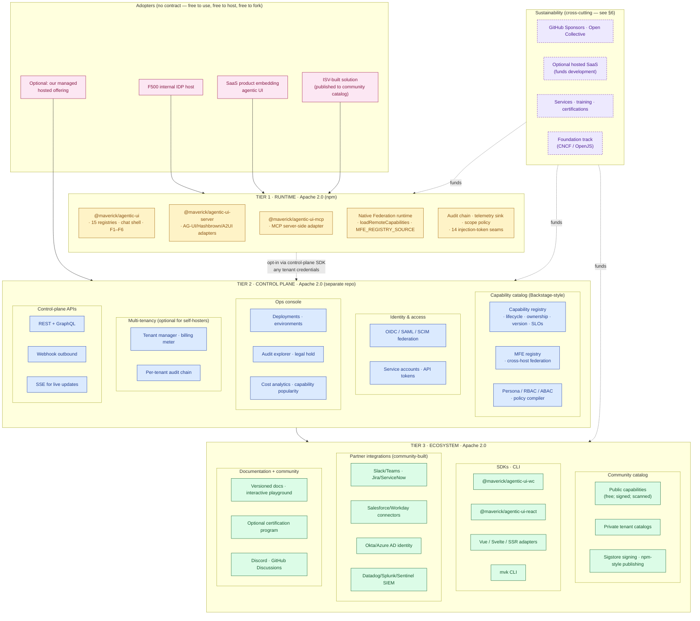

# Platform-evolution plan v3 — fully open-source enterprise platform

**Status:** Draft for review · do **not** start implementation until §10 strategic gates are signed off · supersedes v1 (library evolution) and v2 (open-core + commercial control plane)

**Strategic direction (decided):** All open source. Same three-tier platform architecture as v2 — runtime, control plane, ecosystem — but **everything ships under a permissive open-source license**, governed in the open, funded through a sustainability model (not a subscription model), and competitive defense built on **community + speed + standards alignment**, not exclusivity.

**Reference shapes for "all-OSS platform":** Backstage (Spotify → CNCF Incubating), Grafana (open core w/ optional Enterprise add-ons but core is Apache 2.0), Posthog / Plausible / Cal.com (fully open, hosted as a service), Supabase (fully open, hosted as a service), Kubernetes (foundation-governed, monetized by ecosystem). These are all platforms; none extract value through a commercial control plane. They monetize via hosted offerings, services, sponsorship, and ecosystem position.

> **Companion docs:**
> [docs/plans/ediscovery-app-plan.md](./ediscovery-app-plan.md) — Phases 0–8 reference application (shipped) ·
> [docs/plans/ediscovery-dynamic-ui-plan.md](./ediscovery-dynamic-ui-plan.md) — F1–F6 dynamic-UI program (shipped through F6) ·
> [docs/architecture/registries-vs-industry.md](../architecture/registries-vs-industry.md) — comparison vs. plugin platforms and agent SDKs ·
> [docs/adr/0008-registry-scope-policy.md](../adr/0008-registry-scope-policy.md) — `setScopePolicy` decision

---

## 1. The pivot: what "all open source" changes (and what it doesn't)

### What stays the same (from v2)

The architecture is unchanged. Three tiers — runtime, control plane, ecosystem — are the right shape regardless of license. Backstage and Grafana have the same shape; they're just open. The two non-negotiable runtime principles (P1 embedded-first, P2 zero breaking changes) carry forward verbatim. The codified non-goals (no Temporal/NATS/OPA/OpenSearch in the runtime) carry forward.

### What changes (the consequences of dropping the commercial moat)

| Concern | v2 (open-core + commercial) | v3 (all open source) |
|---|---|---|
| **Runtime tier license** | MIT/Apache (open) | Apache 2.0 (open) |
| **Control-plane license** | Commercial / proprietary | **Apache 2.0 (open)** |
| **Marketplace** | Paid + revenue share (20% fee) | Community catalog, no platform fee, signed packages, **publishing is free** |
| **Compliance attestations** | Apply to commercial managed offering | Apply only to **our hosted SaaS offering** (if we run one); customers who self-host attest themselves; we provide a Shared Responsibility Matrix + control mappings |
| **Identity binding** | Same OIDC/SAML/SCIM, but commercial customers expected | OIDC/SAML/SCIM still required; equally usable by any OSS adopter |
| **Multi-tenancy** | Required for SaaS offering | Required for hosted offering, optional for self-hosted (most self-hosters are single-tenant) |
| **Funding** | Subscription ARR | Sponsorships · GitHub Sponsors · Open Collective · optional hosted SaaS revenue · services + training · seed round from OSS-friendly investors |
| **Headcount** | 25 engineers + 9 GTM at M8 (~$8M annualized) | **5–8 maintainers at M8** + community contributors (~$1.5–2.5M annualized; sustainable from sponsorship + services + hosted) |
| **Sales motion** | Outbound enterprise + PLG | **Community-led growth only** — DevRel, conference talks, technical writing, standards-body engagement |
| **Competitive moat** | Compliance certs + commercial features | **Community + speed + standards alignment** (AG-UI, MCP, MCP UI) |
| **Roadmap pace** | Aggressive (paying customers drive urgency) | **Sustainable** (contributor capacity drives urgency); 2–3× longer calendar for same scope |
| **Customer obligation** | Renewal pressure → product gates | **No customers in the contractual sense** — adopters either self-host (free) or pay for hosting (optional) |

### The hard truth about all-OSS platforms

Successful all-OSS platforms either (a) get acquired (Heptio → VMware, GitHub → Microsoft, Mulesoft → Salesforce), (b) get foundation-governed and survive on a coalition of corporate sponsors (Kubernetes/CNCF, Backstage/CNCF, Apache projects), or (c) build a credible hosted SaaS or services business alongside the OSS (Grafana Labs, Posthog, Supabase). Pure community-led OSS platforms exist (Linux, Postgres) but took decades to mature and still rely heavily on corporate contributors.

**This means: even though we're going all OSS, we still have to pick a sustainability path.** §6 walks through three options + a recommendation.

---

## 2. License decision

**Recommendation: Apache 2.0 across all packages and projects.**

Rationale:

- **Patent grant** — Apache 2.0's explicit patent grant matters for enterprise adoption. MIT doesn't have one; risk-averse enterprise legal teams sometimes block MIT-licensed dependencies for that reason. We will have F500 adopters; a patent grant removes one friction point at zero cost.
- **OSI-approved + GitHub-default-friendly** — fully compatible with GPL, doesn't carry the "viral" reputation of GPL/AGPL.
- **Backstage, Kubernetes, Grafana, Apache Kafka, Hadoop, Cassandra, Spark** — all Apache 2.0. The pattern is well-trodden for enterprise OSS platforms.
- **Permissive enough for ISVs** — third parties can build commercial products on top without license-pollution concerns. Drives ecosystem.
- **Avoid AGPL / SSPL / BSL** — these are "commercial-OSS" licenses that block hyperscaler hosting. We've already chosen all-OSS; AGPL is the wrong fit because it constrains who can host.

Existing repo state: `package.json` declares `"license": "Apache-2.0"`. CI and lockfile already align. **No code change needed; this is just a documentation + ADR commitment.**

Decision gate D1 (§10): commit to Apache 2.0 across all packages, codify in ADR-010, add `LICENSE` files to every project, add SPDX headers to source files in a one-time sweep.

---

## 3. Three-tier architecture (unchanged from v2)

The architecture diagram and tier responsibilities are identical to v2 §3. The only edit: every box in the diagram is open source. Re-included here for self-containment; readers who already absorbed v2 §3 can skip to §4.



ASCII fallback:

```
┌──────────────────────────────────────────────────────────────────────────┐
│ ADOPTERS — F500 IDP hosts · SaaS products · ISV solutions · our hosted   │
└────────────────┬─────────────────────────────────────────────────────────┘
                 │
┌────────────────▼─────────────────────────────────────────────────────────┐
│ TIER 1 · RUNTIME · Apache 2.0 (npm)                                      │
│   @maverick/agentic-ui · agentic-ui-server · agentic-ui-mcp              │
│   Native Federation · 15 registries · F1–F6 · audit chain · sink         │
└────────────────┬─────────────────────────────────────────────────────────┘
                 │  opt-in (any tenant credentials)
                 ▼
┌──────────────────────────────────────────────────────────────────────────┐
│ TIER 2 · CONTROL PLANE · Apache 2.0 (separate repo)                      │
│   Capability catalog · MFE registry · RBAC/ABAC · OIDC/SAML/SCIM         │
│   Multi-tenancy (opt-in for self-hosters) · audit explorer · cost        │
│   Ops console · deploy pipelines · webhooks · GraphQL · SSE              │
└────────────────┬─────────────────────────────────────────────────────────┘
                 │
                 ▼
┌──────────────────────────────────────────────────────────────────────────┐
│ TIER 3 · ECOSYSTEM · Apache 2.0                                          │
│   Community catalog (free, signed, scanned)                              │
│   SDKs · CLI · partner integrations · docs portal                        │
└────────────────┬─────────────────────────────────────────────────────────┘
                 │
                 ▼
┌──────────────────────────────────────────────────────────────────────────┐
│ Sustainability (cross-cutting)                                           │
│   GitHub Sponsors · Open Collective · hosted SaaS (optional)             │
│   Services + training + certifications · foundation track                │
└──────────────────────────────────────────────────────────────────────────┘
```

The shape is identical to v2. Every component is open. Adopters either self-host (zero $) or pay us (or anyone) for hosting (optional).

---

## 4. Tier responsibilities + delivery details

The tier 1, 2, and 3 deliverables, file landscape, sub-system breakdowns from v2 §§4–6 carry forward unchanged. To avoid duplication, this section references back rather than re-stating. Tier-by-tier:

### 4.1 Runtime tier (T1)

Same as v2 §4. R1–R5 phases unchanged: document seams, opt-in `RegistryProviderHook`, `ThreadStateStore` + Redis/Postgres adapters, AG-UI `state` channel, governance hooks (conflict policy, dispose, version constraints, optional metadata fields). ~10–11 engineer-weeks total. Zero breaking changes.

License clarification: every package in `projects/` ships Apache 2.0 with `LICENSE` files committed.

### 4.2 Control plane (T2)

Same scope as v2 §5 — capability catalog, IAM, audit & compliance, cost & observability, ops console, multi-tenancy, deploy pipelines, self-managed packaging — except the **pricing tier discussion (v2 §5.2 deployment shapes) collapses**: there is one shape (anyone can run it), and we may operate one **hosted** instance as a service offering for adopters who don't want to self-host.

Effort estimate from v2 §5.4 (190–260 eng-weeks for full T2) carries forward as the engineering work, but the **calendar inflates** because the maintainer team is smaller (see §7 roadmap).

The control plane lives in a **separate repository** (`sahassakhare/agentic-platform-control-plane`, public, Apache 2.0) — mirrors the Backstage / Grafana / Sentry pattern of "core OSS lib + companion control-plane repo." Keeps issue/PR streams scoped, allows independent versioning, eases CI.

### 4.3 Ecosystem (T3)

Same scope as v2 §6 — multi-framework SDKs (Web Components base + React/Vue/Svelte/SSR adapters), `mvk` CLI, community catalog (renamed from "marketplace"), partner integrations, docs portal, certification program — except:

- **Catalog** is community-driven, not paid. No platform fee, no revenue share. Publishing is free for any contributor; capabilities sign with Sigstore (free). Discovery is free. Nothing to monetize, nothing to gate.
- **Certification program** is optional. May be self-funded (charge for the certification exam to cover infra cost), or sponsored, or simply not built (community-led "starred-author" badging suffices for the first 2–3 years).
- **Partner integrations** are community-built. We seed with 3–5 first-party reference integrations (Slack, Okta, Datadog) but rely on contributors for the long tail. Big-vendor integrations (Salesforce, Workday, ServiceNow) often come *to us* if adoption gets there — that's how Backstage's plugin ecosystem grew.

### 4.4 What's removed vs. v2

- **Subscription billing** — gone. No Stripe, no per-tenant invoicing, no metered pricing engine. (We may add Stripe back if we run a hosted SaaS — but only for that one offering.)
- **Salesforce CPQ + enterprise sales motion** — gone. No quote-to-cash machinery.
- **Per-capability-execution metering** — gone (or, if we run a hosted SaaS, only in that offering's billing layer).
- **Commercial-license team / legal review** — gone.
- **Marketplace revenue share + payouts** — gone.
- **Customer success org (TAMs, solution architects)** — collapsed into community management + (optionally) a small services arm.
- **Per-tier feature gates** — gone. There are no commercial features hidden behind a license check. Every feature is OSS.

This is a substantial *simplification*. The architecture didn't get smaller; the **business machinery around it** got smaller.

---

## 5. Governance

Pure single-vendor OSS doesn't scale beyond ~10 contributors. To welcome external contributors and earn enterprise trust, we need explicit governance.

### 5.1 Three governance options

| Model | Examples | Pros | Cons |
|---|---|---|---|
| **Single-vendor with TSC** (Technical Steering Committee, mostly internal) | Sentry early days, Grafana early, Linkerd early | Fast decisions; clear technical direction; easy to fund | Limited external contributor trust; risk of "open in name only" perception |
| **Foundation-governed** (CNCF / OpenJS / Linux Foundation) | Kubernetes, Backstage (CNCF), Node.js (OpenJS), Helm | Highest enterprise trust; coalition of corporate sponsors; legal/IP protection | Slow to enter (Sandbox → Incubating → Graduated takes 2–4 years); we cede some control; foundation overhead (~$50–250k/yr in fees + meeting time) |
| **Hybrid TSC with external seats** | Strapi early, Grafana current | Middle ground: we keep most control but invite 1–3 external committers/ users to the TSC | Politics; requires us to actually share decisions |

**Recommendation:** Start with **Single-vendor TSC** (option 1). After ~12 months and ≥3 external contributors with merge rights, evolve to **Hybrid TSC** (option 3). Apply for **CNCF Sandbox** (option 2) at year 2, only if the foundation track aligns with adoption demand. Don't rush to a foundation — Backstage was internal at Spotify for ~2 years before going to CNCF.

### 5.2 Governance artifacts to ship at M1

The following artifacts must exist in every public repo before we open contributions externally:

- `LICENSE` (Apache 2.0)
- `CONTRIBUTING.md` (how to contribute, DCO + CLA decision — recommend DCO; CLAs are friction)
- `CODE_OF_CONDUCT.md` (Contributor Covenant 2.1 standard)
- `SECURITY.md` (vulnerability disclosure policy; security@maverick or similar; PGP key)
- `GOVERNANCE.md` (TSC composition, decision process, RFC process)
- `MAINTAINERS.md` (current maintainers, areas of ownership, time-zone coverage)
- `ADR/0001-` through `ADR/0010-` (architectural decision records — start with what we have, keep adding)
- RFC process for substantive changes (modeled after Rust / React / TC39)
- Pull-request templates + issue templates

These are zero-engineering-cost but *high-trust-signal*. F500 procurement teams scan these files before approving an OSS dependency. Skipping them makes us look like a hobby project.

### 5.3 Decision-making process

- **Day-to-day** — repo maintainers merge. Default approver count = 1; security-sensitive paths = 2.
- **Substantive changes** (new public APIs, breaking changes, registry changes) — RFC required. RFC sits in `docs/rfcs/` for ≥7 days before merge.
- **Strategic** (license, governance, foundation track, monetization) — TSC vote.

---

## 6. Sustainability — how we fund the work

The hardest question for an all-OSS platform. Three options + a recommended layered approach.

### 6.1 Option A — Sponsorship-funded (least commitment, slowest)

Sources: GitHub Sponsors (individuals + small companies), Open Collective (transparent), Tidelift (enterprise subscriptions for OSS dependencies, pays us a portion).

**Realistic ceiling:** $50k–500k/yr. Funds 0.5–3 part-time maintainers. Roadmap pace ~3–4 years for full T2 + T3.

**Pros:** No strings; no commercial pressure; we keep total control.

**Cons:** Slow; volatile (income depends on continued enthusiasm); doesn't fund full-time team; doesn't fund SOC 2.

### 6.2 Option B — Hosted SaaS (Posthog / Plausible / Supabase model)

We run an instance of T1 + T2 + T3 ourselves at, say, `app.maverick.dev`. Adopters pay us to host it. The OSS code is identical; we charge for the operation.

**Realistic revenue:** $100k–$2M ARR in years 1–2; $5M+ at 4–5 years if execution is good. Funds 5–15 full-time engineers + small ops + small GTM.

**Pros:** Predictable income; aligns with adopter convenience (most prefer SaaS); funds compliance attestations (SOC 2 Type I/II, ISO 27001) for the hosted offering, which then become a community asset (we publish the controls, self-hosters reuse them).

**Cons:** Requires building a *hosted product* — billing, multi-tenancy, on-call, CS — which is real work parallel to the OSS itself. Risk of conflict-of-interest (hosted-friendly features prioritized over self-hosted features). Mitigation: explicit policy that the OSS gets every feature; hosting only adds operational features (SSO add-on, dedicated tier, support). Same shape as Posthog / Supabase.

### 6.3 Option C — Services + training (consultant-led)

We sell professional services around the OSS: implementation engagements, custom capability development for adopters, training workshops, certification courses, paid Office Hours.

**Realistic revenue:** $200k–$2M/yr at small scale; can fund 2–8 engineers if billable utilization is high.

**Pros:** No product-development overhead beyond the OSS itself; aligned with our expertise; builds long-term customer relationships.

**Cons:** Doesn't scale (linear with headcount); dilutes engineering focus (services engineers are billable, not coding the platform); susceptible to feast/famine cycles.

### 6.4 Recommended: layered (A + B + C)

- **Year 1** — Option A only. GitHub Sponsors + Open Collective. Aim: $50–150k to fund 1 FT maintainer + supplement existing investment. **Goal: prove the OSS adoption thesis.**
- **Year 2** — Add Option C. Take on 3–5 services engagements (~$200–500k). Use the engagements to fund Option B development. **Goal: bootstrap the hosted offering.**
- **Year 3+** — Hosted offering live; Option B becomes the dominant funding source ($1–5M ARR target). Services continues at modest scale. Option A becomes a community-relations channel. **Goal: become self-sustaining.**

This is the same trajectory as Posthog (open + sponsorship → hosted SaaS funds full-time team), Supabase (services + grants → hosted SaaS funds full-time team), n8n (community-led → cloud offering funds team).

### 6.5 Optional: foundation track (year 2+)

If sustainability via the layered model is shaky at year 2, apply for **CNCF Sandbox** or **OpenJS Incubation** track. Foundation track unlocks:

- Corporate sponsorship pool (Microsoft, Google, AWS, IBM, Red Hat, Bloomberg, etc., often sponsor Sandbox-stage projects with $50–500k/yr each)
- Marketing co-op (KubeCon talks, blog placement)
- Legal/IP protection (foundation owns trademarks)
- Higher enterprise-procurement trust

In exchange: technical governance ceded to the foundation TSC (we usually still chair it); some agility lost. Most healthy OSS platforms eventually pursue this. Don't rush; year 2+ is the right time.

### 6.6 Decision for §10

D2: pick the layered (A+B+C) model as the default sustainability path. D3: defer foundation-track decision to year 2 retro.

---

## 7. Resized roadmap — M1 → M8 (over 24–36 months for OSS cadence)

v2's M1–M8 was a 24-month plan for a 25-engineer team. v3's same milestones span **24–36 months for a 5–8 engineer team plus community contributors**. The architectural deliverables are the same; calendar stretches roughly 1.5–2× because we're trading staffing for time.

### 7.1 Revised milestones

| Milestone | Goal | Calendar | Maintainer headcount | Dependent on |
|---|---|---|---|---|
| **M1 — Runtime polish + governance artifacts** | T1 R1–R5 ship. CONTRIBUTING/CODE_OF_CONDUCT/SECURITY/GOVERNANCE in place. License sweep. ADR-010, 011, 012, 013 land. | Q1 | 4 | — |
| **M2 — Control-plane MVP (catalog + IAM read-only)** | T2 C1 (catalog API + Postgres) + T2 C3 partial (OIDC federation). Ops Console v0 (catalog viewer only). Single-tenant only. | Q2–Q3 (longer than v2) | 5 | M1 + 1 backend hire (sponsorship-funded) |
| **M3 — Audit + cost minimal viable** | T2 C4 (audit chain extension + JSONL export) + T2 C5 (basic cost meter). Ops Console gains audit + cost views. | Q4 | 5 | Services revenue starts (Option C) |
| **M4 — Multi-tenancy + ops parity** | T2 C7 (RLS + tenant lifecycle). Ops Console becomes "production-usable" for self-hosters. Federated Auth via SAML. | Q5–Q6 | 6 | Hosted SaaS dev starts in parallel |
| **M5 — Hosted SaaS GA + SOC 2 Type I** | Operate `app.maverick.dev` with paying adopters. SOC 2 Type I attested for the hosted offering only (self-hosters self-attest). First $500k–$1M hosted ARR. | Q7–Q8 | 7 | Funds expand from hosted ARR |
| **M6 — Multi-framework SDKs + CLI v1** | T3 SDKs (WC core + React + Vue) + T3 `mvk` CLI ship. Ecosystem widens beyond Angular. | Q9–Q10 | 7 | M5 funding stable |
| **M7 — Community catalog + signing infrastructure** | T3 community catalog launches with Sigstore signing + scanning. First 50+ third-party capabilities published. Partner integrations (Slack, Okta, Datadog) ship as reference. | Q11–Q12 | 8 | M5 + M6 |
| **M8 — Foundation track + ISO 27001 + healthcare track** | Apply to CNCF Sandbox (or OpenJS). ISO 27001 attested for hosted offering. HIPAA add-on for hosted (BAA available). 100+ catalog capabilities. | Q13–Q15 | 8 + sponsors | Sustainability shifts from layered to majority-hosted-funded |

### 7.2 What this looks like in dollars + headcount

Order-of-magnitude. Compare with v2's table.

| Year | Headcount (FT) | Annualized burn | Funding sources | Status |
|---|---|---|---|---|
| Y1 (M1–M3) | 4–5 | ~$0.8–1.2M | Sponsorship + early services | Pre-revenue OSS; first paying services engagements |
| Y2 (M4–M5) | 5–7 | ~$1.2–1.8M | Sponsorship + services + nascent hosted | First hosted SaaS adopters; SOC 2 Type I |
| Y3 (M6–M8) | 7–8 + community | ~$1.6–2.4M | Mostly hosted SaaS; some sponsorship + foundation | Self-sustaining; CNCF Sandbox application |

Compare with v2's $8M annualized at M8 — **v3 funds itself at ~25–30% of v2's burn** because there's no commercial sales/CS/legal machinery, no commercial-license enforcement, no per-vertical AE specialization. Engineering is the bulk of cost; sponsorship + services + hosted cover it without VC pressure to grow faster.

### 7.3 Comparison summary

| | v2 (open core + commercial) | v3 (all OSS) |
|---|---|---|
| Calendar to "platform GA" | 24 months | 36 months |
| Max headcount | 25 + 9 GTM | 8–10 + community |
| Annualized burn at maturity | ~$8M | ~$2M |
| ARR target at maturity | $15–20M (subscriptions) | $1–5M (hosted only) |
| Compliance scope | Whole product | Hosted offering only |
| Velocity per quarter | Higher | Lower |
| Adoption ceiling | F500 only | F500 + ISVs + universities + air-gapped + hobbyist |
| Sustainability risk | Sales-cycle dependent | Sponsor / hosted-revenue dependent |
| Strategic moat | Compliance + commercial features | Community + standards + speed |

v3's **adoption ceiling is higher** (everyone can use it without a contract), velocity per quarter is lower, but cumulative reach over 5 years is plausibly *larger* because the funnel is unrestricted. This is the bet Backstage and Grafana made; both look defensible 5+ years in.

---

## 8. Compliance — how it works in an all-OSS platform

Compliance attestations apply to *operational deployments*, not source code. So:

- **Self-hosters attest themselves.** They run the OSS in their own infra. Their compliance is theirs to earn.
- **We attest our hosted offering.** When we operate `app.maverick.dev`, that operation gets SOC 2 Type I (M5), Type II (M6+12mo), ISO 27001 (M8), and progressively HIPAA / FedRAMP if customer demand justifies the effort and cost.
- **We provide a Shared Responsibility Matrix.** Public document mapping which controls the OSS provides (encrypted-at-rest configurable, audit chain hashing, BYOK supported in code, RLS in catalog) vs. which the operator provides (key rotation cadence, network controls, physical security, employee background checks). Same shape as AWS Shared Responsibility Model. Self-hosters use this as the starting point for their own audits.
- **We publish control mappings.** SOC 2 / ISO / HIPAA control crosswalks — for each control, which OSS feature satisfies it (or partly satisfies it). This is high-leverage: self-hosters spend 3–6 months mapping controls otherwise; we save them that with maybe 4–6 weeks of writing.

This is the **Posthog / Cal.com / Plausible** approach. Self-hosters get a head start on compliance; the hosted offering carries the badge. Everyone wins; no one is gated.

Sequence for hosted-offering compliance (revised from v2):

| Attestation | Hosted offering | When | Cost |
|---|---|---|---|
| SOC 2 Type I | ✅ | M5 (Q7–Q8) | $40–80k |
| GDPR / CCPA | ✅ | M3 (engineering only) | Eng time only |
| SOC 2 Type II | ✅ | M6+12mo (Q11–Q12) | $30–60k/yr |
| ISO 27001 | ✅ | M8 (Q13–Q15) | $50–100k |
| HIPAA BAA | ✅ (add-on) | M9 if customer demand | $30–60k + insurance |
| FedRAMP | Considered, not committed | year 4+ if a sponsoring agency materializes | $500k–$2M |

---

## 9. Sales & growth — community-led, no AE org

We don't have a sales team. We don't need one for the OSS. For the hosted offering, we still don't need a traditional AE org for years — Posthog and Supabase ran 3+ years with self-serve hosted before adding their first AE. Community-led growth (CLG) covers it.

CLG levers:

- **DevRel** — dedicated DevRel hire (often the founding-engineer pivot at month 12+). Conference talks, podcasts, technical writing, Twitter / X / Bluesky, Reddit.
- **Standards engagement** — be visible at AG-UI working group, MCP working group, MCP UI standard. Speak at AI Engineer Summit, KubeCon, AngularConnect, ReactConf. Position the platform as the reference implementation of these standards.
- **Reference applications** — keep the eDiscovery flagship as the showcase; build 2–3 more (healthcare-clinical-decision, financial-services-claims-review, public-sector-permits-processing). Each is a working demo that an enterprise can clone-and-modify.
- **Enterprise pull, not push** — large adopters who self-host find us first (via OSS), then ask us to host or consult. Inbound funnel is the norm; outbound is rare.
- **Capability gallery** — make it easy to discover what others have built. Network-effect storefront; first 50–100 are hardest, the next 500 follow.

Hiring: M5 + DevRel; M7 + a second DevRel + a community manager. No AEs through M8 unless the hosted SaaS funnel demands it; then it's 1–2 self-serve-conversion specialists, not enterprise AEs.

---

## 10. Decision gates — must answer before any code lands

### 10.1 Strategic gates

| # | Decision | Default | Critical? |
|---|---|---|---|
| **D1** | License: **Apache 2.0** across all packages and projects | Yes | Yes — affects every contribution from now on |
| **D2** | Sustainability: **layered (sponsorship + services + hosted)** | Yes | Yes — drives funding model + roadmap pace |
| **D3** | Foundation track: **defer to year 2 retro** (not pursued at M1) | Yes | Soft — re-evaluate quarterly |
| **D4** | Governance: **single-vendor TSC** at M1 → **hybrid TSC** at +12mo if external contributors materialize → **CNCF Sandbox** at year 2 if adoption justifies | Yes | Soft |
| **D5** | Hosted SaaS: **commit to building it, target M5 GA** | Yes | Yes — determines whether v3 funds itself |
| **D6** | Codify non-goals: no proprietary closed-source features, no "open core with closed extensions" rebrand later (would require ADR override + community process) | Yes | Yes — if we ever close-source a feature, all-OSS commitment is broken; community will perceive it correctly as betrayal (see HashiCorp BSL backlash 2023) |
| **D7** | Repo strategy: T1 stays in current repo; T2 in **`sahassakhare/agentic-platform-control-plane`** (new public repo, Apache 2.0); T3 SDKs in current repo's `projects/`; community catalog in **`sahassakhare/agentic-catalog`** (new public repo) | Yes | Soft (can be split later) |
| **D8** | Tech stack for T2: **TypeScript / Node / Hono / Postgres / Redis** (matches runtime); SDKs in TypeScript universally; CLI in Node (not Rust/Go) for simplicity | Yes | Soft |

### 10.2 Tactical gates per milestone

Each milestone gates on:

- **M1 → M2** — At least 3 external contributors (issues + PRs merged) and 50+ GitHub stars. If not, DevRel investment moves earlier.
- **M2 → M3** — At least 2 self-hosting deployments documented (case studies or just "X is using it" mentions). If not, T2 build pauses for adopter discovery.
- **M3 → M4** — At least 1 services engagement signed ($50k+). If not, sustainability layering reconsidered (Option B accelerated).
- **M4 → M5** — Hosted SaaS pre-orders / waitlist > 25 logos. If not, M5 schedule slips and M6 SDK work advances instead.
- **M5 → M6** — First hosted SaaS revenue > $20k MRR. If not, hosted offering pricing/positioning reviewed.
- **M6 → M7** — At least 5 third-party capability authors active. If not, certification + community-catalog work re-prioritized.
- **M7 → M8** — Sustainability >50% from hosted (vs. sponsorship/services). If yes, foundation track is on. If no, year is extended.

### 10.3 Architecture gates

Same as v2 §11.3 — locked at the start of each milestone, never break:

- Catalog data model — locked at M2
- IAM policy language — locked at M3
- Audit chain extension — locked at M3
- Multi-tenancy isolation guarantees — locked at M2 (red-teamed before M5 hosted GA)

---

## 11. Risks (revised for the OSS path)

| # | Risk | Likelihood | Impact | Mitigation |
|---|---|---|---|---|
| OR1 | Sponsorship undershoots; can't fund full-time team in Y1 | High | High | Mix in services revenue (Option C) early; lower runway target until hosted SaaS produces revenue. Be prepared to slow M2/M3 by 1–2 quarters. |
| OR2 | Hosted SaaS doesn't hit revenue; sustainability fails | Medium | Critical | Multiple bets: services + sponsorship + hosted. If hosted underperforms by Y2, foundation track + corporate sponsorship pool become the path. |
| OR3 | Hyperscaler clones the platform (AWS/Google launch a hosted version) | Low for first 24 months; rises after | High | (a) Apache 2.0 is permissive enough that they can; (b) our defense is community + speed + standards alignment, not licensing; (c) we accept that a hyperscaler clone is also a tailwind (validates the category). Prepare the "why us not them" story: deeper integration, faster iteration, more agentic-UI-specific opinionation. |
| OR4 | Low contributor count → bus factor of 2–3 maintainers | Medium | High | Aggressive RFC + ADR process; heavy automated CI; document everything; mentor 3+ external committers by M2. Foundation track at year 2 closes this risk further. |
| OR5 | Slower velocity loses category to faster-moving commercial competitors (CopilotKit, Vercel AI SDK) | Medium | High | Differentiate on enterprise-controls (multi-tenancy, audit, RBAC, federation) where competitors are weak; lean into standards (AG-UI, MCP) for portability; build the moats commercial competitors *can't* easily replicate (community trust, OSS license, F500 procurement-friendly). |
| OR6 | Compliance work is bigger than expected; SOC 2 slips past M5 | Medium | Medium | Engage auditor at M2 start (12-month observation period requirement). Treat compliance as engineering work with allocated time. Use hosted-only scope to reduce attestation cost. |
| OR7 | License decisions get reversed under commercial pressure (HashiCorp BSL scenario) | Low for us if D6 is locked; rises in Y3+ | Critical to community trust | D6 codifies "no relicensing without community process." If we ever face that pressure, follow Backstage's path (foundation governance protects from unilateral relicense). |
| OR8 | Multi-framework expansion stalls at React; Vue/Svelte/SSR never ship | Medium | Low–Medium | Reactive, not proactive: ship Vue/Svelte if community asks. Don't pre-build them. |
| OR9 | Community burnout among maintainers | Medium | High | Compensation matters: pay maintainers full-time from sponsorship + services + hosted; don't expect heroic volunteer hours. PTO + on-call rotations from Y2. |
| OR10 | Hosted offering competes with self-hosters for our attention; OSS quality slips | Medium | High | Hard rule (D6 corollary): every hosted-only feature must also be a self-hosted feature within 30 days. No exclusivity. Same shape as Posthog. |
| OR11 | Foundation track moves slowly or doesn't accept us | Medium (if pursued) | Low | Foundation acceptance isn't required for survival. Layered sustainability funds operations regardless. Foundation track is upside, not load-bearing. |

---

## 12. What we are explicitly **not** doing (codified non-goals)

All of v1's runtime non-goals carry forward (no Temporal/NATS/OPA/OpenSearch in the runtime, no bundled DB/auth/SIEM, no semantic-search/vector-DB in the runtime, no major version bumps). New non-goals specific to v3:

- ❌ **Closed-source features at any tier.** Every line of code in T1, T2, T3 is Apache 2.0. Optional hosted features (SSO add-on, dedicated tier, premium support) are operational services — not closed code.
- ❌ **License changes** (BSL, SSPL, AGPL, "Elastic License", "Sentry FSL", etc.). D6 commits to Apache 2.0 forever; reversal requires community process + 12-month notice.
- ❌ **Closed-source plugins / capabilities** in the official repo. Third parties can ship closed-source capabilities under their own license; we won't host them in the official catalog (we link to them from the docs).
- ❌ **Per-feature commercial gates** in the OSS code (no "Enterprise Edition" branch).
- ❌ **CLA (Contributor License Agreement) requirements.** Use **DCO (Developer Certificate of Origin)** instead — same protection, less contributor friction.
- ❌ **Trademark abuse against forks.** We trademark "@maverick" + product names but don't sue forks unless they confuse customers (Sentry-like trademark policy, not Mongo-like).
- ❌ **VC-led commercial pressure to relicense.** If we take outside funding, term sheets must include explicit "no relicensing without community process" language.

---

## 13. Sign-off

This plan asks for three commitments before any code lands:

1. **Strategic commitment** to all-Apache-2.0 + layered sustainability (sponsorship + services + hosted SaaS) — D1, D2, D6.
2. **Architectural commitment** to the same three-tier shape v2 proposed, with all tiers open — D7.
3. **Operational commitment** to the M1–M8 sequence at OSS cadence (~36 months for full T2 + T3 + ecosystem), funded through layered model with hosted SaaS ramping at M5.

If any of these can't be committed, fallback options:

- **Runtime-only execution** — ship v1's R1–R5 (10–11 engineer-weeks). Self-position as an open-source agentic-UI library. Defensible, modest. Fits a 1-pair team indefinitely.
- **Slower v3** — extend M1–M8 to 48 months. Reduces burn to ~$1M/yr. Foundation track and corporate sponsorship become more important.
- **Service-led variant** — focus M2–M4 entirely on services revenue; defer T2 control plane until services revenue funds it. Slowest path; lowest risk.

After §10 sign-off, we draft ADR-010 (Apache 2.0 + non-goals), ADR-011 (governance model), ADR-012 (sustainability model), ADR-013 (tier separation contract), and the detailed M1 plan-of-record before any code lands.

---

## Appendix A — ChatGPT-plan disposition table (carried from v1/v2)

Unchanged from v2 Appendix A. The disposition of each original plan section is independent of license model.

## Appendix B — File / package landscape after full execution

Same as v2 Appendix B; every repo public, every package Apache 2.0. Headline:

- **Existing repo** `sahassakhare/agentic-ui` — runtime + SDKs + CLI, Apache 2.0, npm-published
- **NEW repo** `sahassakhare/agentic-platform-control-plane` — control plane sub-systems, Apache 2.0, Docker images published to GHCR
- **NEW repo** `sahassakhare/agentic-catalog` — community catalog frontend + backend, Apache 2.0
- **NEW repo** `sahassakhare/agentic-docs` — versioned docs portal, Apache 2.0
- **NEW repo** `sahassakhare/agentic-integrations` — partner integrations meta-repo (or per-integration repos), Apache 2.0

---

## Appendix C — Reference architectures we're modeled after

**Backstage (Spotify → CNCF Incubating, Apache 2.0)** — closest analogue. Three-tier (catalog + plugins + scaffolder), Spotify still primary maintainer, CNCF governance, hosted commercial offering by Spotify (Spotify Portal) and others (Cortex.io, Roadie.io). 5-year trajectory: open-sourced 2020, CNCF Incubating 2022, ~25k GitHub stars, ~3000 contributors, $30M+ ARR ecosystem. **Read:** the path is real and proven.

**Grafana Labs (Apache 2.0 core, Enterprise add-ons + Cloud)** — open-core variant, but core Grafana is Apache 2.0; Grafana Enterprise has commercial-licensed extensions. ~$300M+ ARR. **Read:** option to add commercial add-ons later if v3 sustainability proves insufficient — but doing so breaks D6 and damages community trust. Avoid unless absolutely necessary.

**Posthog (MIT, hosted-funded)** — fully OSS, monetizes via hosted SaaS exclusively. Fast iteration, strong community, growing ARR. **Read:** clearest model for v3.

**Supabase (Apache 2.0, hosted-funded)** — fully OSS, hosted offering primary revenue. Dual-licensed for some components. **Read:** validates the hosted-funded all-OSS path.

**Strapi (early years: MIT; later: SSPL+Strapi licenses for some packages)** — anti-pattern. Started fully open, partially closed under commercial pressure, suffered community backlash. **Read:** D6 protects us from this trajectory.

**Cal.com (AGPL, hosted-funded)** — interesting variant: AGPL prevents hyperscaler hosting without source-sharing. **Read:** we considered AGPL; chose Apache for enterprise-friendliness. AGPL would protect against OR3 better but at the cost of broader adoption.

**Plausible (AGPL, hosted-funded)** — same shape as Cal.com. **Read:** same trade.

---

*End of v3. Plan is complete; no code change is sanctioned by this document. Awaiting §10 strategic sign-off (D1–D8) and §10.2 tactical-gate buy-in before drafting ADRs and the detailed M1 plan-of-record.*
