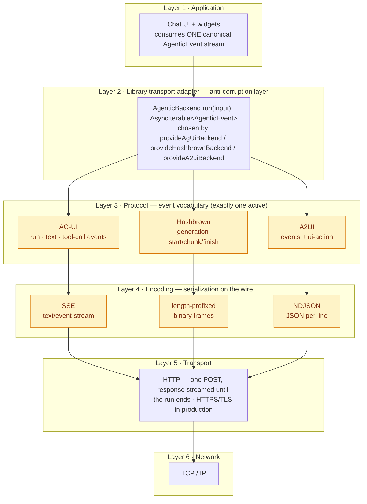
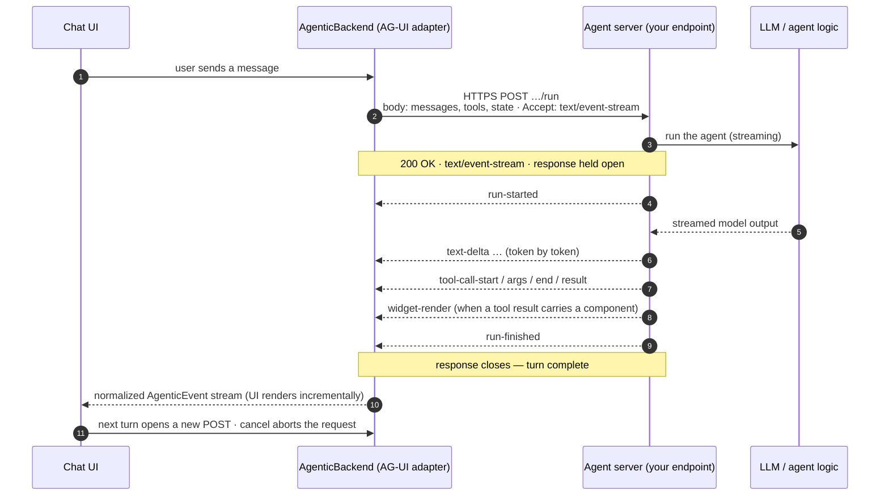
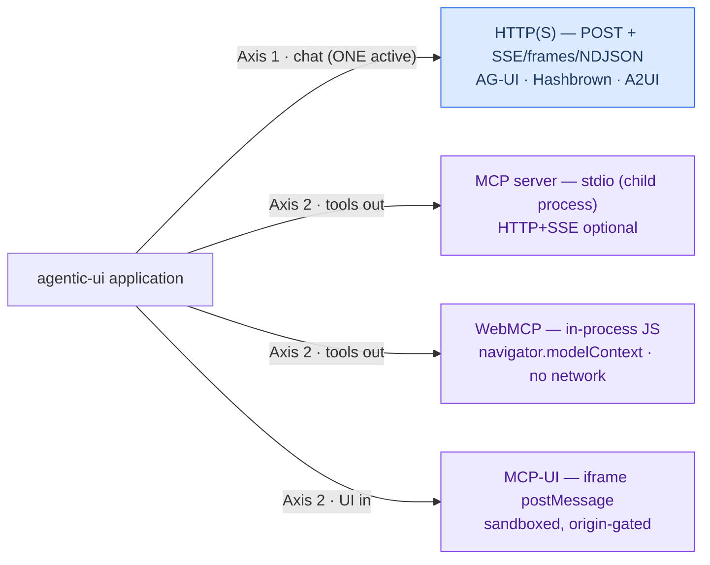

# Transport architecture — how the UI talks to the agent

> Audience: architects evaluating the agentic-ui library. Scope: the **wire** between the
> browser and the agent, the protocols layered on it, and the design rationale. Written at
> the public-API level (no library internals).

## Executive summary

The chat panel reaches its agent with **one HTTP request per turn**: the browser issues a
`POST`, and the agent **streams its reply back over that same, held-open response** using
**Server-Sent Events (SSE)**. In production the connection is **HTTPS/TLS**; cleartext HTTP
is a local-development convenience only.

A precise framing matters here, because "the library talks over HTTP" is too broad:

- **HTTP is the *chat-transport* layer, not the whole library.** The chat backends
  (AG-UI, Hashbrown, A2UI) use HTTP. The library's other agent surfaces deliberately do not:
  the **MCP server** speaks **stdio**, **WebMCP** is **in-process**, and **MCP-UI** uses
  iframe **`postMessage`**.
- **HTTP is the *transport*; AG-UI is a *protocol on top of it*** — analogous to how OpenID
  Connect is a protocol layered on HTTP. AG-UI standardizes the streaming *event vocabulary*
  an agent uses to drive a UI; HTTP just moves the bytes.
- **The application is insulated from both.** All three chat protocols are normalized to one
  canonical `AgenticEvent` stream, so the UI is written once and the wire can change underneath
  it (a one-line provider swap).

---

## 1. The communication model, precisely

The chat path is **request/response streaming**, not a bidirectional socket:

| Property | Behavior | Architectural consequence |
|---|---|---|
| **Initiation** | One client `POST` per user turn | Conversation advances in discrete, client-driven turns |
| **Duration** | Response held open; events stream until the run ends | "Real-time" feel without WebSockets |
| **Directionality** | Half-duplex within a turn: server → client only, after the POST | The only client "uplink" is starting the next turn or aborting |
| **State** | Conversation state travels in the request body (`messages`, `threadId`), not a server session | Endpoint is effectively **stateless per request** → horizontally scalable, no sticky sessions |
| **Cancellation** | Aborting the HTTP request stops the run server-side | Cooperative cancellation falls out of standard `fetch`/`AbortController` |
| **Failure** | A failed run surfaces as a terminal error event, then the response closes | No partial-state ambiguity for the UI |

### Why SSE over `fetch`, and not `EventSource` or WebSocket

The browser's native `EventSource` API is **GET-only** and **cannot set request headers**.
The library instead reads an **SSE-framed body from a streamed `fetch` POST**. That choice is
deliberate and consequential:

- It can **POST a request body** (the conversation, tools, and context) — impossible with `EventSource`.
- It can send an **`Authorization` header** (bearer tokens) and other headers — also impossible with `EventSource`.
- It avoids the legacy **6-connections-per-host** limit that afflicts `EventSource` on HTTP/1.1.
- Versus **WebSockets**: SSE is one-directional (which matches the turn model), rides ordinary
  HTTP infrastructure (proxies, CDNs, auth, observability) with no protocol upgrade, and needs
  no special server runtime. The cost — no client→server push mid-turn — is a non-issue here,
  because a turn is a single request anyway.

This is the same reasoning behind most modern LLM streaming endpoints: SSE-over-`fetch` is the
pragmatic sweet spot between "plain request/response" and "full duplex."

---

## 2. Layered view (the protocol stack)

Reading bottom-up: TCP/IP carries HTTP; HTTP carries an encoding; the encoding carries a
protocol's event vocabulary; the library normalizes that into one event type; the app consumes
it. **The protocol choice lives entirely in layers 3–4 and is selected by a single provider** —
everything above and below is invariant.



The highlighted band (layers 3–4) is the only thing that varies between backends.

---

## 3. Design rationale — why a canonical event model

The defining architectural decision is **not** which protocol to use; it is to refuse to let
any protocol leak into the application. The library applies a **ports-and-adapters /
anti-corruption layer** pattern:

- Every backend is an **adapter** that translates a vendor protocol into one **canonical
  contract** — `AgenticBackend.run(): AsyncIterable<AgenticEvent>`.
- The UI, tools, and widgets are written against that contract, never against AG-UI or
  Hashbrown types.

The payoff is concrete and worth stating plainly to stakeholders:

1. **Protocol independence.** The agent ecosystem is young and churning quarterly. Coupling the
   app to one vendor's event types is a standing liability. Here, swapping AG-UI for Hashbrown
   or A2UI is a **one-line provider change**; no component, tool, or test changes.
2. **Linear, not quadratic, integration cost.** Protocols translate to/from the canonical model
   (hub-and-spoke), so adding the *N*th protocol is one adapter — not *N* pairwise bridges.
3. **Testability.** Because the contract is uniform, a single conformance suite validates every
   adapter, and the UI can be tested against a fake backend with zero network.

This is the same posture as a database access layer or a payment-gateway abstraction: isolate
the volatile external contract behind a stable internal one.

---

## 4. Request lifecycle (AG-UI / SSE)



The adapter emits the same canonical events (`run-started`, `text-delta`, `tool-call-*`,
`widget-render`, `run-finished`) regardless of which protocol produced them.

---

## 5. The three chat protocols, compared

All three are configured by a single provider + URL and expose the identical
`AgenticBackend.run(): AsyncIterable<AgenticEvent>` contract. They differ only in **how the
streamed response is encoded** — a deliberate spread across the three idiomatic choices:

| | **AG-UI** *(eDiscovery demo)* | **Hashbrown** | **A2UI** |
|---|---|---|---|
| Provider | `provideAgUiBackend({ url })` | `provideHashbrownBackend({ url })` | `provideA2uiBackend({ url })` |
| Request | conversation + tools + state | model + system + messages + tools | conversation + tools + state |
| Encoding | **SSE** (`text/event-stream`) | **length-prefixed binary frames** | **NDJSON** (`application/x-ndjson`) |
| Distinctive trait | text-negotiable (SSE or binary), broad ecosystem | compact binary framing | adds a `ui-action` event class for agent-driven UI ops |
| Maturity | established open protocol, official client | real published SDK | least-settled; lib-defined contract |

```text
AG-UI  (SSE)      ->  data: {"type":"text-delta","delta":"Hel"}\n\n
Hashbrown (frame) ->  [length]{"type":"generation-chunk", …}
A2UI   (NDJSON)   ->  {"type":"text-delta","delta":"Hel"}\n
```

Why three encodings and not one: SSE is the lingua-franca of LLM streaming and is human-readable
on the wire; length-prefixed frames are compact and unambiguous to chunk; NDJSON is the simplest
possible streamed-JSON format. The point of the abstraction is that the choice is the *server's*
to make, and the client adapts.

---

## 6. Security & operations (a benefit of riding HTTP)

Choosing HTTP as the transport means the entire mature HTTP toolchain applies unchanged — a
strong argument over a bespoke socket protocol:

- **Transport security:** TLS in production (HTTPS). No custom crypto.
- **AuthN:** standard `Authorization: Bearer <token>` on the POST — possible precisely because
  the client uses `fetch` (not `EventSource`). The reference server validates tokens with a
  **timing-safe** comparison.
- **Origin control:** standard **CORS** with an explicit origin allowlist (`OPTIONS` preflight,
  `Content-Type` / `Accept` / `Authorization` headers).
- **Observability & infra:** ordinary access logs, tracing, reverse proxies, CDNs, and WAFs work
  with no special handling. (One operational note for SSE: disable proxy response buffering so
  events flush promptly.)
- **Scaling:** because each turn is a self-contained request (state in the body, not a session),
  the endpoint scales horizontally with no sticky sessions or shared connection state.

---

## 7. What is deliberately NOT the HTTP chat path

The library has **two orthogonal axes**, and conflating them is the root of the "is it all HTTP?"
confusion:

- **Axis 1 — chat transport (mutually exclusive):** AG-UI / Hashbrown / A2UI. Exactly one is
  active. This is the HTTP path above.
- **Axis 2 — tool exposure & inbound UI (composable, any number active):** these are *not*
  conversation transports and use entirely different channels:



So an external assistant (Claude Desktop, Cursor) calling your tools goes over **stdio**, an
in-page agent uses **in-process** calls, and server-described UI arrives via **`postMessage`** —
none of which is the HTTP chat path.

### 7.1 Composing MCP-UI with the chat transport (AG-UI / Hashbrown / A2UI)

The axes are orthogonal: you run **one** chat backend and can render **MCP-UI** at the same
time — they don't compete. They meet at three seams, two live today and one being the Phase-4
round-trip.

**1 · Rich UI *inside* chat — transport-agnostic, live today.** The primary generative-UI path
is the `components` render hint on a tool result: the active backend normalizes it to a
`widget-render` canonical event, and the host mounts the named **native Angular widget** inline
in the conversation. Because that is a *canonical event*, it behaves identically whether the
bytes arrived as **AG-UI SSE, Hashbrown frames, or A2UI NDJSON** — the chat-backend choice is
invisible to the widget. This is the part that is fully transport-agnostic and production-ready.

**2 · MCP-UI inbound resources — a separate, app-mounted surface (today decoupled from chat).**
`<mvk-mcp-ui-resource>` renders a server-/host-described `UIResource` (sandboxed `text/html` or
`text/uri-list`, or a native `component-tree`). There is **no `AgenticEvent` for a UIResource**,
so it is *not* carried on the chat stream — the app mounts the renderer and supplies the
resource. Consequence: MCP-UI inbound composes with any chat backend simply by **coexisting**;
switching chat protocol changes nothing about MCP-UI rendering, and vice versa.

**3 · Actions — two distinct sources, not yet unified or looped back.**
- **A2UI `ui-action`** flows *down* the chat stream (the agent emits it as a canonical event);
  the host dispatches it via `UI_ACTION_DISPATCHER` → `ActionRegistry`.
- **MCP-UI `ui-action`** flows *up* from a rendered resource via `postMessage`; the action bridge
  validates origin + shape and dispatches `tool` (scope-gated through `ToolRegistry`) or `link`.

  They converge conceptually on "a UI-originated action" but run through **separate paths**, and
  **neither rounds back into the conversation** as the next agent turn. Closing that loop and
  unifying the two dispatch paths is the Phase-4 `ui-action` router.

```mermaid
flowchart LR
  AGENT["Agent (server)"]
  subgraph CHAT["Chat transport — ONE active (AG-UI / Hashbrown / A2UI)"]
    EV["canonical AgenticEvent stream"]
  end
  AGENT -->|"HTTP POST + streamed response"| EV
  EV -->|"widget-render (from components hint) — same over all 3"| NW["Native widget, inline in chat"]
  EV -->|"ui-action (A2UI: agent-driven, down-stream)"| DISP["ActionRegistry (UI_ACTION_DISPATCHER)"]

  subgraph MCPUI["MCP-UI surface — composable, app-mounted"]
    RES["mvk-mcp-ui-resource<br/>sandboxed html / uri-list / component-tree"]
  end
  SRC["UIResource (app- or server-supplied)"] --> RES
  RES -->|"ui-action via postMessage (resource-driven, up)"| BR["McpUiActionBridge → ToolRegistry / navigate"]
  BR -.->|"round-trip as next turn + unify with A2UI path = Phase 4 (not yet)"| AGENT

  classDef live fill:#dcfce7,stroke:#16a34a,color:#14532d;
  classDef gap fill:#fee2e2,stroke:#dc2626,color:#7f1d1d;
  class NW live;
  class BR gap;
```



**Bottom line:** *native widgets in chat* (`components` → `widget-render`) are the
transport-agnostic, production-ready integration — identical across AG-UI / Hashbrown / A2UI.
MCP-UI's sandboxed/declarative rendering is composable but currently a **parallel surface**;
feeding its resources over the chat stream and routing its actions back through the active
transport is the open Phase-4 work.

---

## 8. Limitations — and the layer each actually belongs to

A senior reviewer should know the edges — across both the **chat transport** and **MCP-UI** —
and, just as importantly, **at which layer each edge lives.** They are not all "protocol"
limitations; in fact only one (relative maturity) is.

| Limitation | Layer it belongs to | Why — and the path to lift it |
|---|---|---|
| **Half-duplex within a turn** (mid-turn human input is cancel-and-restart, not an in-band uplink) | **Transport binding (HTTP + SSE)** | HTTP is request/response: after the request body the channel is server→client only. The **AG-UI event model is transport-agnostic** and could be carried over a bidirectional transport. Lift it by binding the same events to **WebSockets** if true duplex is required. |
| **No resume/replay** if a turn's response drops mid-stream | **Implementation + architecture choice — *not* a protocol prohibition** | SSE the transport *does* support resumption (`id:` field + `Last-Event-ID` header). It is unwired here because (a) the client reads a streamed `fetch` body, which — unlike `EventSource` — has no automatic reconnect, and (b) the endpoint is **stateless per request**, so nothing is retained to replay. Lift it with an event-id checkpoint + a stateful/replayable server (a deliberate trade against the current scale-out simplicity). |
| **One active backend = *selector*, not *router*** | **Library design choice** | Purely the single-active backend registry; no protocol or spec involved. Lift it with a routing layer above the registry to multiplex several agents simultaneously. |
| **Maturity varies across protocols** | **External specification / ecosystem** | The only genuinely *spec-level* item: AG-UI is an established open protocol with an official client (and is this repo's production default); A2UI's specification is the least settled. Choose the backend accordingly. |
| **MCP-UI — actions don't round-trip into the conversation** | **Library scope (current phase) — not a protocol limit** | `tool`/`link` actions dispatch locally; `intent`/`prompt`/`notify` are validated and handed to a host handler, not fed back as the next agent turn. Lift with a `ui-action`→loop bridge over a stateful server. |
| **MCP-UI — sandboxed-iframe capability limits** | **Security design choice** | `allow-scripts` only (no `allow-same-origin`) → the frame runs at origin `null`: no cookies / storage / same-origin fetch. Intentional isolation; use the native component-tree path for trusted, full-capability widgets. |
| **MCP-UI — `remote-dom` not rendered** | **Library implementation (unimplemented)** | recognized but shown as an unsupported stub; `text/html`, `text/uri-list`, and component-tree are live. Lift by bundling the remote-dom runtime, or prefer component-tree. |
| **MCP-UI — external-URL rendering is default-deny** | **Security default** | `text/uri-list` resources require an explicit origin allowlist (empty by default). Configure it to permit specific origins. |

**Reading of the table:** none is an inherent, unfixable limitation of AG-UI / Hashbrown / A2UI
*as event protocols*. They are consequences of the HTTP+SSE binding, deliberate design
trade-offs favoring statelessness, current implementation scope, and (for one) the relative
maturity of the external specs.

---

## 9. Overcoming the limitations

Most of these are deliberate trade-offs, not defects — and, crucially, **several collapse into a
single architectural investment** rather than needing separate fixes.

### The big lever — a stateful, session-bearing server + a transport-neutral loop driver

A server that retains per-run state (keyed by `threadId` / `runId`) plus a headless loop driver
lifts **three** limitations at once:

- **Resume / replay** — assign an `id:` to each SSE event and keep a per-run event log; on a
  dropped connection the client reconnects with `Last-Event-ID` and the server replays the tail.
- **MCP-UI interactive round-trip** — a `ui-action` posted by a rendered resource becomes the
  *next turn* fed into the loop, instead of a local-only dispatch.
- **Cross-process multi-turn interop** — the same driver lets a tool/widget run interactively
  inside a foreign host over MCP / A2A.

Trade-off: this surrenders the current **stateless-per-request** scale-out, so it needs a shared
session store (e.g. Redis) and affinity-aware routing. This is exactly **Phase 4 of
[unified-agentic-protocol-interface-plan.md](plans/unified-agentic-protocol-interface-plan.md)**
(stateful session server · loop driver · `ui-action` router).

### Full duplex (mid-turn client → server)

Add a **WebSocket / WebTransport backend adapter** implementing the same
`AgenticBackend.run(): AsyncIterable<AgenticEvent>` contract. Because the UI consumes only the
canonical stream, swapping the transport is invisible above Layer 2. Reach for this *only* when
you need true bidirectional streaming (e.g. live collaboration); for turn-based chat, SSE remains
the better fit.

### Simultaneous multi-agent (router, not selector)

Add a **routing / composite backend** above the registry that fans one turn out to several agents
and merges their event streams — namespacing `runId`s — into the single canonical stream the UI
already consumes.

### MCP-UI capability & trust

- Prefer the **native component-tree** path for trusted, interactive widgets: full capability,
  no sandbox limits, validated against your own widget schemas.
- Reserve **sandboxed `text/html` / `text/uri-list`** for *untrusted* third-party UI; keep the
  **origin allowlist tight** and lean on the **tool scope-policy gate** (a sandboxed resource
  cannot invoke a tool the active persona is not allowed to call).
- Bundle the **remote-dom** runtime only if you specifically need JS-mutation UIs.

### Protocol maturity

The **canonical-event abstraction is itself the mitigation**: adopt or drop a protocol as its
spec settles without touching the app. Pin SDK versions, track the upstream spec, and default to
the most mature backend (AG-UI) for production.

**Synthesis.** Of the eight items in §8: **one** is addressed by a different transport binding
(WebSockets), **one** by a routing layer, **three** are MCP-UI configuration / usage guidance,
**one** is ecosystem maturity (mitigated by the abstraction itself), and the remaining **two**
(resume/replay + MCP-UI round-trip) are delivered by the single Phase-4 investment. **None
requires abandoning the canonical-event design — they extend it.**
